# `tools/architecture-foundry/tests/real_git.rs`

Source SHA-256: `fd985f5bc1ccb05cfa3abb6238759a3ed2207457f96c00f80e080fb43cd307b8`

```mermaid
classDiagram
    class fn_source_root {
      <<fn>>
    }
    class fn_program_path {
      <<fn>>
    }
    class fn_run {
      <<fn>>
    }
    class fn_init_repo {
      <<fn>>
    }
    class fn_commit_all {
      <<fn>>
    }
    class fn_validates_the_repository_work_program {
      <<fn>>
    }
    class fn_initializes_a_real_git_corpus_and_replays_its_receipt {
      <<fn>>
    }
    class fn_extracts_a_real_file_with_cross_repository_lineage {
      <<fn>>
    }
    class fn_admits_workstream_a_only_with_exact_head_evidence {
      <<fn>>
    }
```

## Dependencies

- `ggen_architecture_foundry::{ admit_workstream, digest_file, extract_components, initialize_corpus, load_program, replay_all_receipts, snapshot_repository, validate_program, ComponentMigration, EvidenceFile, MigrationManifest, WorkstreamReport, MIGRATION_SCHEMA, WORKSTREAM_REPORT_SCHEMA, }`
- `std::fs`
- `std::path::{Path, PathBuf}`
- `std::process::Command`
- `tempfile::TempDir`

## Standing

- Structural parse: `ALIVE`
- Runtime behavior: `UNKNOWN`
