# `tools/ggen-architecture/src/autonomic.rs`

Source SHA-256: `fd51c3f923825ec32bfea5db3441db5f9c8eeda20bb421e20c7cc6dd57d24f26`

```mermaid
classDiagram
    class enum_Stimulus {
      <<enum>>
    }
    class struct_Diagnosis {
      <<struct>>
      +"code: String"
      +"severity: Severity"
      +"subject: String"
      +"rationale: String"
      +"affected_assets: Vec~String~"
    }
    class enum_IntentKind {
      <<enum>>
    }
    class struct_ArchitectureIntent {
      <<struct>>
      +"intent_id: String"
      +"kind: IntentKind"
      +"subject: String"
      +"affected_assets: Vec~String~"
      +"preconditions: BTreeSet~String~"
      +"required_capabilities: BTreeSet~String~"
      +"expected_evidence: BTreeSet~String~"
      +"payload: BTreeMap~String"
    }
    class struct_IntentBody {
      <<struct>>
      +"kind: IntentKind"
      +"subject: &'a str"
      +"affected_assets: &'a [String]"
      +"preconditions: &'a BTreeSet~String~"
      +"required_capabilities: &'a BTreeSet~String~"
      +"expected_evidence: &'a BTreeSet~String~"
      +"payload: &'a BTreeMap~String"
    }
    class struct_AutonomicCycle {
      <<struct>>
      +"cycle_id: String"
      +"observed_at: String"
      +"stimuli: Vec~Stimulus~"
      +"diagnoses: Vec~Diagnosis~"
      +"intents: Vec~ArchitectureIntent~"
      +"actuation_performed: bool"
      +"receipt_hash: String"
    }
    class struct_CycleReceiptBody {
      <<struct>>
      +"observed_at: &'a str"
      +"stimuli: &'a [Stimulus]"
      +"diagnoses: &'a [Diagnosis]"
      +"intents: &'a [ArchitectureIntent]"
      +"actuation_performed: bool"
    }
    class struct_AutonomicController {
      <<struct>>
      +"state: &'a ArchitectureState"
    }
    note "ArchitectureIntent"
    note "AutonomicController~"
```

## Dependencies

- `crate::{ capacity::{CapacityEnvelope, CapacityLevel, CapacitySample}, error::{ArchitectureError, Result}, model::{LifecycleState, Severity, Standing}, receipt::deterministic_hash, state::ArchitectureState, }`
- `serde::{Deserialize, Serialize}`
- `std::collections::{BTreeMap, BTreeSet}`

## Standing

- Structural parse: `ALIVE`
- Runtime behavior: `UNKNOWN`
