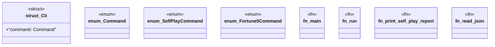

# `tools/ggen-architecture/src/bin/ggen-architecture.rs`

Source SHA-256: `2ee6f198eb71ae82974fd98e7508ccd020ceb1bf2153130f9fc39b86d1ca2a7c`

## Dependencies

- `clap::{Parser, Subcommand}`
- `ggen_architecture::{ demo_scenario, run_scenario, verify_report, ArchitectureState, AutonomicController, CapacityEnvelope, DoctorReport, DoctorStatus, Fortune5Assessment, Fortune5AutonomicPlan, Fortune5Catalog, Fortune5Program, LevelFiveCrownAssessment, LevelFiveCrownProgram, SelfPlayDoctorReport, SelfPlayDoctorStatus, SelfPlayReport, SelfPlayScenario, Severity, Stimulus, }`
- `serde::de::DeserializeOwned`
- `std::{ error::Error, fs, path::{Path, PathBuf}, process::ExitCode, }`

## Standing

- Structural parse: `ALIVE`
- Runtime behavior: `UNKNOWN`
