# `tools/ggen-architecture/src/capacity.rs`

Source SHA-256: `bdbe1a0140ee8ecbd772fe16c6af320f8638d9c40cef6a282390c16d98555977`

```mermaid
classDiagram
    class struct_WorkloadVector {
      <<struct>>
      +"documents: u64"
      +"quads: u64"
      +"blank_nodes: u64"
      +"rules: u64"
      +"shapes: u64"
      +"templates: u64"
      +"projections: u64"
    }
    class struct_CapacitySample {
      <<struct>>
      +"label: String"
      +"workload: WorkloadVector"
      +"elapsed_ms: u64"
      +"peak_memory_bytes: u64"
      +"phase_ms: BTreeMap~String"
    }
    class enum_CapacityLevel {
      <<enum>>
    }
    class struct_CapacityPolicy {
      <<struct>>
      +"warn_elapsed_ms: u64"
      +"refuse_elapsed_ms: u64"
      +"warn_memory_bytes: u64"
      +"refuse_memory_bytes: u64"
      +"max_documents: Option~u64~"
      +"max_quads: Option~u64~"
      +"knee_slope_ratio: f64"
    }
    class struct_CapacityFinding {
      <<struct>>
      +"code: String"
      +"severity: Severity"
      +"message: String"
      +"remediation: String"
    }
    class struct_CapacityEnvelope {
      <<struct>>
      +"samples: Vec~CapacitySample~"
      +"first_warning: Option~String~"
      +"first_refusal: Option~String~"
      +"first_knee: Option~String~"
      +"max_observed_units: u64"
      +"latest_level: CapacityLevel"
    }
    note "CapacityEnvelope"
    note "CapacityPolicy"
    note "Default for CapacityPolicy"
    note "WorkloadVector"
```

## Dependencies

- `crate::model::Severity`
- `serde::{Deserialize, Serialize}`
- `std::collections::BTreeMap`

## Standing

- Structural parse: `ALIVE`
- Runtime behavior: `UNKNOWN`
