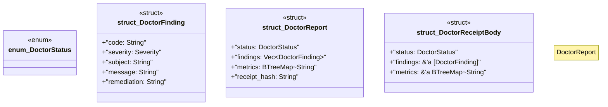

# `tools/ggen-architecture/src/doctor.rs`

Source SHA-256: `cd7dee22640f9ba3e8f39deff392c87d84ed4685fa0db39550150065836001cb`

## Dependencies

- `crate::{ capacity::{CapacityEnvelope, CapacityLevel}, error::Result, model::{AssetKind, LifecycleState, Severity, Standing}, receipt::deterministic_hash, state::ArchitectureState, }`
- `serde::{Deserialize, Serialize}`
- `std::{collections::BTreeMap, fmt::Write as _}`

## Standing

- Structural parse: `ALIVE`
- Runtime behavior: `UNKNOWN`
