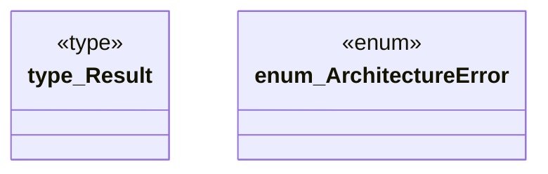

# `tools/ggen-architecture/src/error.rs`

Source SHA-256: `832f076ae44b46eb9e08fca7a91ac83a87bc953941822f1ebd520dad8756fa2e`

## Dependencies

- `thiserror::Error`

## Standing

- Structural parse: `ALIVE`
- Runtime behavior: `UNKNOWN`
