# `tools/ggen-architecture/src/fortune5.rs`

Source SHA-256: `4177632b468309e335bfbed3bc169b455c12d66292f8c114777838f1bfdba29e`

```mermaid
classDiagram
    class enum_Fortune5Domain {
      <<enum>>
    }
    class enum_ProofKind {
      <<enum>>
    }
    class struct_ProofObligation {
      <<struct>>
      +"id: String"
      +"kind: ProofKind"
      +"description: String"
      +"required_evidence: BTreeSet~String~"
    }
    class struct_Fortune5Dimension {
      <<struct>>
      +"id: String"
      +"domain: Fortune5Domain"
      +"title: String"
      +"capability: String"
      +"required_controls: BTreeSet~String~"
      +"obligations: Vec~ProofObligation~"
    }
    class struct_Fortune5Catalog {
      <<struct>>
      +"schema_version: u32"
      +"profile: String"
      +"dimensions: Vec~Fortune5Dimension~"
    }
    class struct_LevelFivePolicy {
      <<struct>>
      +"conjunctive_level_five: bool"
    }
    class struct_Fortune5Policy {
      <<struct>>
      +"require_independent_verifier: bool"
      +"require_segregation_of_duties: bool"
      +"require_artifacts: bool"
      +"level_five: LevelFivePolicy"
    }
    class struct_ControlEvidence {
      <<struct>>
      +"obligation_id: String"
      +"evidence_id: String"
      +"standing: Standing"
      +"producer: String"
      +"approver: String"
      +"verifier: String"
      +"observed_at: String"
      +"digest: String"
      +"artifacts: BTreeSet~String~"
    }
    class struct_Fortune5Program {
      <<struct>>
      +"name: String"
      +"policy: Fortune5Policy"
      +"evidence: Vec~ControlEvidence~"
      +"synthetic: bool"
    }
    class struct_DimensionAssessment {
      <<struct>>
      +"dimension_id: String"
      +"domain: Fortune5Domain"
      +"standing: Standing"
      +"passed_obligations: usize"
      +"total_obligations: usize"
      +"unresolved_obligations: Vec~String~"
    }
    class struct_Fortune5Finding {
      <<struct>>
      +"code: String"
      +"severity: Severity"
      +"subject: String"
      +"message: String"
      +"remediation: String"
    }
    class struct_Fortune5Assessment {
      <<struct>>
      +"program: String"
      +"profile: String"
      +"maturity_level: u8"
      +"level_five_ready: bool"
      +"standing: Standing"
      +"alive_dimensions: usize"
      +"passed_obligations: usize"
      +"total_obligations: usize"
      +"dimensions: Vec~DimensionAssessment~"
      +"findings: Vec~Fortune5Finding~"
      +"synthetic: bool"
      +"receipt_hash: String"
    }
    class struct_AssessmentReceiptBody {
      <<struct>>
      +"program: &'a str"
      +"profile: &'a str"
      +"maturity_level: u8"
      +"level_five_ready: bool"
      +"standing: Standing"
      +"dimensions: &'a [DimensionAssessment]"
      +"findings: &'a [Fortune5Finding]"
      +"synthetic: bool"
    }
    class enum_Fortune5IntentKind {
      <<enum>>
    }
    class struct_Fortune5Intent {
      <<struct>>
      +"intent_id: String"
      +"kind: Fortune5IntentKind"
      +"subject: String"
      +"preconditions: BTreeSet~String~"
      +"required_capabilities: BTreeSet~String~"
      +"expected_evidence: BTreeSet~String~"
      +"payload: BTreeMap~String"
    }
    class struct_Fortune5IntentBody {
      <<struct>>
      +"kind: Fortune5IntentKind"
      +"subject: &'a str"
      +"preconditions: &'a BTreeSet~String~"
      +"required_capabilities: &'a BTreeSet~String~"
      +"expected_evidence: &'a BTreeSet~String~"
      +"payload: &'a BTreeMap~String"
    }
    class struct_Fortune5AutonomicPlan {
      <<struct>>
      +"assessment_receipt: String"
      +"intents: Vec~Fortune5Intent~"
      +"actuation_performed: bool"
      +"receipt_hash: String"
    }
    class struct_Fortune5PlanReceiptBody {
      <<struct>>
      +"assessment_receipt: &'a str"
      +"intents: &'a [Fortune5Intent]"
      +"actuation_performed: bool"
    }
    class fn_build_intent {
      <<fn>>
    }
    class fn_dimension {
      <<fn>>
    }
    class fn_obligation {
      <<fn>>
    }
    class fn_validate_evidence {
      <<fn>>
    }
    class fn_finding {
      <<fn>>
    }
    class fn_sort_findings {
      <<fn>>
    }
    note "Default for Fortune5Policy"
    note "Default for LevelFivePolicy"
    note "Fortune5Assessment"
    note "Fortune5AutonomicPlan"
    note "Fortune5Catalog"
```

## Dependencies

- `crate::{ error::Result, model::{Severity, Standing}, receipt::deterministic_hash, }`
- `serde::{Deserialize, Serialize}`
- `std::collections::{BTreeMap, BTreeSet}`

## Standing

- Structural parse: `ALIVE`
- Runtime behavior: `UNKNOWN`
