# `tools/ggen-architecture/src/level5_crown.rs`

Source SHA-256: `361371bf771e73d910427e60e0042b178deac0acfc38d91edb508a16f2bc9bc1`

```mermaid
classDiagram
    class enum_ReleaseTruth {
      <<enum>>
    }
    class enum_SlaGovernor {
      <<enum>>
    }
    class struct_CrownEvidence {
      <<struct>>
      +"evidence_id: String"
      +"producer: String"
      +"approver: String"
      +"verifier: String"
      +"digest: String"
      +"artifacts: BTreeSet~String~"
      +"standing: Standing"
    }
    class struct_OperationalGuards {
      <<struct>>
      +"max_run_len: u8"
      +"budget_cap: u64"
      +"rate_limit_ppm: u32"
      +"chronology: bool"
      +"conservation: bool"
      +"conservation_tolerance_ppm: u32"
      +"legality: bool"
      +"exclusion_regions: BTreeSet~String~"
    }
    class struct_LevelFiveCrownProgram {
      <<struct>>
      +"name: String"
      +"release_truths: BTreeMap~ReleaseTruth"
      +"sla_governors: BTreeMap~SlaGovernor"
      +"operational_guards: OperationalGuards"
      +"receipt_replay_verified: bool"
      +"direct_actuation_performed: bool"
    }
    class struct_TaxonomyProfileClosure {
      <<struct>>
      +"profile: String"
      +"dimensions: usize"
      +"controls: usize"
      +"obligations: usize"
      +"design_obligations: usize"
      +"operation_obligations: usize"
      +"falsifier_obligations: usize"
      +"unique_dimension_ids: bool"
      +"unique_control_ids: bool"
      +"unique_obligation_ids: bool"
      +"catalog_findings: usize"
    }
    class struct_CrownFinding {
      <<struct>>
      +"code: String"
      +"severity: Severity"
      +"subject: String"
      +"message: String"
      +"remediation: String"
    }
    class struct_LevelFiveCrownAssessment {
      <<struct>>
      +"program: String"
      +"assessment_receipt: String"
      +"taxonomy: TaxonomyProfileClosure"
      +"release_truths_alive: usize"
      +"sla_governors_alive: usize"
      +"operational_controls_alive: usize"
      +"structurally_ready: bool"
      +"promotion_ready: bool"
      +"synthetic: bool"
      +"findings: Vec~CrownFinding~"
      +"receipt_hash: String"
    }
    class struct_CrownReceiptBody {
      <<struct>>
      +"program: &'a str"
      +"assessment_receipt: &'a str"
      +"taxonomy: &'a TaxonomyProfileClosure"
      +"release_truths_alive: usize"
      +"sla_governors_alive: usize"
      +"operational_controls_alive: usize"
      +"structurally_ready: bool"
      +"promotion_ready: bool"
      +"synthetic: bool"
      +"findings: &'a [CrownFinding]"
    }
    class fn_finding {
      <<fn>>
    }
    class mod_tests {
      <<mod>>
    }
    note "CrownEvidence"
    note "Default for OperationalGuards"
    note "LevelFiveCrownAssessment"
    note "OperationalGuards"
    note "ReleaseTruth"
    note "SlaGovernor"
    note "TaxonomyProfileClosure"
```

## Dependencies

- `crate::fortune5::{ControlEvidence, Fortune5Policy, Fortune5Program}`
- `crate::{ error::Result, fortune5::{Fortune5Assessment, Fortune5Catalog, ProofKind}, model::{Severity, Standing}, receipt::deterministic_hash, }`
- `serde::{Deserialize, Serialize}`
- `std::collections::{BTreeMap, BTreeSet}`
- `super::*`

## Standing

- Structural parse: `ALIVE`
- Runtime behavior: `UNKNOWN`
