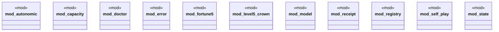

# `tools/ggen-architecture/src/lib.rs`

Source SHA-256: `7f780710a57420bc868344dee0d3945005fe8bffd9e7ec000dd10dd5b1e17030`

## Dependencies

- `autonomic::{ ArchitectureIntent, AutonomicController, AutonomicCycle, Diagnosis, IntentKind, Stimulus, }`
- `capacity::{ CapacityEnvelope, CapacityFinding, CapacityLevel, CapacityPolicy, CapacitySample, WorkloadVector, }`
- `doctor::{DoctorFinding, DoctorReport, DoctorStatus}`
- `error::{ArchitectureError, Result}`
- `fortune5::{ ControlEvidence, DimensionAssessment, Fortune5Assessment, Fortune5AutonomicPlan, Fortune5Catalog, Fortune5Dimension, Fortune5Domain, Fortune5Finding, Fortune5Intent, Fortune5IntentKind, Fortune5Policy, Fortune5Program, ProofKind, ProofObligation, }`
- `ggen_architecture_kernel::{ profiles, ArchitectureFacet, Authority, BuildingBlock, BuildingBlockContract, BuildingBlockId, BuildingBlockRegistry, BuildingBlockViolation, CompositionReceipt, EvidenceKind, EvidenceObligation, EvidenceReceipt, ObligationId, Port, PortDirection, PortId, PortKind, ProfileId, RealizationBinding, RealizationId, ResourceCeiling, ResourceClaim, Standing as BuildingBlockStanding, SubstitutionAssessment, }`
- `level5_crown::{ CrownEvidence, CrownFinding, LevelFiveCrownAssessment, LevelFiveCrownProgram, OperationalGuards, ReleaseTruth, SlaGovernor, TaxonomyProfileClosure, }`
- `model::{ArchitectureAsset, AssetKind, LifecycleState, Severity, Standing, TransitionStep}`
- `registry::{ArchitectureRegistry, ImpactReport, RegistryViolation}`
- `self_play::{ demo_scenario, run_scenario, run_suite, verify_report, verify_suite, ActionSpec, ActorPolicy, ActorRole, Comparison, GameState, Metric, MetricConstraint, MetricEffect, MoveReceipt, SelfPlayDoctorFinding, SelfPlayDoctorReport, SelfPlayDoctorStatus, SelfPlayReport, SelfPlayScenario, SelfPlayStanding, SelfPlayViolation, UseCaseKind, }`
- `state::{ArchitectureState, AutonomicPolicy}`

## Standing

- Structural parse: `ALIVE`
- Runtime behavior: `UNKNOWN`
