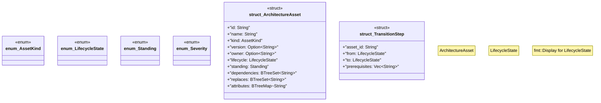

# `tools/ggen-architecture/src/model.rs`

Source SHA-256: `17c75a4006c4aa92d2ad3698c053110f15fc7174b816869cdee59e6cea698241`

## Dependencies

- `serde::{Deserialize, Serialize}`
- `std::{ collections::{BTreeMap, BTreeSet}, fmt, }`

## Standing

- Structural parse: `ALIVE`
- Runtime behavior: `UNKNOWN`
