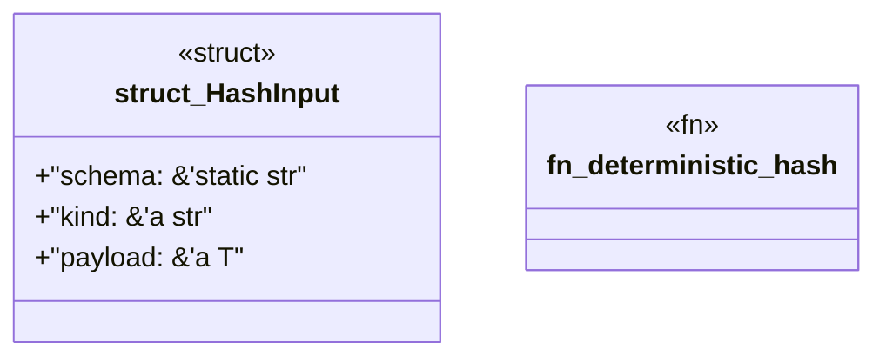

# `tools/ggen-architecture/src/receipt.rs`

Source SHA-256: `b0446485d7b24a84a7ddbb5b35a04d9d26b905a62aa2b030d3db32439d06a0f4`

## Dependencies

- `crate::error::Result`
- `serde::Serialize`

## Standing

- Structural parse: `ALIVE`
- Runtime behavior: `UNKNOWN`
