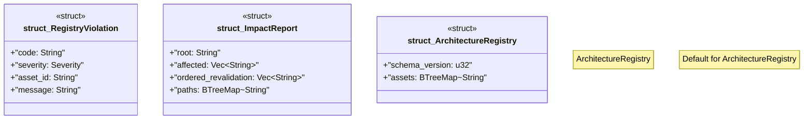

# `tools/ggen-architecture/src/registry.rs`

Source SHA-256: `330c0459f79d4523bdd4b676cdff0df5e894152c44c00cc5ebd8309935879ba1`

## Dependencies

- `crate::{ error::{ArchitectureError, Result}, model::{ArchitectureAsset, LifecycleState, Severity, TransitionStep}, }`
- `serde::{Deserialize, Serialize}`
- `std::collections::{BTreeMap, BTreeSet, VecDeque}`

## Standing

- Structural parse: `ALIVE`
- Runtime behavior: `UNKNOWN`
