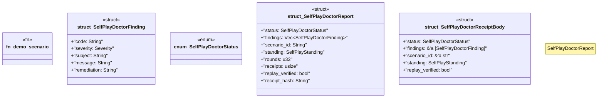

# `tools/ggen-architecture/src/self_play.rs`

Source SHA-256: `42e88be981f4e52c32f4e816a22d150dc3228926b3018da6bc0394e0331c095c`

## Dependencies

- `crate::{ error::Result, model::Severity, receipt::deterministic_hash, }`
- `ggen_architecture_kernel::{ run_scenario, run_suite, verify_report, verify_suite, ActionSpec, ActorPolicy, ActorRole, Comparison, GameState, Metric, MetricConstraint, MetricEffect, MoveReceipt, SelfPlayReport, SelfPlayScenario, SelfPlayStanding, SelfPlayViolation, UseCaseKind, }`
- `serde::{Deserialize, Serialize}`
- `std::{ collections::{BTreeMap, BTreeSet}, fmt::Write as _, }`

## Standing

- Structural parse: `ALIVE`
- Runtime behavior: `UNKNOWN`
