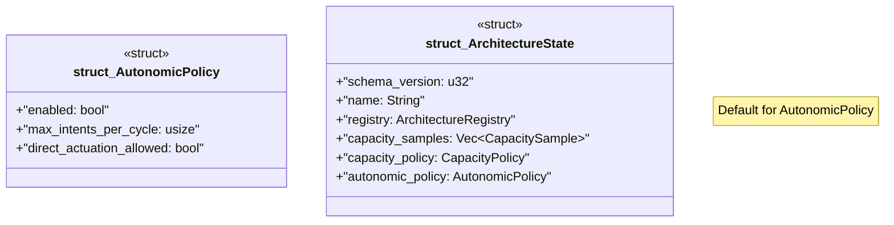

# `tools/ggen-architecture/src/state.rs`

Source SHA-256: `8e4b196874a7f83ee97842f3dafb6899d3d40f3166686574bc7bcf4a69d524ae`

## Dependencies

- `crate::{ capacity::{CapacityPolicy, CapacitySample}, registry::ArchitectureRegistry, }`
- `serde::{Deserialize, Serialize}`

## Standing

- Structural parse: `ALIVE`
- Runtime behavior: `UNKNOWN`
