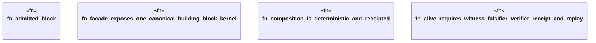

# `tools/ggen-architecture/tests/building_block.rs`

Source SHA-256: `f485014294d5e209c0ea220746122f7e6a15378cb84eea1de3c1bc5be4d1d1ac`

## Dependencies

- `ggen_architecture::profiles::fortune5::REQUIRED_BROKER`
- `ggen_architecture::{ ArchitectureFacet, Authority, BuildingBlock, BuildingBlockContract, BuildingBlockId, BuildingBlockRegistry, BuildingBlockStanding, EvidenceKind, EvidenceObligation, EvidenceReceipt, ObligationId, Port, PortDirection, PortId, PortKind, ProfileId, RealizationBinding, RealizationId, ResourceCeiling, ResourceClaim, }`
- `std::collections::{BTreeMap, BTreeSet}`

## Standing

- Structural parse: `ALIVE`
- Runtime behavior: `UNKNOWN`
