# `tools/ggen-architecture/tests/integration.rs`

Source SHA-256: `ee1f1dd0cc350c2177860c59ad8f4acd62cade5c23f19e9ab07d92f011bf8425`

```mermaid
classDiagram
    class fn_active_asset {
      <<fn>>
    }
    class fn_base_state {
      <<fn>>
    }
    class fn_lifecycle_state_machine_refuses_skipped_promotion {
      <<fn>>
    }
    class fn_impact_analysis_returns_transitive_dependents_in_dependency_order {
      <<fn>>
    }
    class fn_dependency_cycle_is_a_registry_refusal {
      <<fn>>
    }
    class fn_capacity_envelope_detects_warning_refusal_and_nonlinear_knee {
      <<fn>>
    }
    class fn_doctor_refuses_direct_autonomic_actuation {
      <<fn>>
    }
    class fn_autonomic_cycle_emits_intents_but_performs_no_actuation {
      <<fn>>
    }
    class fn_receipt_is_deterministic_for_identical_cycle {
      <<fn>>
    }
    class fn_canonical_repository_state_parses_and_has_closed_dependencies {
      <<fn>>
    }
    class fn_fortune5_catalog_is_conjunctive_twenty_one_by_three {
      <<fn>>
    }
    class fn_synthetic_fortune5_program_proves_the_assessment_machinery {
      <<fn>>
    }
    class fn_synthetic_fortune5_level_five_cannot_authorize_promotion {
      <<fn>>
    }
    class fn_fortune5_segregation_violation_blocks_and_plans_repair {
      <<fn>>
    }
    class fn_sample {
      <<fn>>
    }
```

## Dependencies

- `ggen_architecture::{ ArchitectureAsset, ArchitectureRegistry, ArchitectureState, AssetKind, AutonomicController, AutonomicPolicy, CapacityEnvelope, CapacityLevel, CapacityPolicy, CapacitySample, DoctorReport, DoctorStatus, Fortune5Assessment, Fortune5AutonomicPlan, Fortune5Catalog, Fortune5IntentKind, Fortune5Program, LifecycleState, Standing, Stimulus, WorkloadVector, }`
- `std::{collections::BTreeMap, error::Error}`

## Standing

- Structural parse: `ALIVE`
- Runtime behavior: `UNKNOWN`
