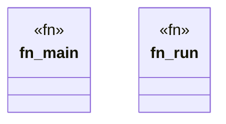

# `tools/pack-gall/src/bin/observe.rs`

Source SHA-256: `fde570f572f57250f54739998a823c91b2f8f0a8aa895b5317b715e705b1c42f`

## Dependencies

- `ggen_pack_gall::{observe, parse_args, write_json}`
- `std::env`

## Standing

- Structural parse: `ALIVE`
- Runtime behavior: `UNKNOWN`
