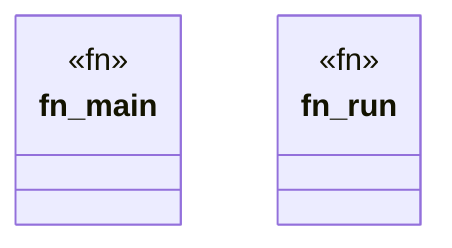

# `tools/pack-gall/src/bin/verify.rs`

Source SHA-256: `56aa27b265d0c71ff1b057a7d65741bab65b61081c606cb2dde5c2b73b6743ec`

## Dependencies

- `ggen_pack_gall::{issue_receipt, parse_args, read_observation, verify, write_json}`
- `std::env`

## Standing

- Structural parse: `ALIVE`
- Runtime behavior: `UNKNOWN`
