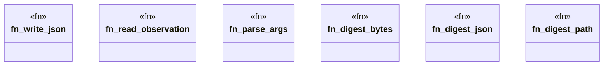

# `tools/pack-gall/src/io.rs`

Source SHA-256: `71d4cb67c19d278d7e4f75e34b777575d1e855a9f32a53fdd4c6a0706d763f03`

## Dependencies

- `crate::model::{Observation, OBSERVATION_SCHEMA}`
- `serde::Serialize`
- `std::collections::BTreeMap`
- `std::fs`
- `std::path::{Path, PathBuf}`

## Standing

- Structural parse: `ALIVE`
- Runtime behavior: `UNKNOWN`
