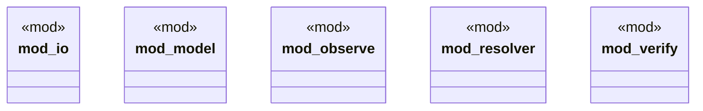

# `tools/pack-gall/src/lib.rs`

Source SHA-256: `12499d803fd6ecc7e93b48df5bb75ea085cda8f43106c3c0e4e19acab455c854`

## Dependencies

- `io::{parse_args, read_observation, write_json}`
- `model::{ Catalog, Observation, Receipt, ResolutionEvidence, VerifierReport, OBSERVATION_SCHEMA, VERIFIER_SCHEMA, }`
- `observe::observe`
- `resolver::resolve`
- `verify::{issue_receipt, verify}`

## Standing

- Structural parse: `ALIVE`
- Runtime behavior: `UNKNOWN`
