# `tools/pack-gall/src/model.rs`

Source SHA-256: `6865fda3c3c2b8c52731d6c38b733ffb15de7926e339353b5cce799cd04a85fd`

```mermaid
classDiagram
    class struct_Contract {
      <<struct>>
      +"schema: String"
      +"required_surfaces: Vec~RequiredSurface~"
      +"command_surfaces: Vec~CommandContract~"
      +"schema_tokens: Vec~SchemaTokenContract~"
      +"catalog_path: String"
      +"canonical_schema_path: String"
      +"verifier_schema_path: String"
    }
    class struct_RequiredSurface {
      <<struct>>
      +"path: String"
      +"owner: String"
      +"class: String"
    }
    class struct_CommandContract {
      <<struct>>
      +"noun: String"
      +"path: String"
      +"required_verbs: Vec~String~"
    }
    class struct_SchemaTokenContract {
      <<struct>>
      +"path: String"
      +"tokens: Vec~String~"
    }
    class struct_SurfaceEvidence {
      <<struct>>
      +"path: String"
      +"owner: String"
      +"class: String"
      +"bytes: u64"
      +"blake3: String"
    }
    class struct_CommandEvidence {
      <<struct>>
      +"noun: String"
      +"path: String"
      +"observed_verbs: Vec~String~"
      +"required_verbs: Vec~String~"
      +"missing_verbs: Vec~String~"
    }
    class struct_SchemaEvidence {
      <<struct>>
      +"path: String"
      +"required_tokens: Vec~String~"
      +"missing_tokens: Vec~String~"
    }
    class struct_Provider {
      <<struct>>
      +"id: String"
      +"aliases: Vec~String~"
    }
    class struct_Group {
      <<struct>>
      +"id: String"
      +"directory: String"
      +"dependencies: Vec~String~"
      +"common_packs: Vec~String~"
      +"provider_packs: BTreeMap~String"
    }
    class struct_Catalog {
      <<struct>>
      +"schema: String"
      +"version: String"
      +"providers: Vec~Provider~"
      +"groups: Vec~Group~"
    }
    class struct_ResolutionEvidence {
      <<struct>>
      +"provider: String"
      +"requested_group: String"
      +"resolved_groups: Vec~String~"
      +"directories: Vec~String~"
      +"packs: Vec~String~"
      +"plan_digest: String"
    }
    class struct_CorpusEvidence {
      <<struct>>
      +"catalog_schema: String"
      +"catalog_version: String"
      +"provider_ids: Vec~String~"
      +"group_count: usize"
      +"unique_pack_count: usize"
      +"catalog_digest: String"
      +"representative_resolutions: Vec~ResolutionEvidence~"
    }
    class struct_Observation {
      <<struct>>
      +"schema: String"
      +"contract_digest: String"
      +"source_digest: String"
      +"surfaces: Vec~SurfaceEvidence~"
      +"command_matrix: Vec~CommandEvidence~"
      +"schema_matrix: Vec~SchemaEvidence~"
      +"ownership: BTreeMap~String"
      +"corpus: CorpusEvidence"
      +"canonical_schema_digest: String"
      +"verifier_schema_digest: String"
    }
    class struct_Checkpoint {
      <<struct>>
      +"id: String"
      +"title: String"
      +"passed: bool"
      +"state: String"
      +"evidence: Vec~String~"
    }
    class struct_VerifierReport {
      <<struct>>
      +"schema: String"
      +"source_digest: String"
      +"observation_digest: String"
      +"checkpoints: Vec~Checkpoint~"
      +"standing: String"
    }
    class struct_Receipt {
      <<struct>>
      +"schema: String"
      +"operation: String"
      +"previous_digest: String"
      +"artifacts: BTreeMap~String"
      +"digest_algorithm: String"
      +"digest: String"
    }
```

## Dependencies

- `serde::{Deserialize, Serialize}`
- `std::collections::BTreeMap`

## Standing

- Structural parse: `ALIVE`
- Runtime behavior: `UNKNOWN`
