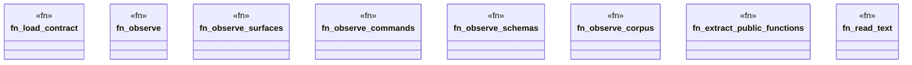

# `tools/pack-gall/src/observe.rs`

Source SHA-256: `09f9a3fd78c2f838411949b25403524b2168bacfef73e4a682305ad7ffcc2f59`

## Dependencies

- `crate::io::{digest_bytes, digest_json, digest_path}`
- `crate::model::{ Catalog, CommandEvidence, Contract, CorpusEvidence, Observation, SchemaEvidence, SurfaceEvidence, CONTRACT_SCHEMA, OBSERVATION_SCHEMA, }`
- `crate::resolver::{resolve, validate_catalog}`
- `std::collections::{BTreeMap, BTreeSet}`
- `std::fs`
- `std::path::Path`

## Standing

- Structural parse: `ALIVE`
- Runtime behavior: `UNKNOWN`
