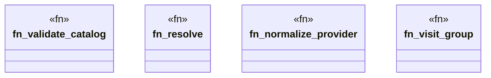

# `tools/pack-gall/src/resolver.rs`

Source SHA-256: `ec8a9670d52203dad7e6b4bbfeb20188370935fee2b2f059cc20877db52c802f`

## Dependencies

- `crate::io::digest_json`
- `crate::model::{Catalog, ResolutionEvidence}`
- `std::collections::BTreeSet`
- `std::path::Path`

## Standing

- Structural parse: `ALIVE`
- Runtime behavior: `UNKNOWN`
