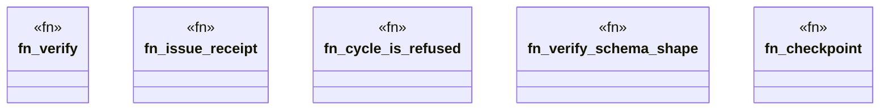

# `tools/pack-gall/src/verify.rs`

Source SHA-256: `ea2a8fa577ab6cba49245218f92e97b16364ebc5bac804e54835abd2f3cedd7c`

## Dependencies

- `crate::io::{digest_json, digest_path}`
- `crate::model::{ Catalog, Checkpoint, Observation, Receipt, VerifierReport, OBSERVATION_SCHEMA, RECEIPT_SCHEMA, VERIFIER_SCHEMA, }`
- `crate::observe::{load_contract, observe}`
- `crate::resolver::resolve`
- `serde_json::Value`
- `std::collections::{BTreeMap, BTreeSet}`
- `std::fs`
- `std::path::Path`

## Standing

- Structural parse: `ALIVE`
- Runtime behavior: `UNKNOWN`
