# `tools/pack-gall/tests/e2e.rs`

Source SHA-256: `83e20975324714b21cef056b022af8487284f5d7705d0f31b9c2409294fec7b5`

```mermaid
classDiagram
    class fn_write {
      <<fn>>
    }
    class fn_fixture {
      <<fn>>
    }
    class fn_real_filesystem_observation_and_external_verification_are_deterministic {
      <<fn>>
    }
    class fn_tampered_command_surface_is_refused {
      <<fn>>
    }
    class fn_resolver_is_deterministic_across_aliases_and_repeated_runs {
      <<fn>>
    }
    class fn_observer_and_verifier_binaries_cross_process_and_filesystem_boundaries {
      <<fn>>
    }
```

## Dependencies

- `ggen_pack_gall::{observe, resolve, verify, Catalog, OBSERVATION_SCHEMA, VERIFIER_SCHEMA}`
- `std::fs`
- `std::path::Path`
- `std::process::Command`
- `tempfile::TempDir`

## Standing

- Structural parse: `ALIVE`
- Runtime behavior: `UNKNOWN`
