# `tools/truth-gate/src/main.rs`

Source SHA-256: `2f666d7321e4f87b49401d4de4e2da859594c4a0832804f6e92e23045e4272ec`

```mermaid
classDiagram
    class mod_policy {
      <<mod>>
    }
    class struct_HookInput {
      <<struct>>
      +"hook_event_name: Option~String~"
      +"tool_name: Option~String~"
      +"tool_input: Option~Value~"
      +"file_path: Option~String~"
      +"cwd: Option~String~"
    }
    class struct_HookOutput {
      <<struct>>
      +"decision: &'static str"
      +"hook_specific_output: HookSpecificOutput"
    }
    class struct_HookSpecificOutput {
      <<struct>>
      +"hook_event_name: String"
      +"additional_context: String"
    }
    class fn_ci_scan {
      <<fn>>
    }
    class fn_collect_violations {
      <<fn>>
    }
    class fn_main {
      <<fn>>
    }
    class fn_check_pre_tool_use {
      <<fn>>
    }
    class fn_check_post_tool_use {
      <<fn>>
    }
    class fn_is_python_source {
      <<fn>>
    }
    class fn_should_scan_non_python {
      <<fn>>
    }
    class mod_tests {
      <<mod>>
    }
```

## Dependencies

- `policy::{ config_policy, evidence_policy, test_policy, Violation, }`
- `serde::{Deserialize, Serialize}`
- `serde_json::Value`
- `serde_json::json`
- `std::fs`
- `std::io::{self, Read}`
- `std::path::Path`
- `super::*`

## Standing

- Structural parse: `ALIVE`
- Runtime behavior: `UNKNOWN`
