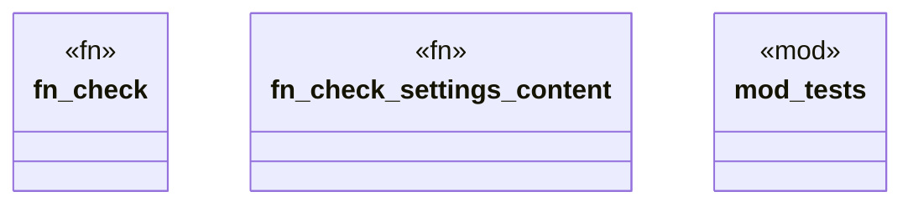

# `tools/truth-gate/src/policy/config_policy.rs`

Source SHA-256: `02b5c331c9c1f57e8616b84ba67ad08bc7398e61d3f1998b63b0128bbe2e4698`

## Dependencies

- `serde_json::Value`
- `serde_json::json`
- `super::*`
- `super::Violation`

## Standing

- Structural parse: `ALIVE`
- Runtime behavior: `UNKNOWN`
