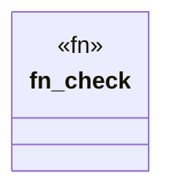

# `tools/truth-gate/src/policy/evidence_policy.rs`

Source SHA-256: `6a04c42881144cd02bbc0b27c2e4590e000a82b630e2826458bcab3e64baba69`

## Dependencies

- `super::Violation`

## Standing

- Structural parse: `ALIVE`
- Runtime behavior: `UNKNOWN`
