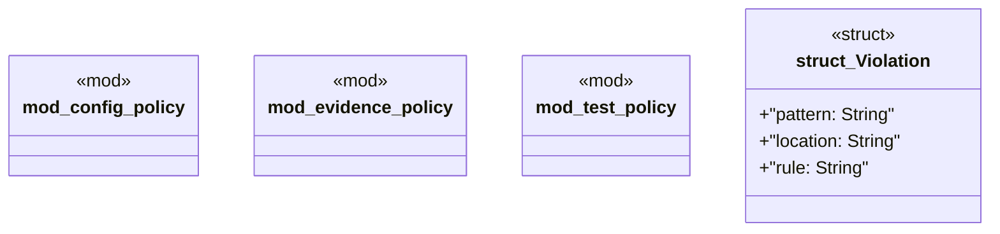

# `tools/truth-gate/src/policy/mod.rs`

Source SHA-256: `4d8324d312a976e489c0a1cf5c60a8df9448b73ded51935e72434a7fa523bad6`

## Dependencies

- None observed.

## Standing

- Structural parse: `ALIVE`
- Runtime behavior: `UNKNOWN`
