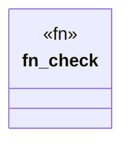

# `tools/truth-gate/src/policy/test_policy.rs`

Source SHA-256: `8cbbc1c96708d66f1214118af0bc3c504a6947a498a41e85087514110e058dd4`

## Dependencies

- `super::Violation`

## Standing

- Structural parse: `ALIVE`
- Runtime behavior: `UNKNOWN`
