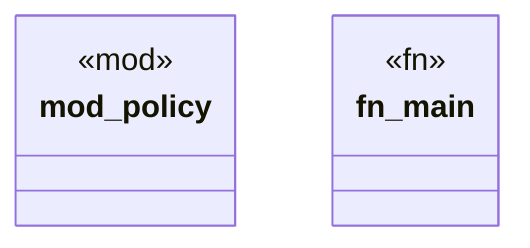

# `tools/truth-gate/test_harness.rs`

Source SHA-256: `c82b297ca5ef1f4c37401d401c508a0f07c18cb4af0bcadf818dffec6efd935e`

## Dependencies

- `policy::test_policy`

## Standing

- Structural parse: `ALIVE`
- Runtime behavior: `UNKNOWN`
