# Workspace and root entrypoints

Each heading is anchored to one source or manifest file. Classes with the same name in different sections are distinct unless an edge explicitly connects them.

## `Cargo.toml`

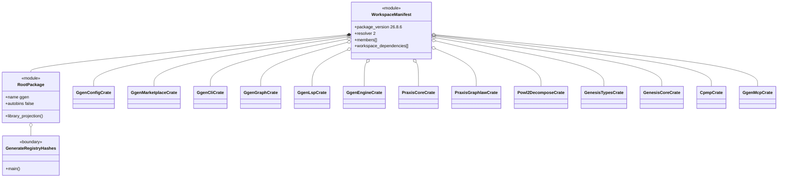

## `src/lib.rs`

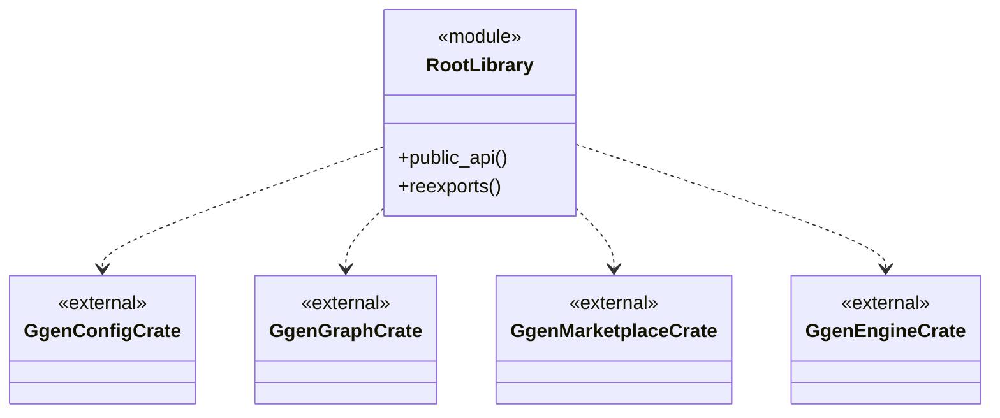

## `src/main.rs`

```mermaid
classDiagram
    class RetiredRootCliEntrypoint {
      <<module>>
      +main()
    }
    class CanonicalCli {
      <<external>>
      +cli_match()
    }
    RetiredRootCliEntrypoint ..> CanonicalCli : retained on disk; not built
```

## `scripts/generate_registry_hashes.rs`

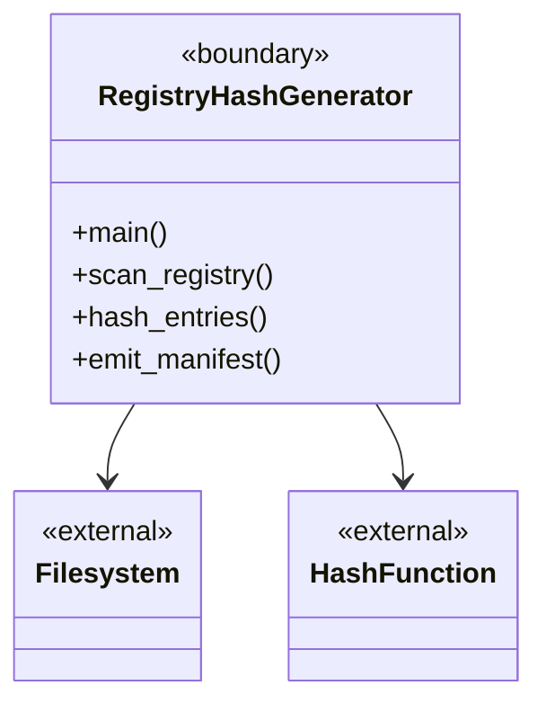

## `crates/ggen-config/src/lib.rs`

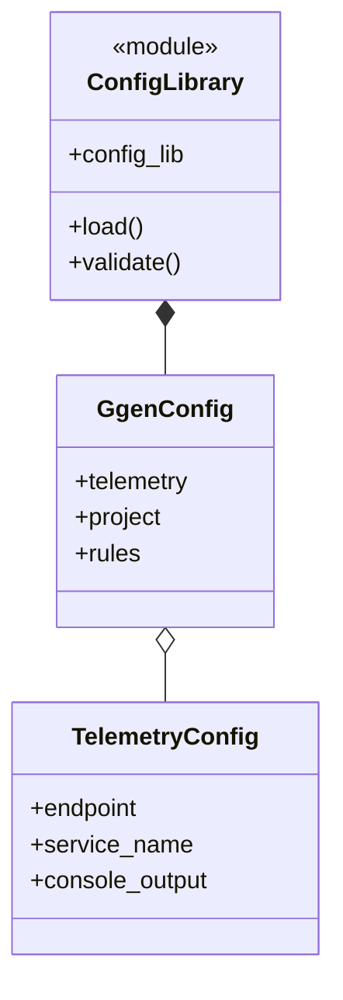

## `crates/ggen-marketplace/src/lib.rs`

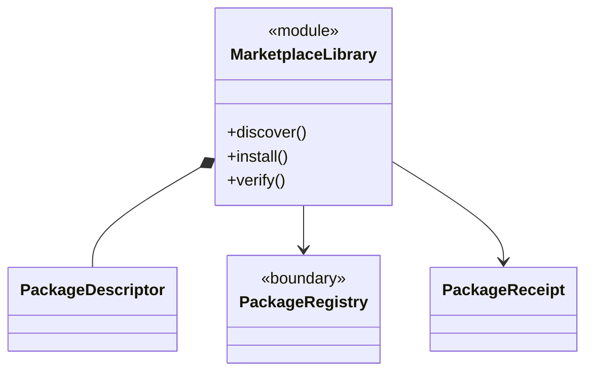

## `crates/ggen-graph/src/lib.rs`

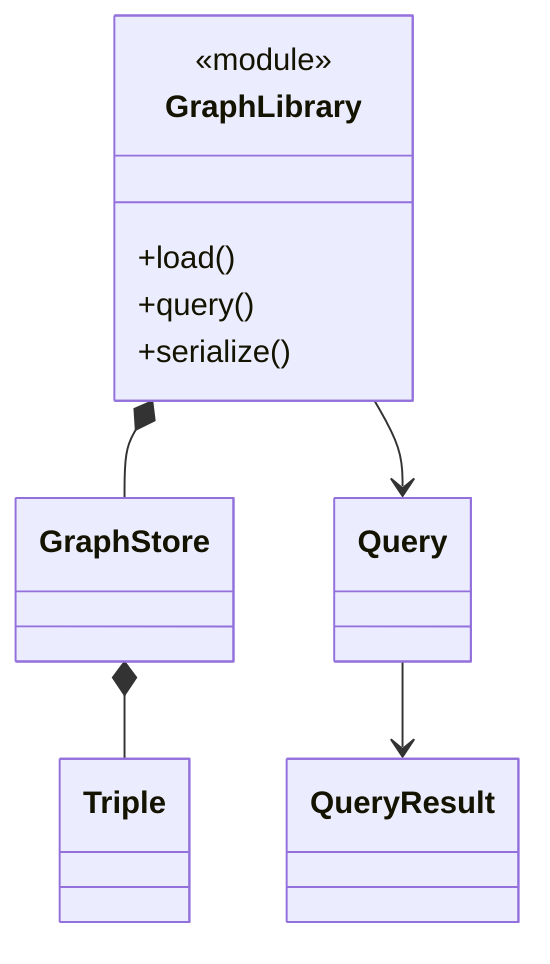

## `crates/ggen-engine/src/lib.rs`

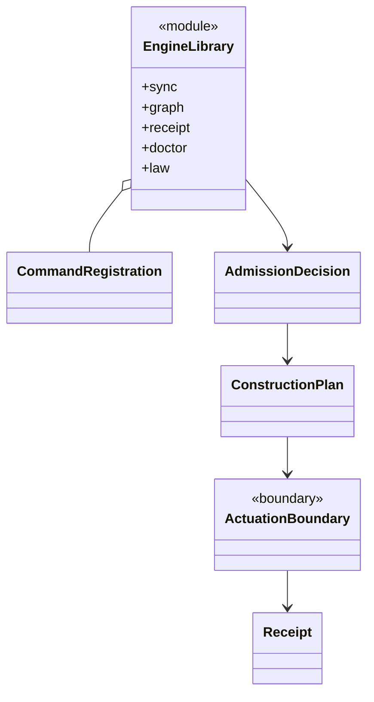

## `crates/ggen-lsp/src/lib.rs`

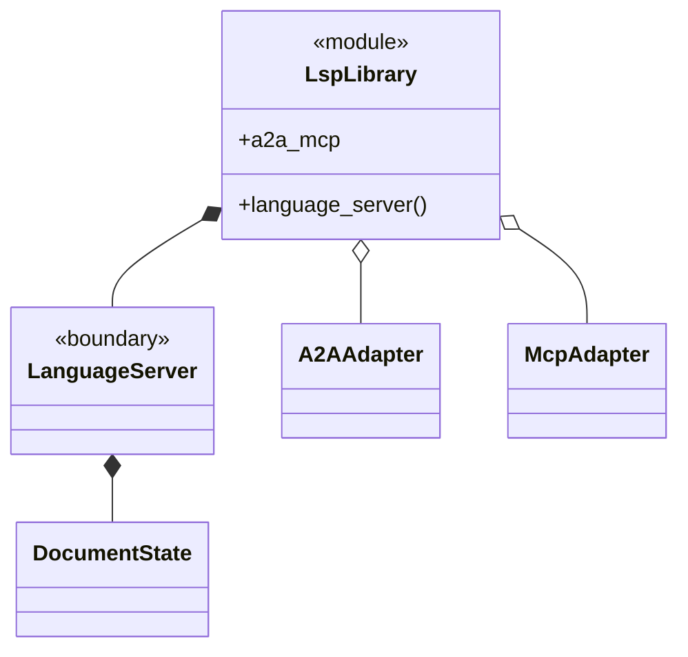

## `crates/ggen-mcp/src/lib.rs`

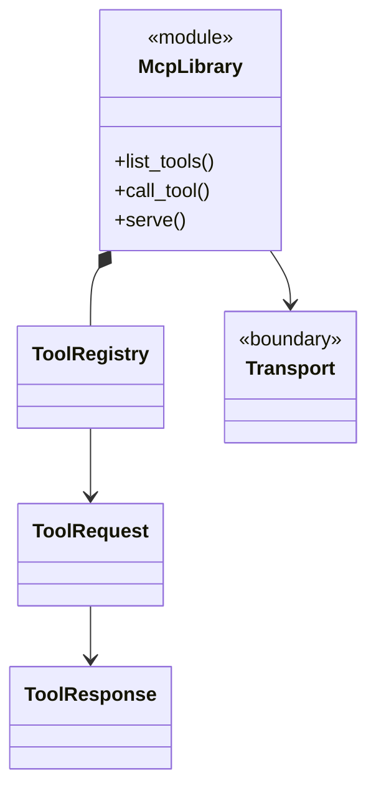

## `crates/genesis-types-v2/src/lib.rs`

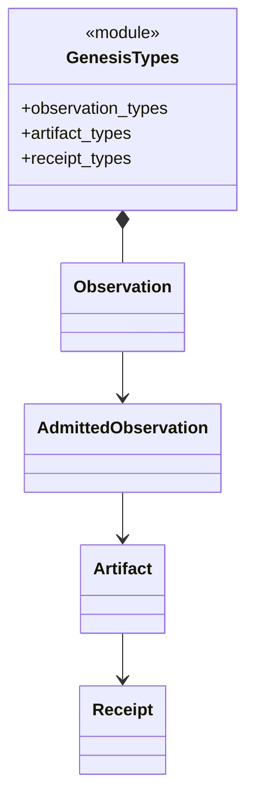

## `crates/genesis-core-v2/src/lib.rs`

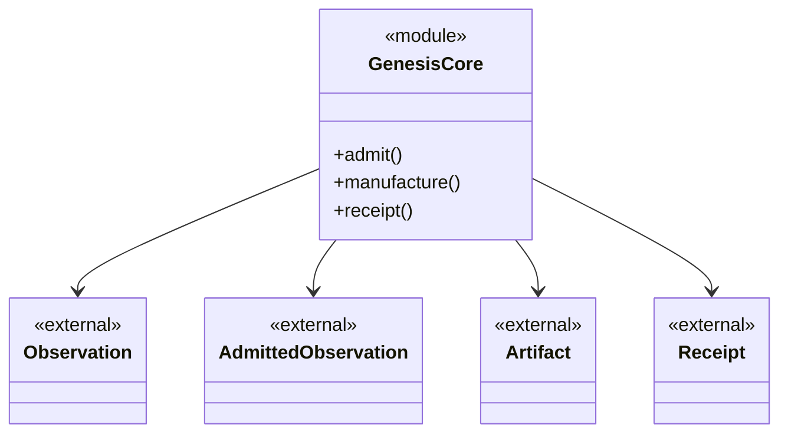

## `crates/praxis-graphlaw/src/lib.rs`

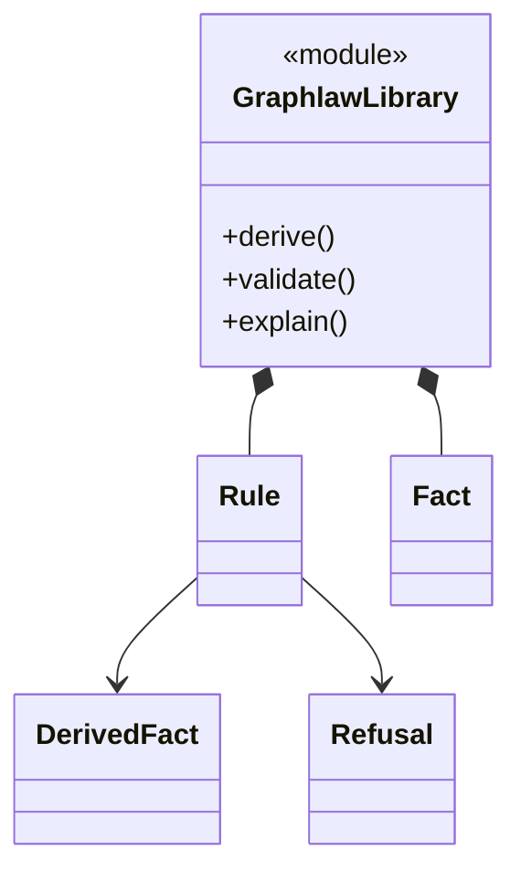

## `crates/powl2-decompose/src/lib.rs`

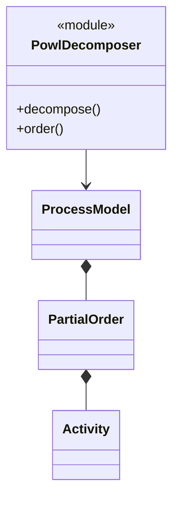

## Cross-file standing

The diagrams above describe ownership and dependency topology. Exact fields and methods beyond publicly observed entrypoint behavior remain `INFERRED`; runtime success remains `UNKNOWN` until the corresponding binary, library, or protocol boundary executes against this exact base.
