<!-- START doctoc generated TOC please keep comment here to allow auto update -->
<!-- DON'T EDIT THIS SECTION, INSTEAD RE-RUN doctoc TO UPDATE -->
**Table of Contents**

- [C4 Level 1: System Context Diagram](#c4-level-1-system-context-diagram)
  - [Entities and Responsibilities](#entities-and-responsibilities)
    - [External Users](#external-users)
    - [TAI System](#tai-system)
    - [External Systems](#external-systems)
  - [Key Interactions](#key-interactions)
  - [Technology Stack](#technology-stack)

<!-- END doctoc generated TOC please keep comment here to allow auto update -->

# C4 Level 1: System Context Diagram

TAI (Temporal Autonomic Infrastructure) in enterprise context.

```mermaid
graph TB
    subgraph "Users"
        ADMIN["👤 System Administrator"]
        OPERATOR["👤 Operator"]
        EXTERNAL["👤 External Client"]
    end

    subgraph "TAI System"
        CORE["🎯 TAI Core System"]
    end

    subgraph "External Systems"
        CLOUD["☁️ Google Cloud Platform"]
        AUTH["🔐 OAuth2 Provider"]
        MONITOR["📊 Monitoring (Prometheus/Datadog)"]
        LOG["📝 Logging (Cloud Logging)"]
    end

    ADMIN -->|Propose/Enforce Policies| CORE
    OPERATOR -->|Submit Signals| CORE
    EXTERNAL -->|API Requests| CORE

    CORE -->|Store/Retrieve State| CLOUD
    CORE -->|Authenticate| AUTH
    CORE -->|Emit Metrics| MONITOR
    CORE -->|Send Logs| LOG

    classDef user fill:#e1f5ff,stroke:#01579b
    classDef system fill:#e8f5e9,stroke:#1b5e20
    classDef external fill:#fff3e0,stroke:#e65100

    class ADMIN,OPERATOR,EXTERNAL user
    class CORE system
    class CLOUD,AUTH,MONITOR,LOG external
```

## Entities and Responsibilities

### External Users
- **System Administrator:** Creates and enforces policies, manages system governance
- **Operator:** Submits control signals, monitors system state
- **External Client:** Integrates with TAI via REST/gRPC APIs

### TAI System
Single unified system providing:
- Policy management (propose, enforce, revoke)
- Signal processing (emit, process, coordinate)
- Action coordination (request, acknowledge, schedule)
- Task scheduling (submit, cancel, track)

### External Systems
- **Google Cloud Platform:** Storage (Firestore), secrets (Vault), monitoring
- **OAuth2:** User authentication and authorization
- **Monitoring:** Observability (metrics, traces, logs)

## Key Interactions

1. **Policy Enforcement Flow:** Admin → TAI → Cloud Storage → Audit Log
2. **Signal Processing:** Operator → TAI → Signal Queue → Coordination
3. **Monitoring:** TAI → Prometheus → Grafana Dashboard

## Technology Stack

- **Language:** Rust (type-safe, zero-cost abstractions)
- **RPC:** gRPC + Protocol Buffers
- **Storage:** Google Firestore (multi-region)
- **Infrastructure:** Kubernetes (GKE)
- **Service Mesh:** Istio (mTLS, traffic management)
- **Observability:** OpenTelemetry + Jaeger + Prometheus
