# C4 Level 2: Container Diagram

TAI system containers and inter-service communication.

```mermaid
graph TB
    subgraph "External"
        CLIENTS["👥 API Clients"]
    end

    subgraph "API Gateway"
        GATEWAY["🚪 Ingress Gateway (Envoy/Istio)"]
        RATELIMIT["⏱️ Rate Limiter"]
        AUTH_GW["🔐 Auth Filter"]
    end

    subgraph "Microservices"
        GOVERNOR["🏛️ Governor Service (gRPC)"]
        COORDINATOR["🔄 Coordinator Service (gRPC)"]
        SCHEDULER["📅 Scheduler Service (gRPC)"]
    end

    subgraph "Data Layer"
        FIRESTORE["🗄️ Firestore (Multi-Region)"]
        REDIS["⚡ Redis Cache"]
    end

    subgraph "Event Streaming"
        PUBSUB["📨 Cloud Pub/Sub"]
        KAFKA["📦 Kafka (Optional)"]
    end

    subgraph "Infrastructure"
        VAULT["🔑 HashiCorp Vault (Secrets)"]
        KMSKEY["🔓 Cloud KMS (Key Management)"]
        TRACE["🎯 Jaeger (Tracing)"]
        PROM["📊 Prometheus (Metrics)"]
    end

    CLIENTS -->|HTTP/gRPC| GATEWAY
    GATEWAY -->|Check Rate Limit| RATELIMIT
    GATEWAY -->|Validate Auth| AUTH_GW
    GATEWAY -->|Route gRPC| GOVERNOR
    GATEWAY -->|Route gRPC| COORDINATOR
    GATEWAY -->|Route gRPC| SCHEDULER

    GOVERNOR -->|Query/Store| FIRESTORE
    GOVERNOR -->|Cache| REDIS
    GOVERNOR -->|Publish Events| PUBSUB
    GOVERNOR -->|Retrieve Secrets| VAULT

    COORDINATOR -->|Query/Store| FIRESTORE
    COORDINATOR -->|Cache| REDIS
    COORDINATOR -->|Publish Events| PUBSUB
    COORDINATOR -->|Retrieve Secrets| VAULT

    SCHEDULER -->|Query/Store| FIRESTORE
    SCHEDULER -->|Cache| REDIS
    SCHEDULER -->|Consume Events| PUBSUB
    SCHEDULER -->|Retrieve Secrets| VAULT

    VAULT -->|Encrypt with| KMSKEY
    GOVERNOR -->|Emit Metrics| PROM
    COORDINATOR -->|Emit Metrics| PROM
    SCHEDULER -->|Emit Metrics| PROM
    GOVERNOR -->|Send Traces| TRACE
    COORDINATOR -->|Send Traces| TRACE
    SCHEDULER -->|Send Traces| TRACE

    classDef external fill:#e3f2fd,stroke:#1976d2
    classDef gateway fill:#fff9c4,stroke:#f57f17
    classDef service fill:#e8f5e9,stroke:#2e7d32
    classDef data fill:#fce4ec,stroke:#c2185b
    classDef event fill:#f3e5f5,stroke:#6a1b9a
    classDef infra fill:#ede7f6,stroke:#311b92

    class CLIENTS external
    class GATEWAY,RATELIMIT,AUTH_GW gateway
    class GOVERNOR,COORDINATOR,SCHEDULER service
    class FIRESTORE,REDIS data
    class PUBSUB,KAFKA event
    class VAULT,KMSKEY,TRACE,PROM infra
```

## Container Descriptions

### API Gateway (Envoy/Istio)
- **Responsibility:** Ingress traffic routing, rate limiting, auth filtering
- **Technology:** Envoy proxy with Istio
- **Features:** TLS termination, request/response modification, circuit breaking

### Microservices (gRPC)

#### Governor Service
- **Responsibility:** Policy management (propose, enforce, revoke, query)
- **Technology:** Rust + Tonic gRPC framework
- **Replicas:** 3-50 (auto-scaled based on CPU/latency)

#### Coordinator Service
- **Responsibility:** Coordination orchestration (signals, actions, state)
- **Technology:** Rust + Tonic gRPC framework
- **Replicas:** 2-100 (auto-scaled based on Kafka lag)

#### Scheduler Service
- **Responsibility:** Task scheduling (submit, cancel, track)
- **Technology:** Rust + Tonic gRPC framework
- **Replicas:** 2-50 (auto-scaled based on queue depth)

### Data Layer

#### Firestore
- **Role:** Primary data store (policies, signals, actions, coordination state)
- **Configuration:** Multi-region, ACID transactions, real-time listeners
- **Sharding:** Automatic by document ID
- **Backup:** Automated daily, 7-year retention

#### Redis Cache
- **Role:** Hot data cache, session store, rate limit buckets
- **Configuration:** 3-node cluster, persistent (RDB + AOF)
- **TTL:** 5 minutes for policies, 1 minute for signals
- **Invalidation:** Via Pub/Sub messages

### Event Streaming

#### Cloud Pub/Sub
- **Role:** Inter-service communication, event sourcing
- **Features:** At-least-once delivery, message persistence (7 days)
- **Topics:** tai-policies, tai-signals, tai-actions, tai-audit-events

#### Kafka (Optional)
- **Role:** Alternative for high-throughput event streaming
- **Topics:** Duplicate of Pub/Sub for multi-region support

### Infrastructure

#### Vault (Secrets)
- **Role:** Dynamic secret generation, credential rotation
- **Integration:** Kubernetes auth (ServiceAccount)
- **Encryption:** Cloud KMS backed

#### Cloud KMS
- **Role:** Root key encryption, FIPS 140-2 compliance
- **Regions:** us-central1, europe-west1, asia-southeast1

#### Jaeger (Distributed Tracing)
- **Role:** Request tracing through microservices
- **Sampling:** 100% in development, 10% in production
- **Retention:** 72 hours

#### Prometheus (Metrics)
- **Role:** Time-series metrics collection
- **Retention:** 30 days locally, long-term in Cloud Monitoring
- **Scrape interval:** 30 seconds

## Communication Patterns

1. **Synchronous:** gRPC calls (request/response)
2. **Asynchronous:** Pub/Sub events (publish/subscribe)
3. **Caching:** Redis with TTL and pub/sub invalidation

## Deployment

All containers run in:
- **Kubernetes (GKE)** with 3 regions
- **Istio service mesh** for traffic management
- **Prometheus + AlertManager** for alerting
