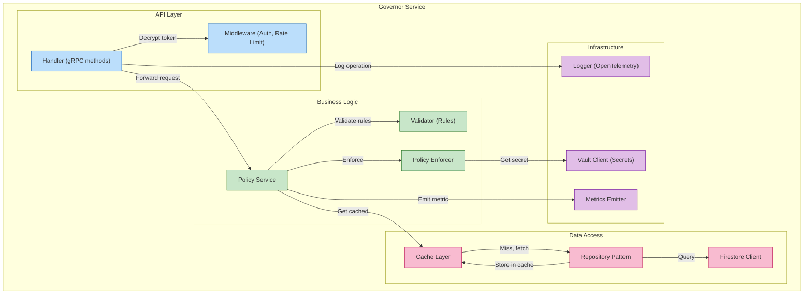

# C4 Level 3: Component Diagram

Internal structure of TAI services (using Governor as example).



## Component Details

### API Layer

#### Handler
```rust
#[tonic::async_trait]
impl Governor for GovernorService {
    async fn propose_policy(&self, request: Request<Policy>) -> Result<Response<Receipt>>;
    async fn enforce_policy(&self, request: Request<Policy>) -> Result<Response<Receipt>>;
    async fn get_policies(&self, request: Request<GetPoliciesRequest>) -> Result<Response<GetPoliciesResponse>>;
}
```

#### Middleware
- Authentication (mTLS certificate extraction)
- Rate limiting (token bucket)
- Request validation (proto validation)
- Span creation (OpenTelemetry)

### Business Logic

#### Policy Service
- Parse and validate policy
- Check authorization
- Store policy state
- Publish policy events

#### Validator
- Type checking (policy_type ∈ {finance, security, operational})
- Rule validation (SPARQL expressions)
- Constraint checking (SHACL shapes)

#### Policy Enforcer
- Apply policy rules
- Update system state
- Emit control signals
- Trigger workflows

### Data Access Layer

#### Repository Pattern
```rust
pub trait PolicyRepository {
    async fn create(&mut self, policy: Policy) -> Result<String>;
    async fn read(&self, id: &str) -> Result<Policy>;
    async fn update(&mut self, policy: Policy) -> Result<()>;
    async fn delete(&mut self, id: &str) -> Result<()>;
    async fn list(&self, filter: PolicyFilter) -> Result<Vec<Policy>>;
}
```

#### Cache Layer
- Key: `policy:{id}` → Serialized JSON
- TTL: 5 minutes
- Invalidation: Pub/Sub messages

#### Firestore Client
- Document queries with filters
- Transaction support
- Batch operations

### Infrastructure

#### Logger (Structured Logging)
```rust
#[tracing::instrument]
pub async fn propose_policy(policy: Policy) {
    tracing::info!(policy_id = %policy.id, "proposing policy");
    // Events automatically logged with context
}
```

#### Metrics Emitter
```rust
REQUEST_COUNT.inc();
REQUEST_DURATION.observe(elapsed);
POLICY_ENFORCEMENTS.inc();
```

#### Vault Client
- Fetch encryption keys
- Retrieve API credentials
- Handle token refresh

## Request Flow (Example: ProposePolicy)

```
1. Client → gRPC Handler (ProposePolicy request)
2. Handler → Middleware
   - Extract mTLS certificate (authentication)
   - Check rate limit
   - Create span (OpenTelemetry)
3. Handler → Policy Service
   - Validate policy structure
   - Call Validator
4. Policy Service → Validator
   - Check policy_type valid
   - Check rules valid SPARQL
5. Policy Service → Cache
   - Try to get related policies
6. Cache miss → Repository
   - Query Firestore
   - Return to cache
7. Repository → Firestore Client
   - Execute query
   - Return documents
8. Policy Service → Enforcer
   - Check authorization (RBAC)
   - Apply policy rules
   - Store new policy state
9. Policy Service → Metrics
   - Emit policy_enforcements counter
   - Emit latency histogram
10. Handler → Logger
    - Log operation details (structured)
11. Handler → Response
    - Return Receipt with success status
```

## Error Handling

```
gRPC Status Code
    ↓
Business Logic Exception
    ↓
Logger (error level)
    ↓
Metrics (error counter)
    ↓
Circuit Breaker (if service dependent failed)
    ↓
Response with error details
    ↓
Client retry (with exponential backoff)
```

## Key Design Patterns

1. **Layered Architecture:** Separation of concerns (API, business logic, data access)
2. **Repository Pattern:** Data access abstraction
3. **Middleware:** Cross-cutting concerns (auth, rate limiting, logging)
4. **Circuit Breaker:** Fault tolerance for downstream services
5. **Cache-Aside:** Efficiency for frequently accessed data

## Testing Strategy

- **Unit Tests:** Service/validator logic with mocks
- **Integration Tests:** Service + real Firestore (testcontainers)
- **End-to-End Tests:** Full gRPC client → handler → service chain
