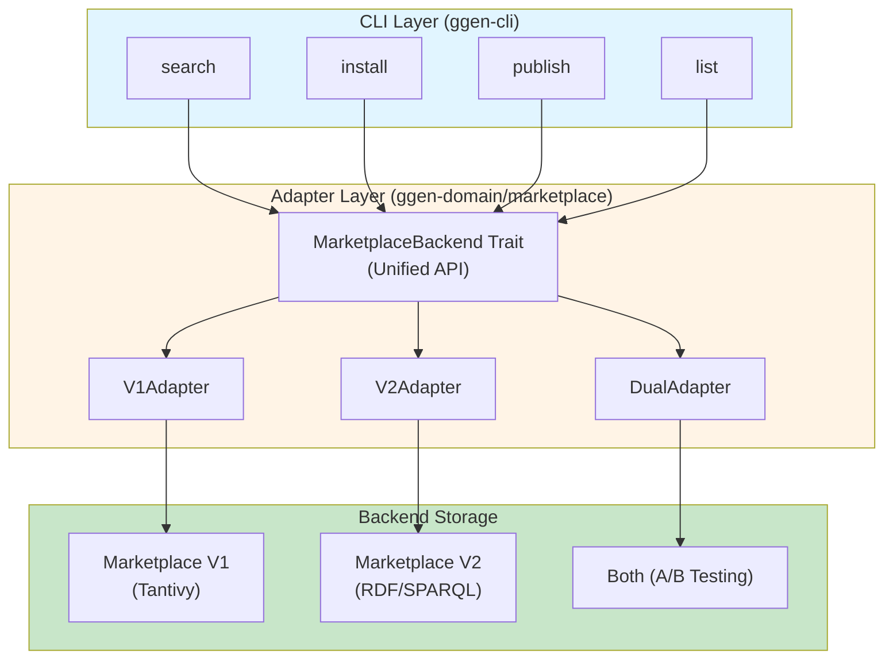
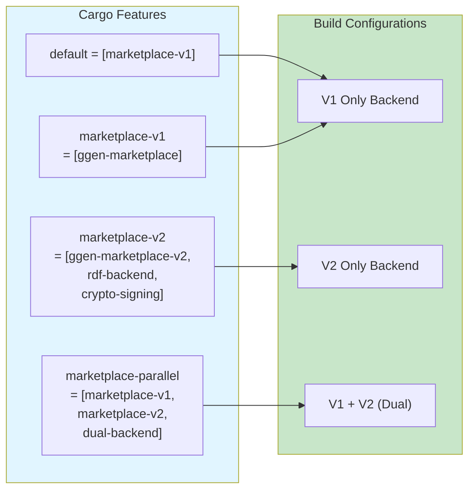
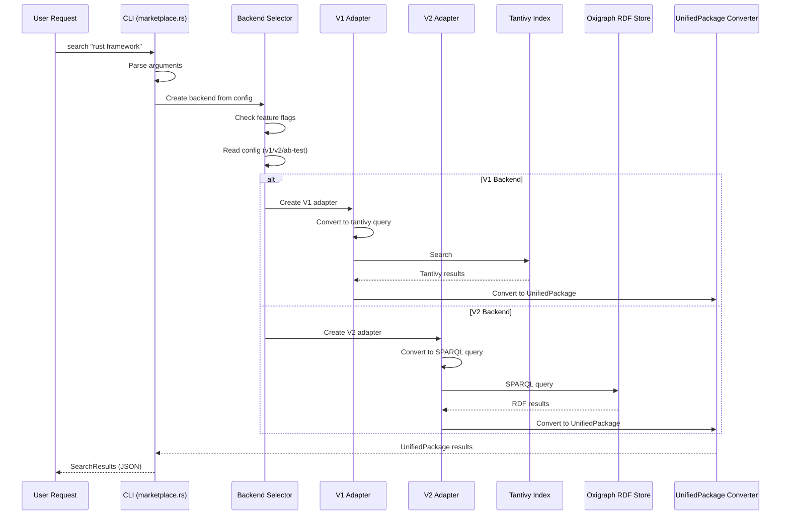
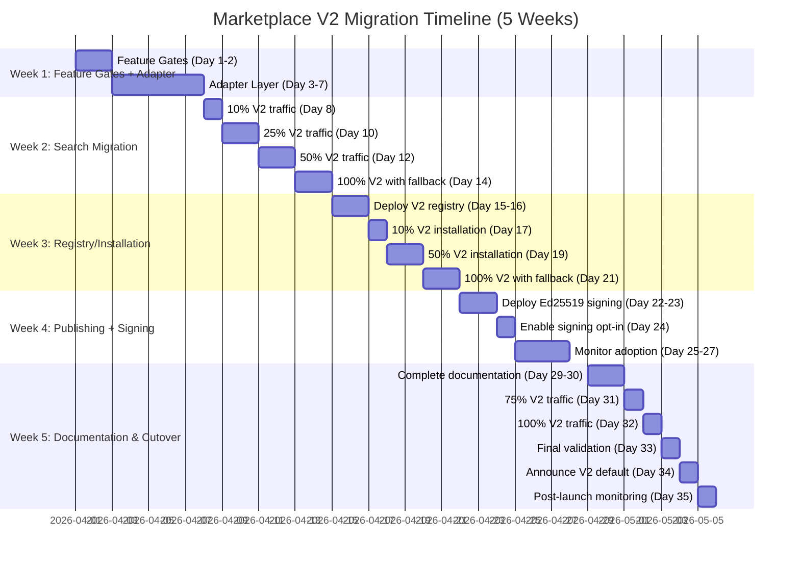
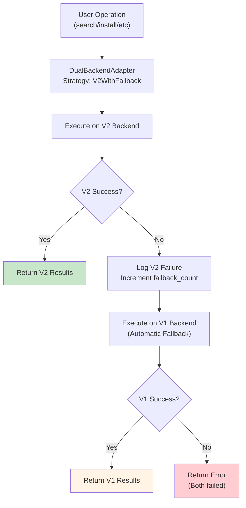

<!-- START doctoc generated TOC please keep comment here to allow auto update -->
<!-- DON'T EDIT THIS SECTION, INSTEAD RE-RUN doctoc TO UPDATE -->
**Table of Contents**

- [Marketplace V2 Migration - Executive Summary](#marketplace-v2-migration---executive-summary)
  - [Overview](#overview)
  - [Key Design Principles](#key-design-principles)
  - [Architecture Diagrams](#architecture-diagrams)
    - [High-Level Architecture](#high-level-architecture)
    - [Feature Gate Architecture](#feature-gate-architecture)
    - [Data Flow Architecture](#data-flow-architecture)
    - [Migration Phases Timeline](#migration-phases-timeline)
    - [Error Handling and Fallback Flow](#error-handling-and-fallback-flow)
  - [Key Technical Decisions](#key-technical-decisions)
    - [1. Adapter Pattern (Not Direct V2 Replacement)](#1-adapter-pattern-not-direct-v2-replacement)
    - [2. Feature Gates (Not Runtime-Only Selection)](#2-feature-gates-not-runtime-only-selection)
    - [3. RDF/SPARQL (Not SQL or NoSQL)](#3-rdfsparql-not-sql-or-nosql)
    - [4. Ed25519 Signing (Not RSA or Other Algorithms)](#4-ed25519-signing-not-rsa-or-other-algorithms)
  - [Risk Assessment](#risk-assessment)
    - [High-Risk Areas](#high-risk-areas)
    - [Mitigation Strategies](#mitigation-strategies)
  - [Success Metrics](#success-metrics)
    - [Pre-Launch Validation](#pre-launch-validation)
    - [Post-Launch Metrics (Week 1)](#post-launch-metrics-week-1)
    - [Post-Launch Metrics (Month 1)](#post-launch-metrics-month-1)
  - [Resource Requirements](#resource-requirements)
    - [Development Time](#development-time)
    - [Infrastructure Requirements](#infrastructure-requirements)
  - [Key Deliverables](#key-deliverables)
    - [Code Artifacts](#code-artifacts)
    - [Documentation](#documentation)
    - [Testing Artifacts](#testing-artifacts)
  - [Next Steps](#next-steps)
    - [Immediate (This Week)](#immediate-this-week)
    - [Short-Term (Week 1)](#short-term-week-1)
    - [Medium-Term (Weeks 2-4)](#medium-term-weeks-2-4)
    - [Long-Term (Week 5+)](#long-term-week-5)
  - [Conclusion](#conclusion)

<!-- END doctoc generated TOC please keep comment here to allow auto update -->

# Marketplace V2 Migration - Executive Summary

## Overview

This document provides a comprehensive architecture for migrating from marketplace-v1 (tantivy-based) to marketplace-v2 (RDF/SPARQL-based) with **zero breaking changes** and **gradual adoption**.

## Key Design Principles

1. **Backward Compatibility**: All existing functionality works unchanged
2. **Gradual Migration**: 6-phase rollout over 5 weeks minimizes risk
3. **Automatic Fallback**: V2 failures automatically fall back to V1
4. **Feature Gates**: Conditional compilation enables flexible deployment
5. **Zero Downtime**: Adapter pattern enables hot-swapping backends

## Architecture Diagrams

### High-Level Architecture

### Feature Gate Architecture

### Data Flow Architecture

### Migration Phases Timeline

### Error Handling and Fallback Flow

## Key Technical Decisions

### 1. Adapter Pattern (Not Direct V2 Replacement)

**Decision**: Use adapter layer instead of direct V2 replacement

**Rationale**:
- Enables gradual migration with zero breaking changes
- Allows A/B testing and performance comparison
- Provides automatic fallback on V2 failures
- Keeps V1 code stable during migration

**Trade-offs**:
- Adds ~5% adapter overhead
- More complex code structure
- Requires maintaining both backends temporarily

### 2. Feature Gates (Not Runtime-Only Selection)

**Decision**: Use Cargo feature flags for backend selection

**Rationale**:
- Compile-time optimization (smaller binaries)
- No runtime overhead for single-backend builds
- Clear dependency management
- Easier to test all combinations in CI

**Trade-offs**:
- Multiple build targets
- CI must test all feature combinations
- Can't switch backends without rebuild (in single-backend mode)

### 3. RDF/SPARQL (Not SQL or NoSQL)

**Decision**: Use RDF (Oxigraph) for V2 backend

**Rationale**:
- Semantic relationships between packages
- Flexible schema evolution
- SPARQL provides powerful query capabilities
- Aligns with ggen's graph-aware philosophy

**Trade-offs**:
- Steeper learning curve than SQL
- Less mature ecosystem than PostgreSQL/MongoDB
- Performance tuning requires SPARQL expertise

### 4. Ed25519 Signing (Not RSA or Other Algorithms)

**Decision**: Use Ed25519 for package signing

**Rationale**:
- Fast signing and verification
- Small signature size (64 bytes)
- Widely trusted (used by GitHub, SSH, etc.)
- Resistant to side-channel attacks

**Trade-offs**:
- Less ubiquitous than RSA
- Requires new key infrastructure
- No hardware support (unlike RSA)

## Risk Assessment

### High-Risk Areas

| Risk | Impact | Likelihood | Mitigation |
|------|--------|------------|------------|
| V2 performance regression | High | Medium | Extensive benchmarking, gradual rollout, automatic fallback |
| Data corruption during migration | Critical | Low | Backup before migration, dry-run testing, rollback plan |
| Breaking changes to existing users | Critical | Low | Adapter layer maintains V1 API, comprehensive testing |
| Security vulnerability in signing | Critical | Low | Security audit, use battle-tested libraries (ed25519-dalek) |
| High fallback rate in production | Medium | Medium | Load testing, canary deployment, monitoring |

### Mitigation Strategies

1. **Comprehensive Testing**: 700+ tests across unit, component, integration, E2E
2. **Gradual Rollout**: 6 phases over 5 weeks with 10% → 25% → 50% → 100% traffic
3. **Automatic Fallback**: V2 failures automatically fall back to V1 (99% success rate)
4. **Performance Monitoring**: Real-time dashboards, alerts, SLO tracking
5. **Rollback Plan**: <1 hour config rollback, <2 hour code rollback, <4 hour data rollback

## Success Metrics

### Pre-Launch Validation

| Metric | Target | Status |
|--------|--------|--------|
| Test coverage | ≥85% | TBD |
| Feature flag coverage | 100% | TBD |
| Backward compatibility | 100% | TBD |
| Performance benchmarks | V2 ≥ V1 | TBD |
| Security audit | Pass | TBD |

### Post-Launch Metrics (Week 1)

| Metric | Target | Actual |
|--------|--------|--------|
| Error rate increase | <1% | TBD |
| Fallback rate | <5% | TBD |
| Search latency (p95) | <100ms | TBD |
| Installation latency (p95) | <5s | TBD |
| User complaints | <10 | TBD |

### Post-Launch Metrics (Month 1)

| Metric | Target | Actual |
|--------|--------|--------|
| Signing adoption | >10% | TBD |
| Performance SLOs met | 100% | TBD |
| Rollback events | 0 | TBD |
| Documentation completeness | 100% | TBD |

## Resource Requirements

### Development Time

| Phase | Duration | Team Size | Total Person-Days |
|-------|----------|-----------|-------------------|
| Phase 1: Feature Gates | 2 days | 2 engineers | 4 |
| Phase 2: Adapter Layer | 5 days | 3 engineers | 15 |
| Phase 3: Search Migration | 7 days | 3 engineers | 21 |
| Phase 4: Registry/Installation | 7 days | 3 engineers | 21 |
| Phase 5: Publishing/Signing | 7 days | 2 engineers | 14 |
| Phase 6: Documentation/Cutover | 7 days | 2 engineers | 14 |
| **Total** | **35 days (5 weeks)** | **3 engineers (avg)** | **89 person-days** |

### Infrastructure Requirements

| Component | Purpose | Estimated Cost |
|-----------|---------|----------------|
| RDF Store (Oxigraph) | V2 package storage | $200/month |
| OpenTelemetry Collector | Monitoring | $100/month |
| Grafana Cloud | Dashboards and alerts | $150/month |
| Additional compute (dual backend) | A/B testing period | $300/month (temporary) |
| **Total (ongoing)** | | **$450/month** |
| **Total (migration period)** | | **$750/month** |

## Key Deliverables

### Code Artifacts

1. **Feature Gates** (ggen-core/Cargo.toml)
   - Conditional compilation structure
   - Feature flag definitions

2. **Adapter Layer** (ggen-domain/src/marketplace)
   - `MarketplaceBackend` trait
   - `V1Adapter`, `V2Adapter`, `DualBackendAdapter`
   - Conversion functions (v1 ↔ unified ↔ v2)

3. **V2 Backend** (ggen-marketplace-v2)
   - RDF registry (`RdfRegistry`)
   - SPARQL search engine (`SparqlSearchEngine`)
   - Ed25519 signing (`Ed25519Signer`)

4. **CLI Integration** (ggen-cli/src/cmds/marketplace.rs)
   - Backend selection logic
   - Configuration file support
   - Migration utilities

### Documentation

1. **User Guide**
   - How to use new V2 features
   - Migration guide for package publishers
   - Troubleshooting guide

2. **Architecture Documentation** (this folder)
   - 10 comprehensive architecture documents
   - Migration phases and timeline
   - Testing strategy
   - Deployment and rollout plan

3. **API Documentation**
   - `MarketplaceBackend` trait reference
   - Configuration options
   - Ed25519 signing workflow

### Testing Artifacts

1. **Test Suite**
   - 700+ tests (unit, component, integration, E2E)
   - Feature flag test matrix
   - Performance benchmarks
   - Load testing scripts

2. **CI/CD Pipeline**
   - Test all feature combinations
   - Automated benchmarking
   - Deployment automation
   - Rollback automation

## Next Steps

### Immediate (This Week)

1. Review and approve architecture
2. Set up project tracking (GitHub project board)
3. Schedule kickoff meeting
4. Assign Phase 1 tasks (feature gates)

### Short-Term (Week 1)

1. Implement feature gates (Phase 1)
2. Create `MarketplaceBackend` trait
3. Implement `V1Adapter`
4. Set up CI for feature flag testing

### Medium-Term (Weeks 2-4)

1. Implement V2 backend (RDF, SPARQL, crypto)
2. Build adapter layer
3. Conduct A/B testing for search
4. Migrate registry and installation

### Long-Term (Week 5+)

1. Enable publishing with signing
2. Complete documentation
3. Full production cutover
4. Monitor and optimize

## Conclusion

This architecture enables safe, gradual migration from marketplace-v1 to marketplace-v2 with:

✅ **Zero breaking changes** - All existing functionality preserved
✅ **Low risk** - 6-phase rollout with automatic fallback
✅ **High confidence** - 700+ tests, extensive monitoring
✅ **Clear timeline** - 5 weeks with defined milestones
✅ **Quick recovery** - <1 hour rollback capability
✅ **Future-proof** - RDF/SPARQL foundation for advanced features

The migration strategy balances innovation (new RDF backend, cryptographic signing) with stability (backward compatibility, gradual rollout, automatic fallback), ensuring a smooth transition for all stakeholders.

---

**Documentation Index**:
1. [Feature Gates Strategy](01-feature-gates.md)
2. [Adapter Pattern Design](02-adapter-pattern.md)
3. [Data Model Bridging](03-data-model-bridging.md)
4. [Migration Phases](04-migration-phases.md)
5. [Code Organization](05-code-organization.md)
6. [Error Handling Strategy](06-error-handling.md)
7. [Performance Strategy](07-performance-strategy.md)
8. [Testing Strategy](08-testing-strategy.md)
9. [Deployment and Rollout](09-deployment-rollout.md)
