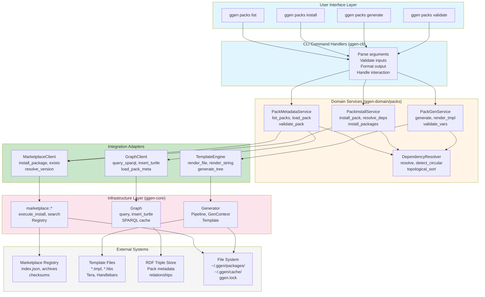
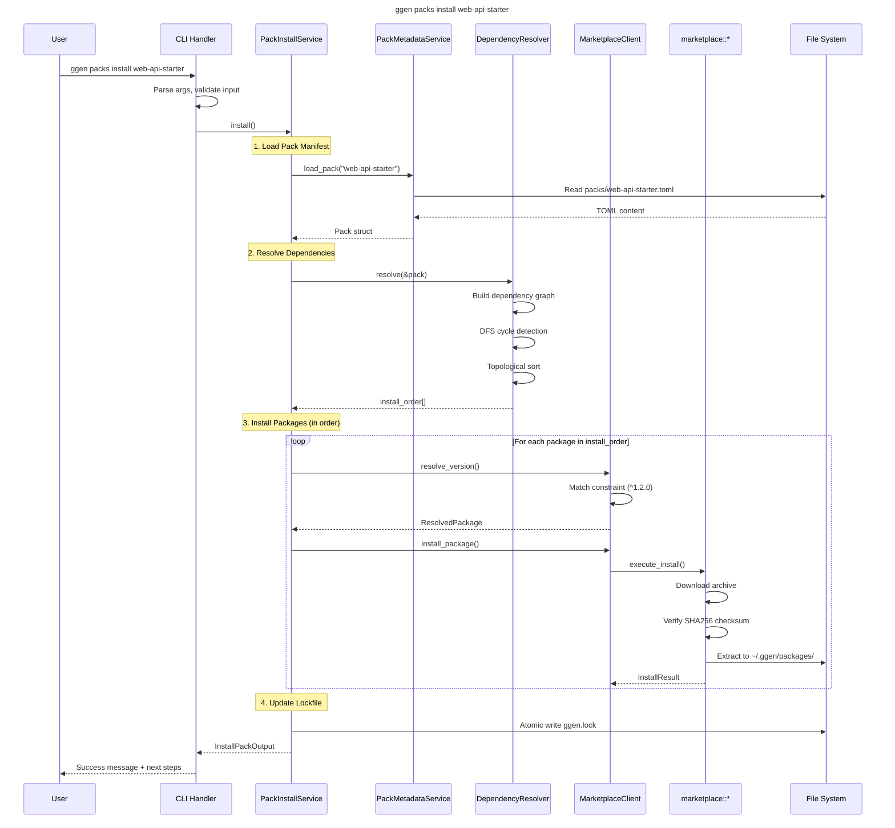
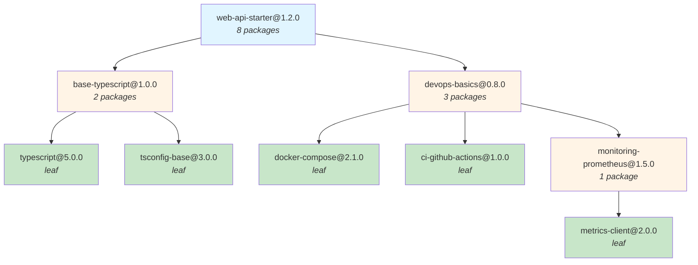
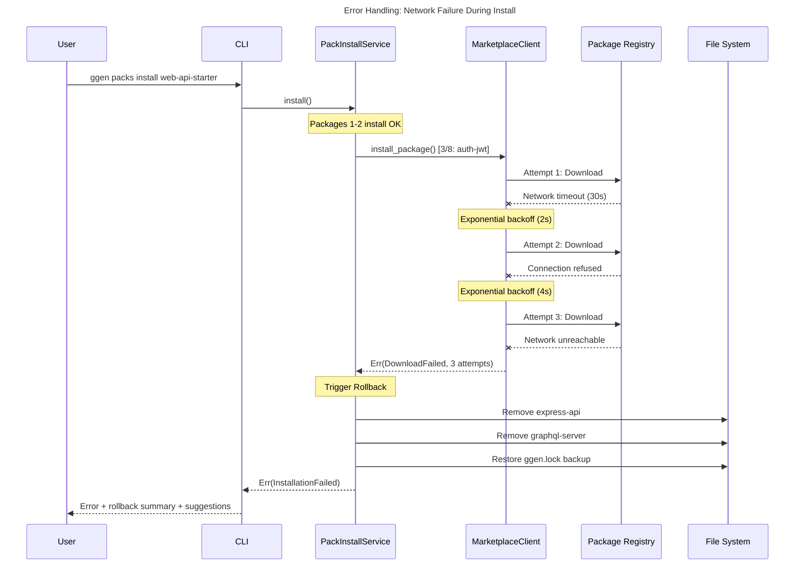
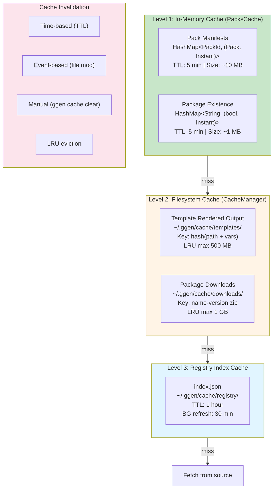

<!-- START doctoc generated TOC please keep comment here to allow auto update -->
<!-- DON'T EDIT THIS SECTION, INSTEAD RE-RUN doctoc TO UPDATE -->
**Table of Contents**

- [Packs System Architecture Diagram](#packs-system-architecture-diagram)
  - [High-Level System Architecture](#high-level-system-architecture)
  - [Data Flow: Install Pack Workflow](#data-flow-install-pack-workflow)
  - [Data Flow: Generate Project Workflow](#data-flow-generate-project-workflow)
  - [Dependency Graph Example](#dependency-graph-example)
  - [Error Handling Flow](#error-handling-flow)
  - [Caching Strategy](#caching-strategy)

<!-- END doctoc generated TOC please keep comment here to allow auto update -->

# Packs System Architecture Diagram

**Version:** 3.2.0
**Last Updated:** 2025-01-15

## High-Level System Architecture



## Data Flow: Install Pack Workflow



## Data Flow: Generate Project Workflow

```
User: ggen packs generate web-api-starter my-api --var author="Jane"
  │
  ├──> CLI Handler (ggen-crates/ggen-cli/src/cmds/packs.rs)
  │    └──> Parse args, validate input
  │
  ├──> PackGenerationService::generate()
  │    │
  │    ├──> 1. Load Pack Manifest
  │    │    └──> PackMetadataService::load_pack("web-api-starter")
  │    │         └──> Pack { templates: [...] }
  │    │
  │    ├──> 2. Resolve Variables
  │    │    ├──> User-provided: { author: "Jane" }
  │    │    ├──> Auto-detected: { project_name: "my-api", timestamp: "2025-01-15..." }
  │    │    ├──> Template defaults: { license: "MIT", port: "3000" }
  │    │    │
  │    │    └──> variables = {
  │    │         project_name: "my-api",
  │    │         author: "Jane",
  │    │         timestamp: "2025-01-15T10:30:00Z",
  │    │         license: "MIT",
  │    │         port: "3000",
  │    │         database: "postgres",
  │    │         enable_graphql: "true"
  │    │       }
  │    │
  │    ├──> 3. Validate Variables
  │    │    ├──> For each template:
  │    │    │    ├──> Check required variables present
  │    │    │    ├──> Validate types (string, int, bool)
  │    │    │    ├──> Validate patterns (regex)
  │    │    │    └──> Validate constraints (ranges, enums)
  │    │    │
  │    │    └──> ✓ All variables valid
  │    │
  │    ├──> 4. Render Templates
  │    │    │
  │    │    ├──> For template in pack.templates:
  │    │    │    │
  │    │    │    ├──> TemplateEngine::render_file()
  │    │    │    │    │
  │    │    │    │    ├──> Load template file (src/server.ts.tmpl)
  │    │    │    │    │
  │    │    │    │    ├──> Generator::generate()
  │    │    │    │    │    ├──> Parse frontmatter (YAML)
  │    │    │    │    │    ├──> Apply Tera filters ({{ name | upper }})
  │    │    │    │    │    ├──> Substitute variables
  │    │    │    │    │    └──> Return rendered content
  │    │    │    │    │
  │    │    │    │    └──> Rendered: "const PORT = 3000;\n..."
  │    │    │    │
  │    │    │    ├──> Render output path (may have variables)
  │    │    │    │    └──> "src/{{ project_name }}/server.ts"
  │    │    │    │         -> "src/my-api/server.ts"
  │    │    │    │
  │    │    │    ├──> Create output directory
  │    │    │    │    └──> mkdir -p ./my-api/src/my-api
  │    │    │    │
  │    │    │    ├──> Write file
  │    │    │    │    └──> ./my-api/src/my-api/server.ts (324 bytes)
  │    │    │    │
  │    │    │    ├──> Set permissions (if specified)
  │    │    │    │    └──> chmod 0644 server.ts
  │    │    │    │
  │    │    │    └──> ✓ server.ts rendered
  │    │    │
  │    │    └──> [Repeat for all 12 templates]
  │    │         └──> ✓ 12 files created (11.2 KB total)
  │    │
  │    ├──> 5. Run Post-Generation Hooks (optional)
  │    │    ├──> Execute pack.hooks.post_generate[]
  │    │    │    └──> "npm install" (if specified)
  │    │    │
  │    │    └──> ✓ Hooks completed
  │    │
  │    └──> Return GenerateOutput {
  │         pack_id: "web-api-starter",
  │         project_name: "my-api",
  │         files_created: 12,
  │         output_path: "./my-api",
  │         generation_time: 2.3s
  │       }
  │
  └──> CLI: Display success message + next steps
```

## Dependency Graph Example



**Topological Sort (install order):**
| Level | Packages | Parallel |
|-------|----------|----------|
| 0 | typescript, tsconfig-base, docker-compose, ci-github-actions | 4 parallel |
| 1 | metrics-client, monitoring-prometheus | 2 parallel |
| 2 | base-typescript, devops-basics | 2 parallel |
| 3 | web-api-starter | 1 (final) |

## Error Handling Flow



## Caching Strategy



**Cache Hit Flow:**
1. Check in-memory cache (fastest)
2. If miss, check filesystem cache
3. If miss, fetch from source + populate caches
4. Return result

---

**Related Documents:**
- [Architecture Overview](01_ARCHITECTURE_OVERVIEW.md)
- [Command Specification](02_COMMAND_SPECIFICATION.md)
- [Data Model](03_DATA_MODEL.md)
- [Integration Layer](04_INTEGRATION_LAYER.md)
- [User Workflows](05_USER_WORKFLOWS.md)
- [Implementation Guide](06_IMPLEMENTATION_GUIDE.md)
