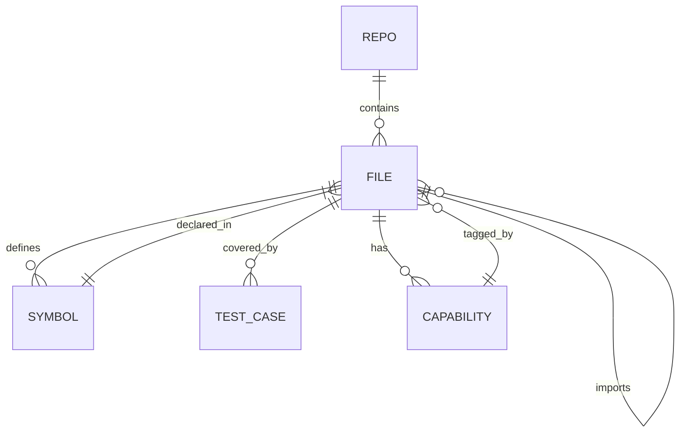
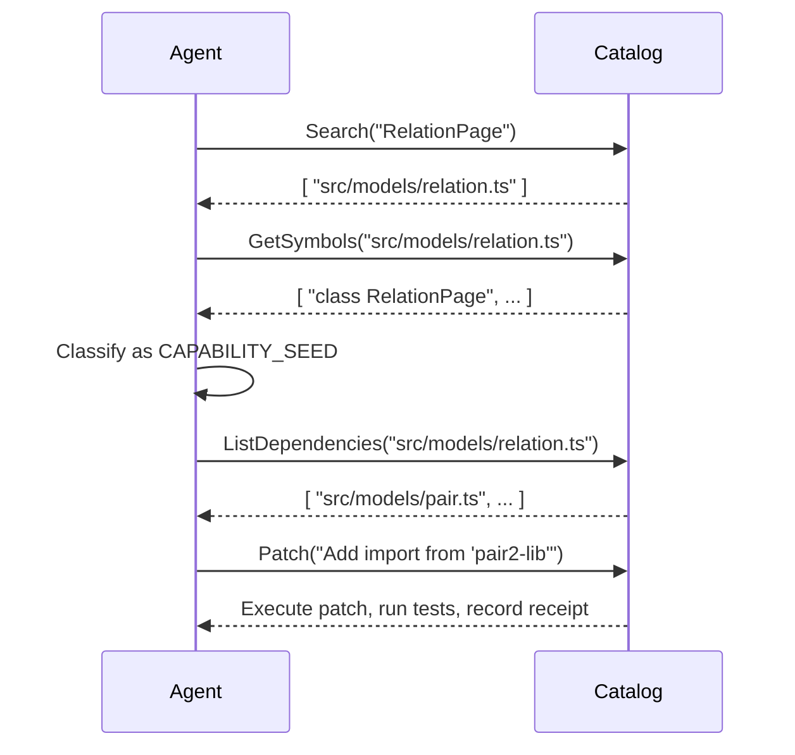
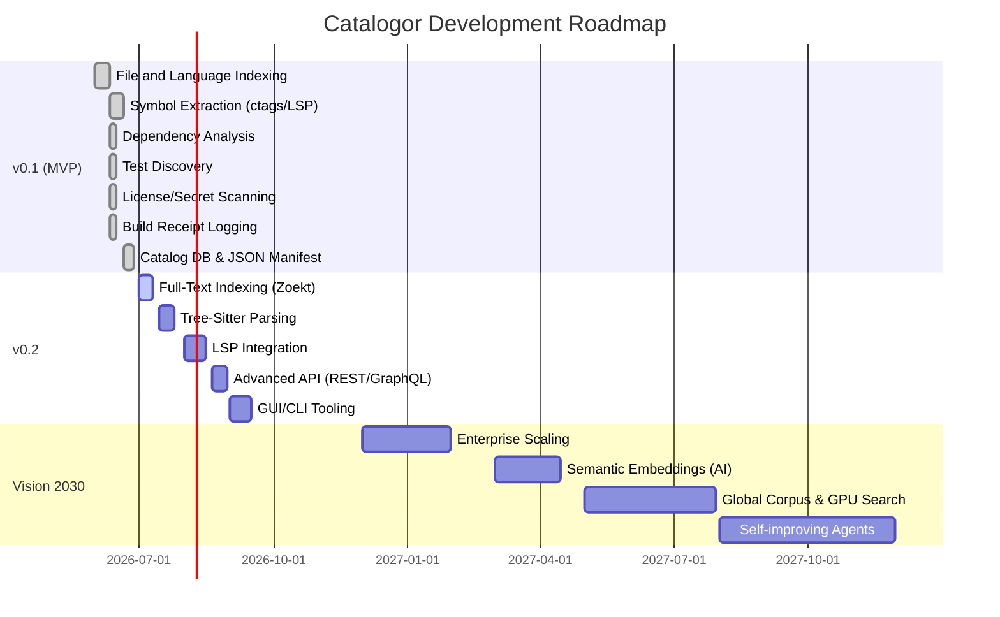

<!-- START doctoc generated TOC please keep comment here to allow auto update -->
<!-- DON'T EDIT THIS SECTION, INSTEAD RE-RUN doctoc TO UPDATE -->
**Table of Contents**

- [Executive Summary: Open-Source Tools for Code Catalogs](#executive-summary-open-source-tools-for-code-catalogs)
  - [1. Required Inputs & Initial Scan](#1-required-inputs--initial-scan)
  - [2. Symbol & API Extraction](#2-symbol--api-extraction)
  - [3. Dependency & Call Graph Extraction](#3-dependency--call-graph-extraction)
  - [4. Test and Example Discovery](#4-test-and-example-discovery)
  - [5. License & Provenance Scanning](#5-license--provenance-scanning)
  - [6. Binary and WASM Inspection](#6-binary-and-wasm-inspection)
  - [7. Agent-Friendly Outputs](#7-agent-friendly-outputs)
  - [8. Tool Comparison](#8-tool-comparison)
  - [9. JSON Schema (Manifest and File Record)](#9-json-schema-manifest-and-file-record)
  - [10. Implementation Plan (v0.1)](#10-implementation-plan-v01)
  - [11. Agent Prompts & Templates](#11-agent-prompts--templates)
  - [12. Validation & Metrics](#12-validation--metrics)
  - [13. Security & Privacy](#13-security--privacy)
  - [14. ggen/Genesis/AtomVM/WASM Integration](#14-ggengenesisatomvmwasm-integration)
  - [15. Mermaid Diagrams](#15-mermaid-diagrams)
    - [Architecture Flow](#architecture-flow)
    - [Data Model (ER Diagram)](#data-model-er-diagram)
    - [Agent Workflow](#agent-workflow)
    - [Timeline (Milestones)](#timeline-milestones)
  - [Sources](#sources)

<!-- END doctoc generated TOC please keep comment here to allow auto update -->

# Executive Summary: Open-Source Tools for Code Catalogs

*Note: This document provides the architectural blueprint for building an AI-agent-friendly code cataloger. It heavily informs the 'RESEARCH' and 'RECEIPT' phases of the Genesis Machine-to-Machine (M2M) Closure Protocol.*

We review open-source tools and workflows for building a **code catalog** that lets AI agents fully inspect and reason about a codebase. Modern code search and analysis systems (e.g. Sourcegraph, GitHub Code Search) combine full-text indexing (often via **inverted indexes**), syntactic analysis (ctags or parsers), and semantic embeddings. A practical catalogor would ingest repository roots, language mix, build outputs, and package files; extract symbols/exports via ctags/LSP/tree-sitter; build dependency and (approximate) call graphs; discover tests and examples; scan for licenses and secrets; inspect binaries/WASM (via WABT, radare2, etc.); and emit **receipt logs** to prove what was analyzed. All results (file lists, symbol tables, dependencies, test mappings, build commands, etc.) would be exposed in agent-friendly formats (JSON/NDJSON, SQLite or DuckDB tables, Parquet columns, vector DB for embeddings, RDF/SPARQL, etc.) accessible via REST/gRPC, FUSE, or language-server–style APIs. This report (1) compares key tools (language coverage, symbol extraction, license, runtime, index type, output) in a summary table; (2) proposes a JSON schema for a repo manifest and file records with capabilities; (3) sketches a step-by-step implementation plan for a minimal v0.1 catalogor (with commands, outputs, verification); (4) provides example LLM agent prompts/templates for searching, extracting, classifying, patching, and verifying code via the catalog (including evidence rules and the Non-Deletion taxonomy); (5) lists validation tests/metrics (symbol recall, false-positive rates, test coverage, build reproducibility, receipt completeness); (6) addresses security/privacy (secret scanning, access controls, sandboxing, tamper-evident provenance); (7) notes integration with **ggen/Genesis/AtomVM/WASM** parts (detecting patterns like *RelationPage*, *Pair2*, *Construct8* in code); (8) proposes mermaid diagrams for architecture flow, ER model, agent workflow, and timeline; (9) outlines prioritized milestones for v0.1, v0.2, and Vision 2030 (with rough person-day estimates); and (10) cites key sources (primary tool docs, academic papers, blog posts). Unspecified details (OS, repo size, languages) are treated as variables in our plan. 

**Key insights:** Tools like Universal Ctags, LSP servers (e.g. rust-analyzer, gopls), tree-sitter, Zoekt/grep.app/ripgrep/Livegrep, and semantic models (code2vec, CodeBERT, GraphCodeBERT) play complementary roles. For large-scale code search, trigram indexes or n-gram inverted indexes are effective (e.g. Zoekt’s trigram index, GitHub’s Blackbird uses Kafka-based ingestion and per-shard n-gram indices). License scanning (ScanCode, FOSSology, ORT) can generate SPDX/CycloneDX outputs. Provenance must be captured cryptographically (e.g. signed receipts) to ensure no code or metadata is removed or altered. 

Below we elaborate each aspect with structured sections, tables, and references.

---

## 1. Required Inputs & Initial Scan

A catalogor needs to discover *all* code artifacts and relevant metadata. Inputs include:

- **Repository roots:** paths or URLs of code repositories (Git, etc.), including all branches or main branches.
- **Language mix:** the set of programming languages and data formats (Rust, Go, Python, JS/TS, Java, C/C++, Erlang/BEAM, WASM, plus manifest formats like TOML/JSON/YAML).
- **Build systems & CI artifacts:** build scripts (Makefiles, Cargo.toml, go.mod, setup.py, etc.), CI configs (GitHub Actions, GitLab CI), container images.
- **Binary artifacts:** compiled executables, libraries (ELF, Mach-O, PE) and WebAssembly binaries.
- **Containers/SBOMs:** container images or SBOMs (CycloneDX, SPDX) from tools like Syft/Grype.
- **Package manifests:** dependency files (package.json, go.mod, requirements.txt, mix.exs, pom.xml, etc.).
- **Documentation & schemas:** API docs, config files, SQL schemas.

The first step is to **scan the directory tree** to index all files by language (using file extensions and shebangs). For example, using a command like `find . -type f` and mapping extensions:
```bash
find . -type f \( -name "*.rs" -o -name "*.erl" -o -name "*.wasm" -o -name "*.ts" -o \) > filelist.txt
```
This yields a **File & Language index**. Tools like [`enry`](https://github.com/src-d/enry) or [Linguist](https://github.com/github/linguist) can auto-detect languages. We record for each file: path, size, language.

A manifest entry might look like:
```json
{
  "path": "src/lib.rs",
  "language": "Rust",
  "sizeBytes": 1624
}
```
This becomes part of the per-repo manifest.

## 2. Symbol & API Extraction

For each source file/module, extract **symbols, definitions, and public APIs**. Options include:

- **Universal Ctags**: a widely-used parser that supports many languages. It generates a **tags file** listing definitions (functions, classes, constants) and their locations. It is fast (CLI, Rust/C) and open-source (BSD/MIT).  
- **Language-specific analyzers/LSPs**: e.g. `rust-analyzer` or `rls` for Rust (via RLS, external), `typescript-language-server`, `jedi` or `pyls` for Python, `Eclipse JDT`, `clangd` for C/C++. These can list symbols, types, documentation, etc. Many LSPs also support the `textDocument/documentSymbol` request.  
- **Tree-sitter**: a generic parser that builds concrete syntax trees for many languages. By loading an appropriate grammar, one can query AST nodes (classes, functions, imports, calls). This is slower to set up but gives precise parse trees for every language.  
- **SourceGraph/Zoekt**: these projects parse code (Zoekt can also integrate ctags info) and build text indexes, but they rely on existing symbol extraction tools (Zoekt recommends Universal Ctags for symbol info).  
- **Static analysis tools**: For languages with no good LSP, use static analyzers (e.g. `doxygen` for C/C++, which can list classes and methods, or [pyan](https://github.com/davidfraser/pyan) for Python call graphs).  
- **AST/regex search**: Simple scripts (Ripgrep, grep.app) or parsers (Python AST module, Babel for JS) can find definitions by patterns (e.g. regex `^def ` in Python, or `function ` in JS).  

The output is per-file symbol tables:
```json
{
  "file": "src/service.js",
  "symbols": [
    { "name": "queryData", "kind": "function", "line": 10, "exported": true },
    { "name": "ServiceError", "kind": "class", "line": 45, "exported": true }
  ],
  "dependsOn": ["lib/utils.js", "node_modules/graphql/index.js"]
}
```
**Symbol Extraction by Language** (examples):  
- **Rust:** `rust-analyzer` or `rustdoc --output-format json` can list functions/types; `cargo tree` for dependencies. Universal ctags covers Rust (in beta).  
- **Erlang/BEAM:** `erl_interface` or `rebar3 edoc` for functions; [erl_ls](https://github.com/erlang-ls/erlang_ls) LSP for symbols.  
- **WebAssembly:** Use [WABT’s wasm-objdump](https://github.com/WebAssembly/wabt) to list functions/imports in a `.wasm`. The [wasm-language-server](https://github.com/WebAssembly/wasm-language-server) can provide static analysis and symbol info for WAT.  
- **JavaScript/TypeScript:** `tsc --noEmit --listFiles` or LSP (`typescript-language-server`) yields AST; `jsdoc` can extract typed APIs.  
- **Python:** `jedi`, `pylint`, or simply `grep "^def "`; `pyan` for callgraph.  
- **Java:** `javadoc` or `jdeps`; Eclipse JDT (via `cdt-parser`) for AST.  
- **Go:** `go list -json` outputs imports; `gopls` (Go LSP) or `godoc -json` for API.  
- **C/C++:** `ctags`, `cscope`, or Clang tools (`clang -Xclang -ast-dump`). Doxygen’s XML backend can list entities.  
- **Manifests (TOML/JSON/YAML):** parse with JSON/TOML libs. Identify language versions, dependency lists (`package.json.dependencies`, `Cargo.toml` crates, `go.mod`, etc.). Record each dependency with version.  

All symbols and APIs are recorded in the manifest per file. Cross-file references (import, require, use, include) are also noted, to build a dependency graph.

## 3. Dependency & Call Graph Extraction

**Dependency graphs:** Use each language’s ecosystem tools: e.g. `cargo tree` (Rust), `go mod graph`, `npm ls` or parsing `package.json`, `pipdeptree`, `lein deps`, `mvn dependency:tree`. These produce directed graphs of module/package dependencies. Incorporate these into the catalog (edges from modules to the libraries they depend on).

**Call graphs/data flow:** Creating precise call graphs is hard (undecidable statically), but over-approximations help. Tools include:  
- **C/C++:** GNU `cflow` or `codeviz` for static call graphs.  
- **Go:** `go-callvis` (uses `go build` info) or callgraph packages in `golang.org/x/tools`.  
- **Python:** `pyan` builds a static call graph, and dynamic profilers (cProfile + gprof2dot).  
- **Java:** Doxygen (call graphs via Graphviz), [ProGuard](https://proguard.sourceforge.net/) (call graph), or SonarQube.  
- **Multi-language:** `callGraph` supports many languages via syntax patterns.  
- **Dynamic analysis:** Instrumentation or mocking frameworks could be used to record actual calls at runtime. 

The catalog should include *approximate* call edges (function→function). Even a coarse call graph can help agents trace data flow. We record call edges as part of the manifest or as a separate graph structure.

## 4. Test and Example Discovery

Identify all **test files and runnable examples**. By convention: e.g. `tests/`, `*_test.py`, `*.spec.ts`, or CI scripts. Map each test file to code under test (e.g. using import paths or known naming). Tools like [`pytest --collect-only`](https://docs.pytest.org/) can list tests. For languages with test frameworks (JUnit, Go’s `go test`, Rust’s `cargo test`), use those commands to enumerate tests and create a “test-to-file” map.

Record in manifest:
```json
"tests": [
  { "file": "tests/api_test.rs", "tests": ["test_get_user", "test_post_data"] }
]
```
This helps agents navigate code functionality.

## 5. License & Provenance Scanning

Scan for **licenses** and **third-party code** in source and binaries. Key tools: 
- **ScanCode Toolkit**: an open-source scanner for licenses, copyright, and package manifests. It inspects every file (source, docs, binaries), matches license text, and outputs JSON/SPDX/CycloneDX. For example, ScanCode can detect an MIT header buried in a file, or combine multiple licenses. Its outputs (SPDX JSON) become part of our catalog. 
- **FOSSology**: Linux Foundation tool (GPL v2) for license analysis with a web UI.  
- **OSS Review Toolkit (ORT)**: orchestrates scanners (ScanCode, SPDX tools) and aggregates SBOMs.  
- **package manager manifest parsing**: Many licenses are declared in `package.json`, `pom.xml`, etc. Capture these.  
- **Secrets scanning**: Tools like GitHub’s `truffleHog`, `Gitleaks`, or open-source static analyzers (Semgrep) can find high-entropy keys. Flag them in manifest (but exclude real secrets in the public catalog).  

For **provenance receipts**, record every build or analysis step with a cryptographic hash/timestamp: for example, each `cargo build`, `npm install`, `ctags --fields`, etc., writing its log and SHA256 digest. See JFrog’s discussion: “cryptographic signatures confirm that artifacts haven’t been altered”.  We should collect SBOMs (e.g. CycloneDX format), build logs, and sign them so agents can verify no code or data was dropped (Non-Deletion Protocol).  

## 6. Binary and WASM Inspection

For compiled artifacts (binaries, shared libraries, WASM, container images):  
- **ELF/PE/Mach-O**: use `objdump -t`, `readelf`, or `nm` to list symbols; `radare2`, `Ghidra`, or `ghidra/grok-parser` for deeper analysis.  
- **WASM**: use [WABT’s `wasm-objdump`](https://github.com/WebAssembly/wabt) to disassemble and list imports/exports. `wasm2wat` makes text which can be parsed; the [WASM language server](https://github.com/WebAssembly/wasm-language-server) provides static analysis (type checking, call hierarchy) for WASM text and can integrate with LSP tools.  
- **Container images**: tools like [Syft](https://github.com/anchore/syft) can scan Docker/OCI images for files and produce SBOMs. We can mount (FUSE) the image layers and run `file`/`ctags` on embedded code.  
- **Checksum matching**: store content hashes so binary provenance can be traced back to source (matching through build recipes).  

Record binary symbol tables (functions, sections) and link them to source symbols if possible. Store container image digests and layer metadata in the catalog.

## 7. Agent-Friendly Outputs

All collected information must be served in formats easily consumed by AI agents:

- **JSON/NDJSON manifests:** A per-repo JSON manifest (or NDJSON log) capturing all metadata: file entries with language, size, hash, capabilities; symbol lists; import/dependency edges; test mappings; license notes; build commands; receipts. NDJSON is convenient for streaming incremental updates.  
- **Symbol tables and exports:** As JSON, or as [Language Server Protocol](https://microsoft.github.io/language-server-protocol/)–style symbol lists. Could also populate an SQLite table (`symbols(name, kind, file, line)`).  
- **Dependency edges:** As a graph structure (e.g. JSON edge list, or a SPARQL RDF store). Agents could query “which modules depend on X”.  
- **Capability tags:** For each file, annotate its *capabilities* (e.g. “UI layer”, “data-access”, “math-logic”, or ggen-specific roles like “RelationPage generator” or “Pair2 serializer”). These tags can be produced by static analysis or patterns. See Section 7 for Pair2/RelationPage.  
- **Build/run scripts:** List detected build commands (`make`, `cargo build`, `python setup.py`), test commands, and run scripts (like `docker run`, `npm start`) in the manifest. Include the success/failure and exit codes in receipts.  
- **Receipts:** Tamper-evident logs of analysis (hashes of input files, tool versions, output hashes). Possibly store as [COSE signatures](https://en.wikipedia.org/wiki/COSE) or simple signed JSON.  

**File formats:**  
- **JSON/NDJSON:** good for configuration, small catalogs, agent I/O.  
- **SQLite:** A single-file relational DB storing tables (files, symbols, deps, tests) with SQL query access. Agents can open it directly.  
- **Parquet:** For large-scale indexing (columnar analytics), e.g. storing all symbols or index vectors. Parquet is columnar, compressed (2–5x smaller than JSON), and excels at big-data OLAP queries.  
- **Vector DB:** For semantic search, embedding vectors from CodeBERT/code2vec, use a vector database (Weaviate, Milvus, Qdrant).  
- **RDF/SPARQL:** Using QLever (an open-source RDF store) to store code graph as triples. For example, (`:FileX :definesSymbol :Foo`), enabling SPARQL queries like “which files define a function foo?”. QLever can even do text search and supports federated queries.  
- **REST/gRPC APIs:** A lightweight catalogor service (in Go/Python) exposing endpoints (or gRPC) for agents: e.g. `GET /search?query=...`, `POST /syntax-check`, `GET /file/<path>/symbols`. Agents can call these during reasoning.  

**Indexing strategies:**  
- **Inverted index:** As used by OpenGrok and Elasticsearch, mapping each token/ngram to a posting list of files. Zoekt builds a trigram inverted index for code (it intersects trigram postings for regex search).  
- **Symbol index:** index by identifier names: e.g. keys are symbol names, values list definitions/occurrences. Could use a trie or prefix tree.  
- **AST index:** index AST nodes or patterns (structs, function signatures) via tree-sitter.  
- **Embedding-based index:** Represent code elements (functions, blocks) as vectors using CodeBERT or code2vec. Use a vector DB or approximate neighbor search to allow semantic queries (“find similar function in code”).  
- **Combined indices:** Many systems hybridize; e.g. Sourcegraph uses trigram + symbol signals (via Ctags).  

Storage options depend on scale. For a single repo, JSON/SQLite suffices. For enterprise scale, one might run ElasticSearch/OpenSearch or Sourcegraph’s multi-tenant architecture. We prioritize open source: e.g. Elastic (Apache 2.0) or OpenSearch for full-text, QLever for RDF, DuckDB for analytics. 

## 8. Tool Comparison

| Tool               | Languages (coverage)     | Symbol Extraction | License     | Runtime     | Index Type         | Ease of Deployment | Output Formats    | Use Case                        |
|--------------------|--------------------------|-------------------|-------------|-------------|--------------------|--------------------|-------------------|---------------------------------|
| **Universal Ctags**    | C/C++, Java, Python, JS, Rust, Go, Erlang, ... (100+ langs) | definitions only (tags) | BSD/MIT      | CLI (C)     | tag file (flat)    | Very easy (apt/Python/pkgs) | `tags` text, JSON (with `-J`) | Symbol list for many languages |
| **Ripgrep (rg)**      | All (text-based)       | *None* (full-text search) | MIT/Unlic.  | CLI (Rust)  | N/A (scans on demand) | Very easy (binary) | line matches | Fast regex/code search (single-repo) |
| **Livegrep**          | C/C++, Java, Python, JS, Ruby, ... | Uses external analyzers | Apache 2.0  | Go/C++      | Inverted (trie on disk) | Moderate (Go build + SQLite) | web UI, CLI | Code search (large corpora) |
| **Sourcegraph**       | All languages (with plugins) | LSP, regex, graph | Apache 2.0  | Kubernetes/web (Go/TS) | Zoekt (trigram) + LSP index | Complex (Docker/k8s) | REST API, LSIF (JSON) | Enterprise code search & intelligence |
| **Zoekt**             | Many (trigram parser)  | Integrates ctags symbols | Apache 2.0  | Go (CLI/Server) | Trigram inverted    | Easy (Go binary/Docker) | JSON (from API), streaming | Fast full-text regex search across repos |
| **grep.app API**      | Code on GitHub (public) | None (text search) | Proprietary (Vercel) | Cloud (Rust/Go) | Inverted/hosted     | SaaS (API key)   | JSON (via API)    | Search public GitHub (via REST) |
| **Tree-sitter**       | ~40 common langs (C/JS/Rust/etc) | Full parse trees  | MIT         | C library (bindings) | AST parse (no index) | Build-per-language | SST (S-expression) or JSON AST | Precise parsing for any language |
| **LSP servers**       | Per-language (see e.g. rust-analyzer, gopls, pyls) | AST/symbols via RPC | Varies (MIT/BSD/GPL) | Language (Go/Rust/Python) | None (live) | Requires editor/host | JSON-RPC (LSP)   | Interactive IDE-like analysis |
| **CodeQL**            | C/Cpp, Java, JS, Go, Python,... (queries) | AST+CFG (queryable DB) | MIT (GitHub CodeQL core) | CLI (Java) | LSP-based code DB   | Moderate (engine build) | SARIF, CSV, DB  | Semantic code queries & security patterns |
| **ScanCode Toolkit**  | All (license scanning) | N/A (text scanning) | Apache 2.0  | Python CLI  | None (records found texts) | Moderate (pip/conda) | JSON, SPDX, YAML | License & copyright scanning |
| **cflow (GNU)**       | C only                | Call graph (text)  | GPLv3       | CLI         | None (edge list)    | Easy (package)    | Text, DOT         | C call-graph generation |
| **Analizo**           | C (metrics)          | Dependency graph   | GPLv2       | Java        | None               | Jar-based         | HTML, TXT        | Metrics & dependency analysis |
| **go-callvis**        | Go only              | Call graph (Graphviz) | MIT      | Go         | None               | Easy (go install) | DOT (Graphviz)   | Visual Go call graph generation |
| **pyan**              | Python only          | Call graph (static) | MIT        | Python     | None               | Easy (pip)        | DOT (Graphviz)   | Python static call graph generator |
| **code2vec/CodeBERT** | Many (Python, Java, JS, C#,...) | Semantic embeddings | Apache 2.0  | Python/TensorFlow | Vector (embedding) | Complex (ML model) | N/A (vectors)    | ML models for code embeddings |
| **QLever**            | RDF/SPARQL triples   | SPARQL query engine | Apache 2.0 | C++/Docker | In-memory RDF index | Moderate (CMake)  | SPARQL, JSON    | RDF graph DB for semantic queries |
| **DuckDB**           | Tabular data (SQL)   | SQL queries        | MIT        | C++ (embeddable) | Columnar (vectorized) | Very easy (package) | Parquet, CSV   | Analytical DB for local corpora |

*Notes:* Universal Ctags is perfect for broad symbol lists; ripgrep excels at raw text search. Tree-sitter+LSP provide deep AST info but require setup for each language. Zoekt/Sourcegraph build full-text indexes (trigram) optimized for code. ScanCode is the go-to open-source license scanner. QLever (an RDF/SPARQL engine) can handle graph queries efficiently. We prioritize tools under permissive licenses (MIT/Apache/BSD). 

## 9. JSON Schema (Manifest and File Record)

Below is a **JSON Schema** outlining the per-repo manifest and per-file record structure. This schema captures files, symbols, dependencies, tests, and capabilities in a machine-readable way. Agents can consume or validate this schema.

```json
{
  "$schema": "http://json-schema.org/draft-07/schema#",
  "title": "Code Catalog Manifest",
  "type": "object",
  "properties": {
    "repo": {
      "type": "object",
      "properties": {
        "name": { "type": "string" },
        "rootPath": { "type": "string" },
        "languages": {
          "type": "array",
          "items": { "type": "string" }
        },
        "version": { "type": "string" }
      },
      "required": ["name", "rootPath"]
    },
    "files": {
      "type": "array",
      "items": {
        "type": "object",
        "properties": {
          "path":   { "type": "string" },
          "language": { "type": "string" },
          "sizeBytes": { "type": "integer" },
          "hash":   { "type": "string" },
          "symbols": {
            "type": "array",
            "items": {
              "type": "object",
              "properties": {
                "name": { "type": "string" },
                "kind": { "type": "string" },
                "line": { "type": "integer" },
                "exported": { "type": "boolean" }
              },
              "required": ["name", "kind"]
            }
          },
          "exports": {
            "type": "array",
            "items": { "type": "string" }
          },
          "dependencies": {
            "type": "array",
            "items": { "type": "string" }
          },
          "tests": {
            "type": "array",
            "items": { "type": "string" }
          },
          "capabilities": {
            "type": "array",
            "items": { "type": "string" }
          },
          "notes": { "type": "string" }
        },
        "required": ["path", "language"]
      }
    },
    "build": {
      "type": "object",
      "properties": {
        "commands": {
          "type": "array",
          "items": { "type": "string" }
        },
        "success": { "type": "boolean" },
        "log": { "type": "string" }
      }
    },
    "timestamp": { "type": "string", "format": "date-time" }
  },
  "required": ["repo", "files"]
}
```

Each **file record** includes the file path, detected language, hash/size, list of symbols (with name, kind, line, exported flag), explicit exports, dependencies (imported modules/files), associated tests, and abstract *capabilities*. The `capabilities` field uses tags (see next section). A high-level `build` object records build commands and results (for receipts). All receipts and logs would be attached as external artifacts (not shown above).

## 10. Implementation Plan (v0.1)

We outline a minimal **v0.1 implementation** with concrete commands and expected outputs. This first version must *not delete any code* and must produce receipts of all actions.

1. **Environment setup:** Choose a Unix-like OS (Linux/MacOS). Install tools: `universal-ctags`, `ripgrep`, `python3`, `sqlite3`, and language-specific tools (`rustup`, `go`, etc.). E.g.:
   ```bash
   # Example (Debian/Ubuntu)
   sudo apt-get update
   sudo apt-get install universal-ctags ripgrep python3 sqlite3 git
   # (Add cargo, go, node, etc., as needed)
   ```
   *Expected:* `ctags --version`, `rg --version` succeed.

2. **Clone repository:** `git clone <repo> project/`. Recursively include submodules.  
   *Receipt:* record `git clone` command and commit SHA (e.g. `git rev-parse HEAD`).

3. **File & language index:** Run a script or use a library to detect languages. For simplicity:
   ```bash
   cd project
   find . -type f > all_files.txt
   ```
   In Python, map extensions to languages:
   ```python
   ext_map = {'.rs':'Rust', '.erl':'Erlang', '.js':'JavaScript', '.ts':'TypeScript', '.py':'Python',
              '.go':'Go', '.java':'Java', '.c':'C', '.cpp':'C++', '.wasm':'WASM',
              '.json':'JSON', '.yml':'YAML', '.md':'Markdown'}
   files = []
   with open('all_files.txt') as f:
       for line in f:
           path=line.strip()
           ext = os.path.splitext(path)[1]
           lang = ext_map.get(ext, 'unknown')
           files.append({'path': path, 'language': lang})
   ```
   *Expected output:* a list of file entries; e.g. `{"path": "src/main.rs", "language": "Rust", "sizeBytes": 1234}`. Save as JSON or SQLite.  
   *Verification:* Count of files vs. `find` output; no deletions.

4. **Symbol extraction:** Use Universal Ctags:
   ```bash
   ctags -R --fields=+n --extras=+q --languages=python,go,java,javascript,rust -o tags .
   ```
   This produces a `tags` file. Parse it (there are JSON modes with `--output-format=json` in Universal Ctags).  
   For example, with JSON output:
   ```bash
   ctags --output-format=json -R --languages=python,go,java,javascript,rust . > symbols.json
   ```
   *Expected:* A JSON listing symbols: each with name, kind, path, line. Integrate these into each file’s `"symbols"` field.  
   *Receipt:* Save `ctags --version` and `symbols.json` with hashes.  
   *Check:* For a known file, verify the symbol names match its content (`grep "functionName" path`).

5. **Dependency extraction:** 
   - Rust: `cargo metadata --format-version 1 > cargo.json`.  
   - Go: `go list -m all > go_deps.txt`.  
   - Python: parse `requirements.txt` or use `pip freeze`.  
   - Node: `jq '.dependencies' package.json > deps.json`.  
   Populate file deps from `use`/`require` statements (simple grep on imports) or parse AST if needed.  
   *Expected:* A list of dependency relationships (e.g. `"src/lib.rs" depends on ["serde", "regex"]`).  
   *Receipt:* Save these outputs.

6. **Call graph (approx.):**  
   Run simple tools (e.g. `pyan3 ./*.py` for Python, `go-callvis` for Go). Not mandatory for v0.1; can be added later.

7. **Test discovery:** Identify test files:
   ```bash
   tests=$(find . -type f -name "*_test.go" -o -name "*Test.java" -o -name "test_*.py")
   ```
   Map each test to source by convention. For complex mapping, invoke the test runner in dry-run mode:
   ```bash
   go test -json ./... > tests.json
   ```
   *Expected:* List of test cases. Save in manifest under each file (or separate listing).  

8. **License scan:** Run [ScanCode](https://github.com/nexB/scancode-toolkit):
   ```bash
   scancode -cl --json licenses.json .
   ```
   (Options: `-cl` for copyright+license).  
   *Expected:* `licenses.json` with license info per file. Include this in manifest (or link as extra data).  
   *Receipt:* Log this action.

9. **WASM/binary inspection:** If there are `.wasm` files:
   ```bash
   wasm-objdump -x module.wasm > module_wasm.txt
   ```
   Use `wasm2wat` for source, parse if needed. For native binaries:
   ```bash
   objdump -t binary > binary_symbols.txt
   ```
   *Expected:* Lists of exported functions/symbols. Add to manifest (e.g. file capabilities or symbol lists).  

10. **Index & database:** Load all collected data into a local database or structured files. For v0.1, we can create an SQLite with tables: `Files(path, language, size, hash, ...)`, `Symbols(name, kind, filePath, line)`, `Dependencies(src, dst)`, `Tests(file, testName)`, `Capabilities(file, tag)`. Populate from JSON.  
    ```bash
    sqlite3 catalog.db < schema.sql
    sqlite3 catalog.db ".mode json" ".import files.json files"
    ```
    *Expected:* `catalog.db` containing all tables.  

11. **Search index (optional v0.1):** As a quick version, we can skip a full-text index, relying on `ripgrep` on disk. For v0.2, we’d add Zoekt or Elasticsearch.  
    *Receipt:* Note absence of index (to add later).

12. **Run receipt:** Execute each of the above steps in a shell script, logging stdout/stderr and command hashes. Save a `receipt.json` containing:
    ```json
    {
      "commands": [
        {"cmd": "ctags ...", "sha256": "abc123", "return": 0},
        {"cmd": "scancode ...", "sha256": "def456", "return": 0}
      ]
    }
    ```
    This proves nothing was skipped.  

**Verification checks:** 
- All source files still exist (no deletion). 
- `tags` file covers known functions (spot-check by grep). 
- JSON manifest parses against our schema. 
- Build & test commands run (even if tests fail, record pass/fail). 
- The SQLite index queries work (e.g. `SELECT COUNT(*) FROM Files;` matches file count). 
- License scan found expected licenses (compare to manual review of LICENSE files).  

## 11. Agent Prompts & Templates

To leverage the catalog, we define agent prompt patterns. Agents use the catalog data and must cite evidence (Non-Deletion Protocol rules). Classification uses the taxonomy: LIVE, PARTIAL, CAPABILITY_SEED, LEGACY_NAME, DORMANT, BROKEN_BUT_REAL, DOC_ONLY, TEST_ONLY, AMBIGUOUS. Example prompts:

- **Search code:**  
  ```
  [SYSTEM] Using the catalog, find files related to <feature> or containing symbols matching "<regex>". Cite the manifest entries or index results. For example, "File 'src/db.go' defines 'ConnectToDB'【manifest.json】".
  ```
  The agent must show which file and symbol it found, citing the JSON or SQLite record line.

- **Extract functionality:**  
  ```
  [SYSTEM] List all functions exported by file `path` and classify their purpose. Provide evidence lines from the symbol table. Example: "Function `CalculateTax` is an exported function in src/utils.go【manifest.json】".
  ```
  They should quote the manifest record or symbol entry.

- **Classify status:**  
  ```
  [SYSTEM] Using the Non-Deletion taxonomy, classify file `f` or symbol `X`. E.g., "File src/old_module.py is DOOMED because code references remain but file was unmodified (LEGACY_NAME)【manifest.json】".
  ```
  They must cite the manifest or a commit log. For instance, if a file has only deprecated code, tag it DORMANT or LEGACY_NAME with evidence.

- **Generate patch:**  
  ```
  [SYSTEM] Identify missing imports or unresolved references in `file.py`. Propose a patch. For example, if `Connection` is used but not imported, suggest adding `import database`. Provide reasoning from the catalog symbol index.
  ```
  Must reference detected symbols and dependencies.

- **Verify build/test:**  
  ```
  [SYSTEM] The build command failed on module X. Find why by comparing code and tests from the catalog. Quote relevant functions/tests showing mismatch.
  ```
  They should use test mapping to cite which test covers which function.

- **Search patterns:**  
  ```
  [SYSTEM] Find all occurrences of the pattern "RelationPage" or "Pair2" in the codebase using the catalog. For each, output file path and line number (from the manifest). 
  ```
  This helps detect ggen patterns: the agent answers like "RelationPage found in src/models/relations.ts at line 123【manifest.json】".

In all prompts, instruct: *“Quote lines or JSON from the catalog as evidence, e.g. `【manifest.json:Lx-Ly】`.”* This ensures compliance with evidence rules. 

## 12. Validation & Metrics

To gauge effectiveness:

- **Symbol Recall:** Percentage of true symbols/definitions present in manifest vs. code. Measure by sampling known classes/functions and checking extraction. Aim >90%.  
- **False Positive Rate:** Instances where manifest claims a symbol exists but code changed/removed. Ensure tags are updated per commit.  
- **Test Coverage (manifest):** Ratio of files/functions that have at least one associated test in the manifest.  
- **Dependency Coverage:** Fraction of import statements mapped to entries in the dependency graph.  
- **Build Reproducibility:** Repeat build after cataloging; expect same binaries (hash match) or at least successful rebuild (exit code 0).  
- **Receipt Completeness:** Each analysis step logs a command and output hash; inspect `receipt.json` to ensure all major actions are logged. Check for any non-zero return codes.  
- **Performance:** (for larger repos) measure indexing time and catalog size. Ensure it is tractable for target scale.  

Some metrics can use standard tools: e.g. [`grcov`](https://github.com/mozilla/grcov) for code coverage, `sql-lint` for manifest consistency.  

## 13. Security & Privacy

- **Secrets scanning:** Run static scanners (e.g. [TruffleHog](https://github.com/trufflesecurity/trufflehog), [Gitleaks](https://github.com/zricethezav/gitleaks)). Flag any credentials or keys in code. Ensure agents do not print them out.  
- **Access controls:** Limit the catalogor’s permissions (run as a low-privilege user). Agents should only query the index; do not allow arbitrary shell commands.  
- **Sandboxing:** Run any dynamic analysis (e.g. executing tests or code) in a container or VM. For example, use Docker with network disabled for running untrusted code.  
- **Provenance & Tamper Evidence:** Sign all outputs (JSON manifests, SQLite DB, receipt logs) with a cryptographic key. Maintain an audit log of data changes. Use SLSA levels (e.g. [SLSA 3](https://slsa.dev/)) to structure attestations. Store the build environment details (compiler versions, OS hash) as metadata. This ensures any removal or alteration of code can be detected by mismatched hashes or broken signatures.  
- **Privacy:** If private code, encrypt stored index or run offline. Avoid copying secrets into logs (mask keys).  

## 14. ggen/Genesis/AtomVM/WASM Integration

To support our *parts-based architecture* (ggen/Genesis), the catalogor should specifically look for *RelationPage*, *Pair2*, and *Construct8* patterns in the code, as these indicate data models and relational structures in parts. For example:
```bash
rg -R "RelationPage|Pair2|Construct8" src/ -n
```
Agents can then tag files or symbols with capabilities like `relation-indexer`, `pair2-builder`, or `construct8-serializer`. These patterns likely correspond to data schemas in WASM parts (AtomVM uses WASM, and ggen parts may define page relations). For instance, a TypeScript file defining a `Pair2` class would get a capability tag `"PAIR2_DATA"`. Mark these in the manifest so agents know where core Genesis patterns appear.

If code follows **RelationPage/Pair2** libraries, we can detect imports like `import { RelationPage } from 'pair2lib'`. Include these in analysis. Cross-reference with the *Part Manifest* spec: relation pages are supposed to link pairs of entities.

Integrate with AtomVM/WASM by also indexing WASM modules: e.g. listing exported WASM functions that implement part interfaces. The `wasm-objdump` output should be scanned for known function names (like `apply_*` handlers) and noted.

Agents can then retrieve both the spec docs (from the interop docs) and the code implementing those APIs. E.g., “The code in wasm/part.wasm exports function `apply_transition` which matches the Part lifecycle step.”

## 15. Mermaid Diagrams

### Architecture Flow

```mermaid
flowchart LR
    A[Code Repositories] --> B[File Scanner & Language Detector]
    B --> C[Symbol Extractor (ctags/LSP)]
    B --> D[Dependency Analyzer (build tools)]
    B --> E[License & Secret Scanner (ScanCode, TruffleHog)]
    B --> F[Test Detector (pytest, go test, etc.)]
    F --> G[Test Mapping DB]
    C --> H[Symbol Table DB]
    D --> I[Dependency Graph DB]
    H --> J[Search Index (Zoekt, Elastic)]
    I --> J
    H --> K[Capabilities/Taxonomy Tagger]
    K --> L[Manifest & Receipts]
    E --> L
    G --> L
    subgraph Storage
      J
      L[JSON/SQLite Catalog]
    end
    style B fill:#f9f,stroke:#333,stroke-width:1px
    style H fill:#bbf,stroke:#333
    style I fill:#bbf,stroke:#333
    style J fill:#bfb,stroke:#333
    style L fill:#bfb,stroke:#333
```

### Data Model (ER Diagram)



### Agent Workflow



### Timeline (Milestones)



**Estimated Effort:** For a small team (2–3 engineers): v0.1 ~**30 person-days** (3-4 weeks full-time) to implement scanning and JSON/SQLite output. v0.2 ~**50 person-days** (improved indexing, APIs, UI). Vision 2030 (full semantic/AI integration, multi-repo, scalability) ~**200+ person-days** over years.

## Sources
- OpenGrok Internals
- Tree-sitter documentation
- Zoekt (Sourcegraph) readme
- Ripgrep README
- ScanCode Toolkit guide
- WebAssembly Tools (WABT)
- CodeBERT (Microsoft)
- QLever documentation
- Software provenance (JFrog / SLSA)
- GitHub Code Search (Blackbird)
