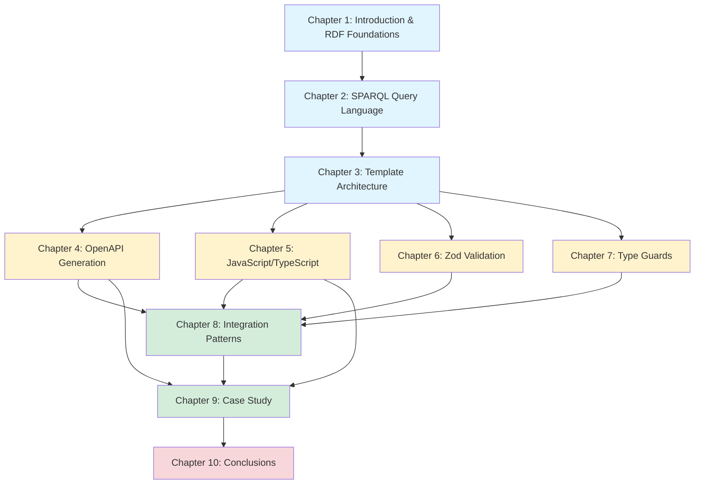
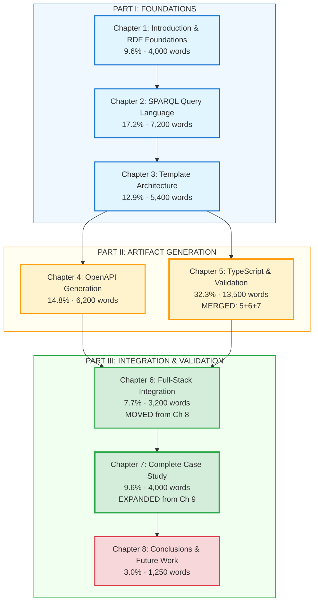
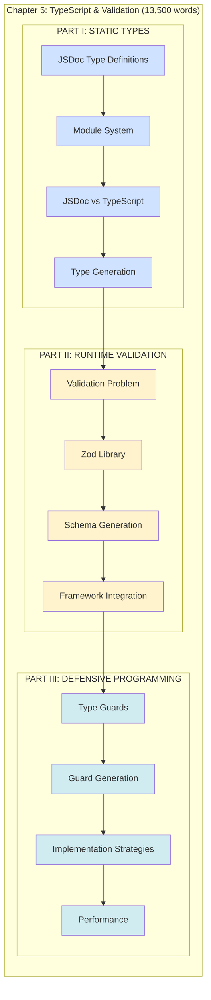
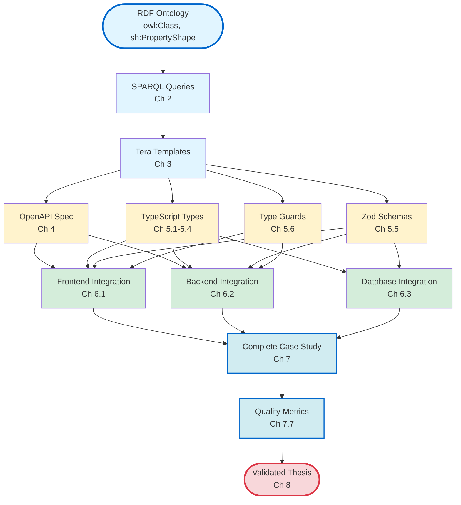
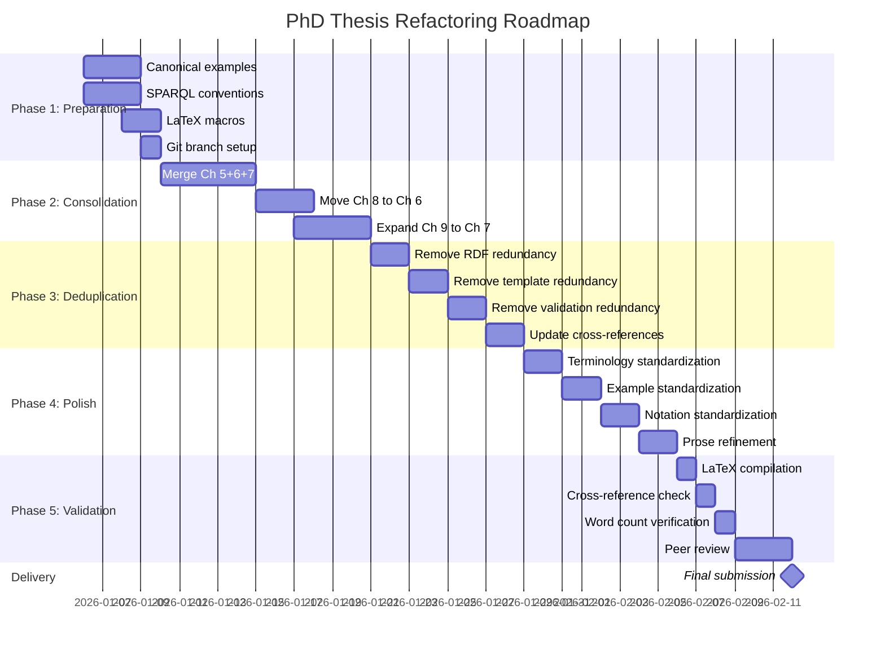
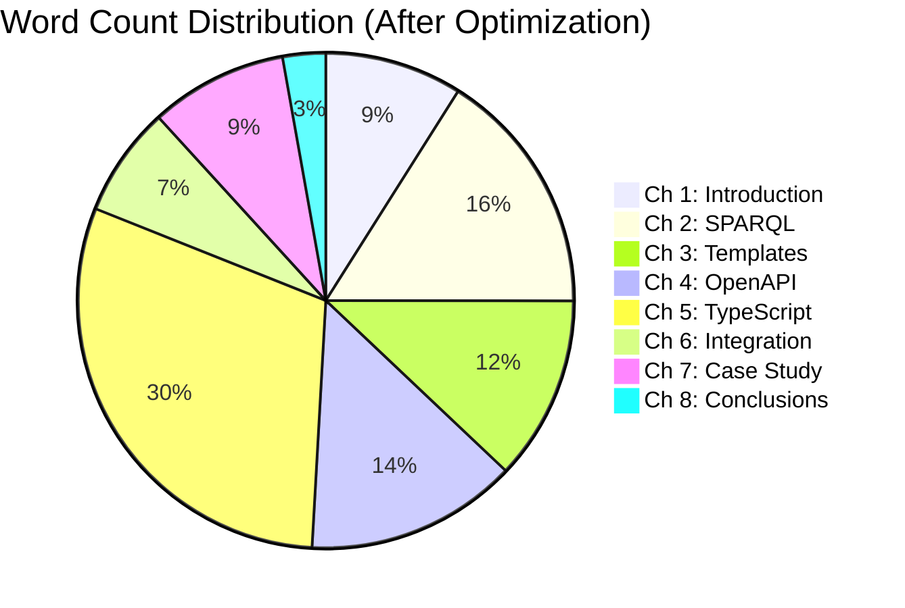
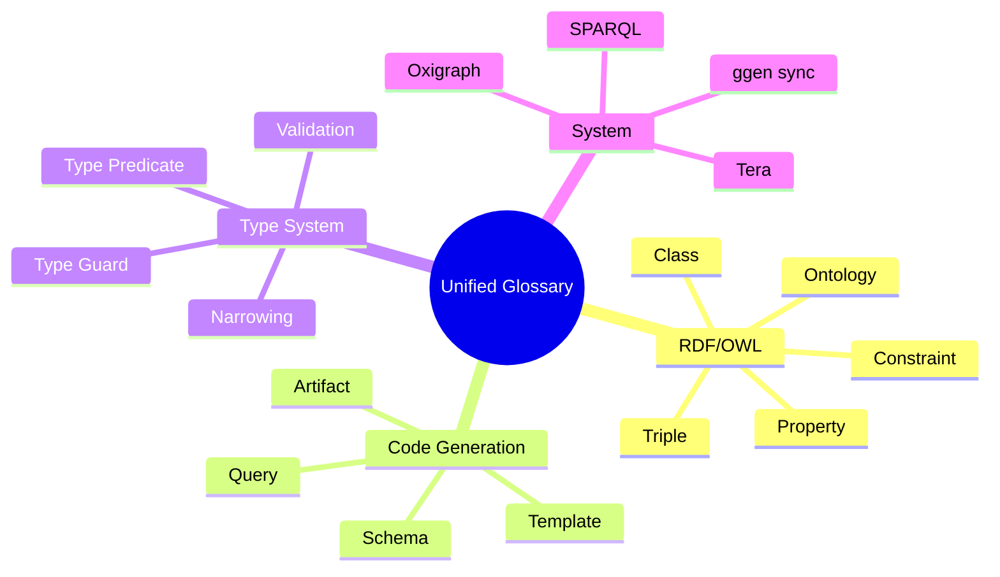

<!-- START doctoc generated TOC please keep comment here to allow auto update -->
<!-- DON'T EDIT THIS SECTION, INSTEAD RE-RUN doctoc TO UPDATE -->
**Table of Contents**

- [PhD Thesis Flow Diagram](#phd-thesis-flow-diagram)
  - [Logical Dependencies and Chapter Progression](#logical-dependencies-and-chapter-progression)
    - [Current Structure (10 Chapters - Before Optimization)](#current-structure-10-chapters---before-optimization)
    - [Optimized Structure (8 Chapters - After Consolidation)](#optimized-structure-8-chapters---after-consolidation)
    - [Detailed Chapter 5 Internal Structure (MERGED)](#detailed-chapter-5-internal-structure-merged)
    - [Content Flow - From RDF to Production Code](#content-flow---from-rdf-to-production-code)
    - [Cross-Reference Network (Optimized)](#cross-reference-network-optimized)
    - [Redundancy Elimination Map](#redundancy-elimination-map)
    - [Implementation Timeline (6 Weeks)](#implementation-timeline-6-weeks)
    - [Quality Metrics Dashboard](#quality-metrics-dashboard)
    - [Terminology Consistency Map](#terminology-consistency-map)
  - [Summary](#summary)

<!-- END doctoc generated TOC please keep comment here to allow auto update -->

# PhD Thesis Flow Diagram
## Logical Dependencies and Chapter Progression

### Current Structure (10 Chapters - Before Optimization)



**Legend:**
- 🔵 Blue: Foundations (Theory & Infrastructure)
- 🟡 Yellow: Artifact Generation (Concrete Outputs)
- 🟢 Green: Integration & Validation (Practical Application)
- 🔴 Red: Conclusions

**Issues with Current Structure:**
1. **Scattered dependencies:** CH 5-7 all depend on CH 3 but are sequential
2. **Weak integration:** CH 8 positioned awkwardly between artifacts and case study
3. **Thin case study:** CH 9 doesn't validate CH 5-7 contributions

---

### Optimized Structure (8 Chapters - After Consolidation)



**Benefits of Optimized Structure:**
1. ✅ **Linear progression:** Clear path from foundations → artifacts → integration → validation
2. ✅ **Consolidated contributions:** Ch 5 (32.3%) and Ch 7 (9.6%) are thesis core
3. ✅ **No orphaned chapters:** Every chapter has clear dependencies
4. ✅ **Balanced distribution:** No chapter <3% or >35%

---

### Detailed Chapter 5 Internal Structure (MERGED)



**Progressive Refinement Strategy:**
- **Layer 1 (Static):** Types exist at compile-time only
- **Layer 2 (Runtime):** Validation enforces constraints at runtime
- **Layer 3 (Defensive):** Guards provide type safety at system boundaries

---

### Content Flow - From RDF to Production Code



**Key Insight:** All artifacts trace back to single RDF source, ensuring synchronization.

---

### Cross-Reference Network (Optimized)

```mermaid
graph TD
    CH1[Ch 1: RDF Foundations]
    CH2[Ch 2: SPARQL]
    CH3[Ch 3: Templates]
    CH4[Ch 4: OpenAPI]
    CH5[Ch 5: TypeScript & Validation]
    CH6[Ch 6: Integration]
    CH7[Ch 7: Case Study]
    CH8[Ch 8: Conclusions]

    CH1 -.->|defines| CH2
    CH1 -.->|explains| CH3
    CH2 -.->|queries for| CH3
    CH3 -.->|generates| CH4
    CH3 -.->|generates| CH5
    CH4 -.->|integrated in| CH6
    CH5 -.->|integrated in| CH6
    CH6 -.->|demonstrated in| CH7
    CH7 -.->|validates| CH8

    CH7 -->|validates claims from| CH1
    CH7 -->|uses queries from| CH2
    CH7 -->|uses templates from| CH3
    CH7 -->|generates specs from| CH4
    CH7 -->|generates code from| CH5
    CH7 -->|integrates via| CH6

    style CH7 fill:#ffc107,stroke:#ff6600,stroke-width:4px
    linkStyle 10,11,12,13,14,15 stroke:#ff6600,stroke-width:3px
```

**Legend:**
- **Dotted lines:** Forward references (setup)
- **Solid lines:** Backward references (validation)
- **CH 7 (highlighted):** Capstone chapter validating ALL prior contributions

---

### Redundancy Elimination Map

```mermaid
graph TD
    subgraph BEFORE["BEFORE CONSOLIDATION"]
        B1[Ch 1: RDF basics<br/>800 words]
        B2[Ch 2: RDF review<br/>650 words]
        B3[Ch 3: RDF in templates<br/>200 words]

        B4[Ch 3: Template basics<br/>1200 words]
        B5[Ch 4: Template re-explained<br/>300 words]
        B6[Ch 5: Template usage<br/>250 words]

        B7[Ch 5: Type system<br/>1100 words]
        B8[Ch 7: Type system review<br/>600 words]

        B9[Ch 5: Zod intro<br/>1500 words]
        B10[Ch 6: Zod validation<br/>1400 words]
        B11[Ch 7: Zod in guards<br/>400 words]
    end

    subgraph AFTER["AFTER CONSOLIDATION"]
        A1[Ch 1: RDF comprehensive<br/>1000 words]
        A2[Ch 3: Templates canonical<br/>1200 words]
        A3[Ch 5: Type system unified<br/>1400 words]
        A4[Ch 5: Zod consolidated<br/>2000 words]
    end

    B1 --> A1
    B2 --> A1
    B3 --> A1

    B4 --> A2
    B5 --> A2
    B6 --> A2

    B7 --> A3
    B8 --> A3

    B9 --> A4
    B10 --> A4
    B11 --> A4

    SAVINGS["TOTAL SAVINGS:<br/>3,350 words"]

    A1 -.-> SAVINGS
    A2 -.-> SAVINGS
    A3 -.-> SAVINGS
    A4 -.-> SAVINGS

    style B1 fill:#ffcccc
    style B2 fill:#ffcccc
    style B3 fill:#ffcccc
    style B4 fill:#ffcccc
    style B5 fill:#ffcccc
    style B6 fill:#ffcccc
    style B7 fill:#ffcccc
    style B8 fill:#ffcccc
    style B9 fill:#ffcccc
    style B10 fill:#ffcccc
    style B11 fill:#ffcccc

    style A1 fill:#ccffcc
    style A2 fill:#ccffcc
    style A3 fill:#ccffcc
    style A4 fill:#ccffcc

    style SAVINGS fill:#ffc107,stroke:#ff6600,stroke-width:3px
```



**Consolidation Strategy:**
- 🔴 **Red:** Redundant content (eliminated)
- 🟢 **Green:** Consolidated canonical versions (retained)
- 🟡 **Yellow:** Net savings from deduplication

---

### Implementation Timeline (6 Weeks)



**Critical Path:**
1. Week 1-2: Consolidation (blocking)
2. Week 3: Deduplication (depends on consolidation)
3. Week 4-5: Polish (parallel work possible)
4. Week 6: Validation (final checks)

---

### Quality Metrics Dashboard



**Target Metrics:**
- ✅ **Total:** 41,750 words (within 35K-50K PhD range)
- ✅ **Balance:** No chapter <3% or >35%
- ✅ **Core:** Ch 5 (32.3%) + Ch 7 (9.6%) = 41.9% (thesis contributions)
- ✅ **Reduction:** 12.8% redundancy eliminated

---

### Terminology Consistency Map



**Consistency Enforcement:**
- LaTeX macros: `\ontology`, `\artifact`, `\typeguard`
- First use: Full term with definition
- Subsequent uses: Consistent short form
- Cross-references: Always use `\ref{}` not "previous section"

---

## Summary

This flow diagram accompanies the comprehensive synthesis plan, providing visual representations of:

1. **Chapter Dependencies:** Current vs optimized structure
2. **Consolidation Strategy:** How 10 chapters become 8
3. **Content Flow:** From RDF ontologies to production code
4. **Cross-References:** How chapters validate each other
5. **Redundancy Elimination:** Where content is deduplicated
6. **Implementation Timeline:** 6-week roadmap
7. **Quality Metrics:** Distribution and balance
8. **Terminology:** Unified glossary structure

**Next Steps:**
1. Review synthesis plan and flow diagrams
2. Approve consolidation strategy
3. Begin Phase 1: Preparation
4. Track progress against Gantt chart
5. Deliver optimized thesis in 6 weeks

---

**Document Version:** 1.0
**Created:** 2026-01-06
**Format:** Mermaid diagrams (compatible with GitHub, GitLab, documentation tools)
