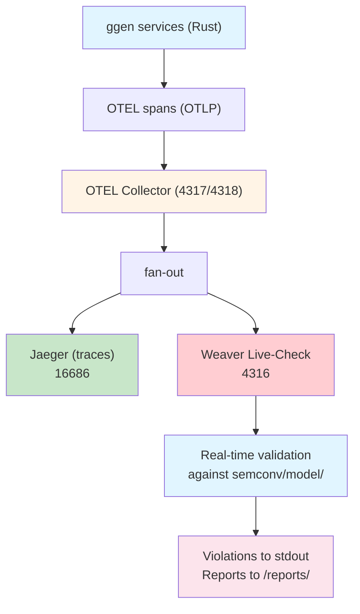

# Weaver Registry Integration for ggen - Executive Summary

**Status:** Design Complete - Ready for Implementation
**Date:** 2026-04-01
**Pattern Reference:** ~/chatmangpt weaver registry integration

---

## What is Weaver?

Weaver is an OpenTelemetry semantic convention validator that:
- Receives OTLP spans from the OTEL Collector
- Validates each span against a semconv registry (YAML schema)
- Reports violations in real-time (logs + JSON reports)
- Provides CLI tools for schema checking and drift detection

**Pattern Used:** Production-hardened integration from ~/chatmangpt BusinessOS.

---

## Why ggen Needs Weaver

### Current State
- ✅ ggen has semconv registry at `semconv/model/` (6 domains)
- ✅ ggen has OTEL instrumentation in `ggen-ai`, `ggen-a2a-mcp`, etc.
- ✅ ggen has OTEL constants in `crates/ggen-ai/src/lib.rs:otel_attrs`
- ❌ **No validation** - Spans may have wrong/missing attributes
- ❌ **No CI gate** - Broken instrumentation can merge
- ❌ **No drift detection** - Schema and code can diverge

### Problems Weaver Solves

| Problem | Weaver Solution |
|---------|----------------|
| Instrumentation bugs reach production | Real-time validation during dev |
| Schema drift (code ≠ semconv) | `weaver registry infer` detects drift |
| Missing required attributes | Violation logs identify exact issue |
| CI doesn't check semconv | GitHub Actions workflow fails build |
| Documentation is out-of-date | Semconv registry is single source of truth |

---

## Architecture



**Key Difference from Current:**
- Current: Collector → Jaeger only
- With Weaver: Collector → Jaeger + Weaver (fan-out)

---

## Implementation Phases

### Phase 1: Docker Infrastructure (2 files)
- `docker/weaver/Dockerfile` - Weaver container (uses official `otel/weaver` image)
- `tests/integration/otel-collector-with-weaver.yaml` - Collector config with weaver exporter
- `tests/integration/docker-compose.weaver.yml` - Extend test stack

### Phase 2: Verification (1 file)
- `tests/integration/weaver-verification.sh` - 12-test verification script

### Phase 3: CI/CD (2 files)
- `.github/workflows/weaver-check.yml` - GitHub Actions workflow
- `scripts/weaver/verify-semconv.sh` - Pre-commit hook

### Phase 4: Drift Detection (1 file, optional)
- `scripts/weaver/infer-drift.sh` - Compare live telemetry with schema

### Phase 5: Documentation (1 file)
- `docs/how-to-weaver-live-check.md` - User guide

**Total:** 7 new files, 0 existing files modified

---

## Key Features

### 1. Real-Time Validation
Every span emitted by ggen services is validated against semconv registry:

```bash
# Start weaver stack
docker compose -f tests/integration/docker-compose.otel-test.yml \
               -f tests/integration/docker-compose.weaver.yml up -d

# Run ggen with OTEL enabled
export OTEL_EXPORTER_OTLP_ENDPOINT=http://localhost:4318
cargo run --bin ggen -- sync

# Check for violations
docker logs ggen-weaver-live-check --tail 50
```

### 2. CI/CD Gating
GitHub Actions workflow validates semconv registry before merge:

```yaml
- name: Check registry syntax
  run: |
    weaver registry check \
      -r ./semconv/model \
      -p ./semconv/policies/ \
      --quiet
```

### 3. Drift Detection
Identify when live telemetry diverges from schema:

```bash
./scripts/weaver/infer-drift.sh
```

### 4. MCP Server Integration (Future)
Enable Claude Desktop to query semconv registry:

```bash
weaver registry mcp
```

---

## Current ggen Semconv Coverage

### Already Defined (No Changes Needed)

| Domain | Span Name | File | Status |
|--------|-----------|------|--------|
| **LLM** | `ggen.llm.generation` | `semconv/model/llm/spans.yaml` | ✅ |
| **Pipeline** | `ggen.pipeline.operation` | `semconv/model/pipeline/spans.yaml` | ✅ |
| **MCP** | `ggen.mcp.tool_call` | `semconv/model/mcp/spans.yaml` | ✅ |
| **YAWL** | `ggen.yawl.workflow` | `semconv/model/yawl/spans.yaml` | ✅ |
| **A2A** | `ggen.a2a.message` | `semconv/model/a2a/spans.yaml` | ✅ |
| **Error** | `ggen.error.raised` | `semconv/model/error/spans.yaml` | ✅ |

### Policy Rules (Already Defined)
`semconv/policies/ggen.rego` - 7 rules enforcing:
- All groups must declare stability
- LLM spans must have `llm.model`
- Pipeline spans must have `pipeline.operation`
- MCP spans must have `mcp.tool_name`
- YAWL spans must have `yawl.workflow_id`
- A2A spans must have `a2a.message_id`
- Error spans must have `error.type`

---

## Example Violation Output

### Valid Span (No Violations)
```bash
$ docker logs ggen-weaver-live-check --tail 5
INFO ggen-weaver-live-check: Received span: ggen.llm.generation
INFO ggen-weaver-live-check: Span validated successfully
```

### Invalid Span (Unknown Attribute)
```json
{
  "level": "WARN",
  "span_name": "ggen.llm.generation",
  "service": "ggen-ai",
  "violations": [
    {
      "attribute": "totally.bogus.attribute",
      "rule": "attribute_not_in_registry",
      "message": "Attribute 'totally.bogus.attribute' is not declared in the semconv registry"
    },
    {
      "attribute": "llm.model",
      "rule": "enum_value_not_declared",
      "message": "Value 'unknown-model' is not a declared enum member for 'llm.model'"
    }
  ]
}
```

---

## Benefits

### For Developers
- **Fast feedback** - Catch bugs during development, not in production
- **Clear errors** - Know exactly what attribute is wrong
- **Documentation** - Semconv registry is single source of truth

### For Operations
- **Production confidence** - Spans validated before reaching prod
- **Drift detection** - Identify when code diverges from schema
- **Troubleshooting** - Violation logs point to root cause

### For CI/CD
- **Automated gating** - Fail builds when semconv is invalid
- **Regression testing** - Ensure new spans follow conventions
- **Documentation enforcement** - Schema always up-to-date

---

## Estimated Effort

| Phase | Files | Effort | Dependencies |
|-------|-------|--------|--------------|
| 1. Docker Infrastructure | 3 | 1-2 days | None |
| 2. Verification | 1 | 1 day | Phase 1 |
| 3. CI/CD | 2 | 1 day | None |
| 4. Drift Detection | 1 | 1 day (optional) | Phase 1 |
| 5. Documentation | 1 | 1 day | All phases |

**Total:** 5-7 days for full implementation

---

## Next Steps

### Immediate (Design Review)
1. ✅ Review design document: `docs/weaver-registry-integration-plan.md`
2. ✅ Confirm ggen's semconv registry structure
3. ✅ Verify OTEL instrumentation coverage
4. ⏳ **Approve implementation**

### Implementation (After Approval)
1. **Phase 1:** Create Docker infrastructure
2. **Phase 2:** Add verification script
3. **Phase 3:** Enable CI/CD gating
4. **Phase 4:** Add drift detection (optional)
5. **Phase 5:** Write documentation

### Rollout Strategy
1. Start with local development (Phase 1-2)
2. Add to CI (Phase 3)
3. Enable in pre-production (Phase 4)
4. Document and train team (Phase 5)

---

## References

- **Full Design:** `/Users/sac/ggen/docs/weaver-registry-integration-plan.md`
- **~/chatmangpt Pattern:** `/Users/sac/chatmangpt/docs/diataxis/how-to/run-weaver-live-check.md`
- **Weaver GitHub:** https://github.com/cheriot/weaver
- **ggen Semconv:** `/Users/sac/ggen/semconv/model/`

---

## Questions?

See the full design document for:
- Detailed architecture diagrams
- Complete file-by-file checklist
- Example YAML files
- Troubleshooting guide
- Integration with existing spans

**Status:** Ready for implementation. Awaiting approval.
