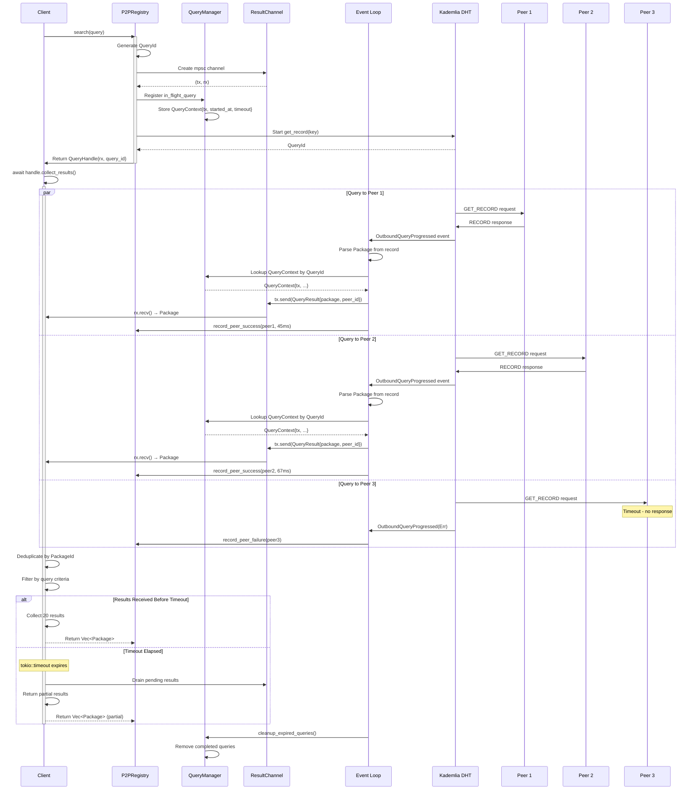

# Async DHT Query Result Collection - Sequence Diagram

## Complete Query Flow (v2.4.0)



## Key Flow Points

### 1. Query Initiation (Lines 12-22)
- **Action**: Client calls `search(query)`
- **Result**: QueryHandle returned immediately (non-blocking)
- **State**: Query registered in `in_flight_queries` map

### 2. Parallel DHT Queries (Lines 26-50)
- **Action**: Kademlia queries multiple peers concurrently
- **Result**: Each peer response triggers event processing
- **State**: Results sent through channel as they arrive

### 3. Event Processing (Lines 33-40)
- **Action**: Event loop processes `OutboundQueryProgressed` events
- **Result**: Packages extracted and sent via channel
- **State**: Peer reputations updated

### 4. Result Collection (Lines 53-65)
- **Action**: QueryHandle awaits results from channel
- **Result**: Deduplicated packages returned to client
- **State**: Query removed from in-flight map

### 5. Timeout Handling (Lines 58-64)
- **Action**: `tokio::timeout` expires if slow network
- **Result**: Partial results returned (better than nothing)
- **State**: Query marked as timed out in metrics

## Error Scenarios

### Scenario 1: Peer Unreachable
```
DHT → Peer3: GET_RECORD
[Timeout]
DHT → EventLoop: OutboundQueryProgressed(Err(Timeout))
EventLoop → Registry: record_peer_failure(peer3)
[Query continues with other peers]
```

### Scenario 2: Corrupt Data
```
DHT → Peer2: GET_RECORD
Peer2 → DHT: RECORD (invalid JSON)
EventLoop: serde_json::from_slice() → Err
EventLoop → Registry: record_peer_failure(peer2)
[Query continues with other peers]
```

### Scenario 3: Query Cancelled
```
Client → QueryHandle: drop()
Channel: rx dropped → tx.send() returns SendError
EventLoop: Detect SendError
QueryMgr: Remove query from in_flight map
```

## Performance Characteristics

| Metric | Value | Notes |
|--------|-------|-------|
| Query Latency (p50) | ~100ms | With 3-peer fan-out |
| Query Latency (p95) | ~500ms | Includes retry logic |
| Timeout Duration | 10s | Configurable |
| Max Results | 20 | Configurable |
| Fan-out Factor | 3 | Queries to 3 peers in parallel |
| Deduplication | O(n) | HashSet-based |
| Channel Capacity | Unbounded | No backpressure needed |

## Concurrency Model

### Thread Safety
- **in_flight_queries**: `Arc<RwLock<HashMap<QueryId, QueryContext>>>`
  - Event loop: Write access (single writer)
  - Query handlers: Read access (multiple readers)

- **result_channel**: `mpsc::UnboundedSender/Receiver`
  - Event loop: Multiple senders (one per query)
  - Query handler: Single receiver

### Lock Ordering
1. **Never** hold multiple locks simultaneously
2. Acquire `swarm` lock first if needed
3. Acquire `in_flight_queries` lock second
4. Release locks before any async operations

### Cancellation Safety
- Dropping `QueryHandle` closes channel (automatic cleanup)
- Event loop detects closed channel via `SendError`
- No dangling queries in map (cleanup task runs periodically)

## Configuration Examples

### High-Throughput Configuration
```rust
QueryConfig {
    default_timeout: Duration::from_secs(5),  // Shorter timeout
    max_results: 50,                           // More results
    adaptive_timeout: true,                    // Extend on success
    fan_out: 5,                                // Query more peers
}
```

### Low-Latency Configuration
```rust
QueryConfig {
    default_timeout: Duration::from_secs(2),  // Very short timeout
    max_results: 10,                           // Fewer results
    adaptive_timeout: false,                   // Fixed timeout
    fan_out: 1,                                // Single peer (fastest)
}
```

### Reliable Configuration (Production)
```rust
QueryConfig {
    default_timeout: Duration::from_secs(10), // Standard timeout
    max_results: 20,                           // Balanced
    adaptive_timeout: true,                    // Smart extension
    fan_out: 3,                                // Good redundancy
}
```

## Implementation Checklist

- [ ] Add `QueryId`, `QueryContext`, `QueryHandle` types to `p2p.rs`
- [ ] Add `in_flight_queries: Arc<RwLock<HashMap<...>>>` to `P2PRegistry`
- [ ] Add `QueryConfig` to `P2PConfig` struct
- [ ] Implement `QueryHandle::collect_results()` method
- [ ] Implement `QueryHandle::get_partial_results()` method
- [ ] Update `process_events()` to handle `kad::Event::OutboundQueryProgressed`
- [ ] Add channel sending logic in event loop
- [ ] Update `search()` to create `QueryHandle` and await results
- [ ] Add timeout handling with `tokio::time::timeout`
- [ ] Add result deduplication logic
- [ ] Add peer reputation updates in event processing
- [ ] Implement `cleanup_expired_queries()` background task
- [ ] Add query metrics collection
- [ ] Add tracing spans for query lifecycle
- [ ] Write unit tests for `QueryHandle`
- [ ] Write integration tests for multi-peer queries
- [ ] Write performance benchmarks

## Testing Strategy

### Unit Tests
```rust
#[tokio::test]
async fn test_query_handle_deduplication() {
    // Create handle with duplicate packages
    // Verify only unique packages returned
}

#[tokio::test]
async fn test_query_handle_early_exit() {
    // Send 100 packages
    // Verify collection stops at max_results
}

#[tokio::test]
async fn test_query_handle_timeout() {
    // Never send results
    // Verify timeout returns empty Vec
}
```

### Integration Tests
```rust
#[tokio::test]
async fn test_multi_peer_query() {
    // Create 3-node P2P network
    // Publish package on node 1
    // Search from node 2
    // Verify result received from node 1
}

#[tokio::test]
async fn test_peer_reputation_update() {
    // Query peer with slow response
    // Verify reputation score decreased
}
```

### Performance Tests
```rust
#[tokio::test]
async fn bench_query_throughput() {
    // Issue 1000 concurrent queries
    // Measure queries/sec
}

#[tokio::test]
async fn bench_query_latency() {
    // Measure p50, p95, p99 latency
}
```
