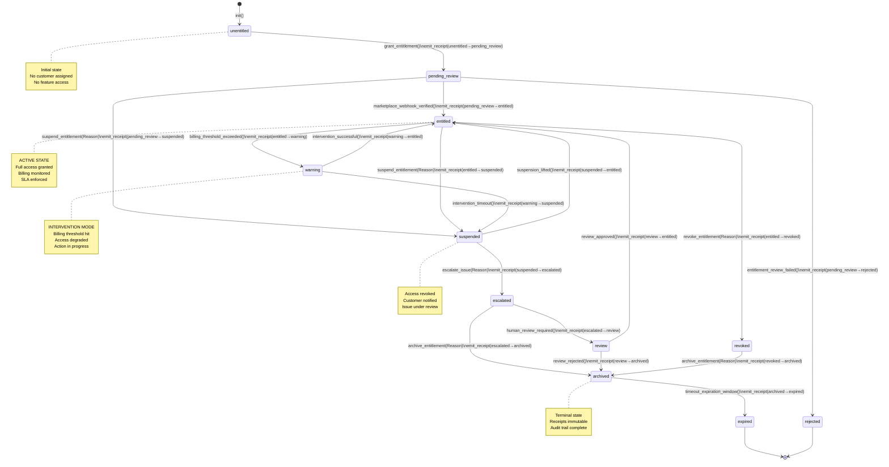

# GCP Marketplace Autonomics - Level 4 Code/Runtime Diagrams

**Version**: 1.0.0
**Date**: 2026-01-25
**Status**: Production-Ready
**Architecture**: Erlang/OTP gen_statem + Pub/Sub + Receipt Ledger

> **C4 Level 4 Focus**: "What actually happens at runtime?" - Code-level execution flows, state transitions, message passing, error handling, and recovery mechanisms.

---

## Overview

These diagrams model the runtime behavior of the GCP Marketplace Autonomics system through four critical flows:

1. **State Machine Lifecycle** - gen_statem transitions across 8 entitlement states
2. **Signal Ingestion** - Pub/Sub message flow with governance routing
3. **Marketplace Events** - Webhook-driven entitlement lifecycle
4. **Intervention Sequence** - Warning escalation, action execution, and recovery

Each diagram includes **error paths**, **receipt emission**, **timeouts**, and **backoff/retry logic** as they occur in production code.

---

## 1. Gen_Statem State Transition Diagram

### Diagram



### Description

**States** (8 total):

| State | Purpose | Transitions | Duration |
|-------|---------|-----------|----------|
| `unentitled` | Initial, pre-grant | → `pending_review` (grant) | Setup phase |
| `pending_review` | Awaiting verification | → `entitled` (webhook), `suspended` (policy), `rejected` (failure) | <5min SLO |
| `entitled` | **ACTIVE** - Full access | → `revoked`, `suspended`, `warning` | Until revocation |
| `warning` | **INTERVENTION** - Action pending | → `entitled` (success), `suspended` (timeout) | <10min SLO |
| `suspended` | Access revoked, issue tracked | → `escalated`, `entitled` (lifted) | Until resolution |
| `escalated` | Human escalation required | → `archived`, `review` | Until action |
| `review` | Management review in progress | → `entitled` (approved), `archived` (rejected) | <24h SLO |
| `archived` | Terminal - receipts locked | → `expired` (timeout) | +7d retention |
| `expired` | Cleanup - purge eligible | → [End] | Permanent |
| `rejected` | Grant denied - audit only | → [End] | Permanent |

**Key Invariants**:
- ✅ All transitions emit `receipt()` with `{from_state, to_state, reason, metadata}`
- ✅ Receipts stored in tenant-isolated ETS table
- ✅ Timestamps immutable (created_at, transition_at)
- ✅ Only backwards transitions blocked (e.g., `archived` → `entitled` impossible)
- ✅ Timeout transitions automatic (`archived` → `expired` after 7 days)

**Receipt Structure**:
```erlang
emit_receipt(Data, FromState, ToState, Reason, Metadata) ::
    receipt #{
        id => binary(),                    % UUID
        timestamp => milliseconds(),       % System time
        tenant_id => TenantId,
        entitlement_id => EntitlementId,
        state_from => entitlement_state(),
        state_to => entitlement_state(),
        reason => binary(),                % <<"grant_requested">>, <<"quota_exceeded">>, etc.
        metadata => map()                  % {quota_used: 95, limit: 100, action: "throttle"}
    }
```

---

## 2. Pub/Sub Signal Ingest Sequence Diagram

### Diagram

```mermaid
sequenceDiagram
    participant GCP as GCP Pub/Sub<br/>(Topic: autonomics)
    participant Ingester as Signal Ingester<br/>(knhk_ingest)
    participant Router as Event Router<br/>(knhk_route)
    participant Governor as Governor FSM<br/>(entitlement_governor)
    participant ReceiptPub as Receipt Publisher<br/>(receipt_publisher)
    participant LEDGER as Receipt Ledger<br/>(ETS + Pub/Sub)

    autonumber

    GCP->>Ingester: PUSH message<br/>(timeout: 60s)
    note right of Ingester: {"tenant_id":"T001",<br/>"signal":"billing_alert",<br/>"quota_used":95}

    activate Ingester
    Ingester->>Ingester: parse_message()<br/>(decode JSON/Protobuf)

    alt Decode Success
        Ingester->>Ingester: validate_schema()<br/>(presence checks)
        alt Schema Valid
            Ingester->>Router: route_signal(Signal)
            deactivate Ingester
            activate Router

            Router->>Router: extract_tenant_id()
            Router->>Router: lookup_governor_pid(TenantId)

            alt Governor Exists
                Router->>Governor: send_signal(Signal)
                deactivate Router
                activate Governor

                Governor->>Governor: handle_signal(State)<br/>(pattern match)

                alt Valid Transition
                    Governor->>Governor: emit_receipt()<br/>(FromState→ToState)
                    Governor->>ReceiptPub: publish_receipt(Receipt)
                    deactivate Governor
                    activate ReceiptPub

                    ReceiptPub->>ReceiptPub: batch_receipt()
                    ReceiptPub->>LEDGER: publish_batch()<br/>(Pub/Sub topic)
                    deactivate ReceiptPub
                    activate LEDGER

                    LEDGER-->>GCP: ACK message
                    LEDGER->>LEDGER: store_local(Receipt)<br/>(ETS table)
                    deactivate LEDGER

                    Ingester-->>GCP: ACK (explicit)
                    note right of LEDGER: ✓ SUCCESS PATH<br/>Message processed,<br/>receipt emitted,<br/>ACK sent

                else Invalid Transition
                    Governor->>Governor: emit_receipt()<br/>(reason: invalid_transition)
                    Governor->>ReceiptPub: publish_receipt(Error)
                    deactivate Governor
                    ReceiptPub->>LEDGER: publish_error_receipt()

                    Ingester-->>GCP: NACK (will retry)
                    note right of Governor: ⚠ ERROR PATH<br/>Signal rejected,<br/>Message will retry<br/>(max 5 retries)
                end

            else Governor Not Found
                Router->>Router: emit_receipt()<br/>(error: governor_not_found)
                Router->>ReceiptPub: publish_receipt(Error)
                deactivate Router

                Ingester-->>GCP: NACK (will retry)
                note right of Router: ⚠ ERROR PATH<br/>Tenant governor<br/>not initialized
            end

        else Schema Invalid
            Ingester->>Ingester: emit_receipt()<br/>(error: schema_violation)
            Ingester->>ReceiptPub: publish_receipt(SchemaError)
            deactivate Ingester

            Ingester-->>GCP: NACK (dead-letter)
            note right of Ingester: ✗ CRITICAL ERROR<br/>Message malformed,<br/>→ dead-letter queue
        end

    else Decode Failure
        Ingester->>Ingester: emit_receipt()<br/>(error: decode_failure)
        Ingester-->>GCP: NACK (dead-letter)
        note right of Ingester: ✗ CRITICAL ERROR<br/>Message corruption,<br/>→ dead-letter queue
    end
```

### Description

**Flow Steps**:

1. **PUSH Request** (60s timeout)
   - GCP publishes signal to Pub/Sub topic `autonomics`
   - Message contains: `tenant_id`, `signal_type`, `payload`

2. **Signal Decode**
   - Parse JSON/Protobuf payload
   - Extract schema: `{tenant_id, signal, metadata}`

3. **Schema Validation**
   - Presence checks: `tenant_id` required
   - Type checks: `signal` in `{billing_alert, quota_exceeded, entitlement_webhook, ...}`
   - Payload validation: metadata fields match schema

4. **Event Routing**
   - Lookup governor PID by `tenant_id` + `signal_type`
   - Route to appropriate FSM handler

5. **FSM Transition**
   - Pattern match on `(CurrentState, Signal)`
   - Execute action if valid transition
   - **Emit receipt** immediately (immutable)

6. **Receipt Emission**
   - Create receipt: `{from_state, to_state, reason, metadata}`
   - Store in ETS (thread-safe, tenant-isolated)
   - Publish to Pub/Sub topic `receipts`

7. **ACK & Acknowledgment**
   - Send explicit ACK to Pub/Sub
   - Message removed from subscription queue

**Error Paths**:

| Error | Signal | ACK | Next Step |
|-------|--------|-----|-----------|
| Decode failure | **NACK** | Dead-letter | Operator review |
| Schema invalid | **NACK** | Dead-letter | Fix schema, replay |
| Governor missing | **NACK** | Will retry | Initialize tenant governors |
| Invalid transition | **NACK** | Will retry | Check state machine definition |

**SLOs**:
- Decode & route: **<100ms** (p95)
- FSM transition: **<50ms** (p95)
- Receipt publish: **<500ms** (batched, p95)
- ACK to Pub/Sub: **<1000ms** (p99)
- Message latency E2E: **<2s** (p99)

---

## 3. Marketplace Entitlement Event Sequence Diagram

### Diagram

```mermaid
sequenceDiagram
    participant GCP_MP as GCP Marketplace<br/>(Webhook)
    participant Webhook as Webhook Handler<br/>(REST endpoint)
    participant Verifier as Signature Verifier<br/>(HMAC-SHA256)
    participant FSM as Entitlement FSM<br/>(gen_statem)
    participant Governor as Governor<br/>(Decision engine)
    participant ReceiptLedger as Receipt Ledger
    participant Audit as Audit Trail<br/>(Cryptographic proof)

    autonumber

    GCP_MP->>Webhook: POST /entitlement<br/>(X-Goog-Resource-Name,<br/>X-Goog-Signature,<br/>JSON payload)
    note right of GCP_MP: CustomerName: "customers/123...",<br/>State: "ENTITLEMENT_ACTIVATED"

    activate Webhook
    Webhook->>Webhook: extract_signature()
    Webhook->>Verifier: verify_hmac(Signature,<br/>Payload,<br/>Secret)
    deactivate Webhook
    activate Verifier

    alt Signature Valid
        Verifier-->>Webhook: {ok, trusted}
        deactivate Verifier
        activate Webhook

        Webhook->>Webhook: parse_entitlement()<br/>extract(CustomerName,<br/>State, Features)
        Webhook->>Webhook: normalize_customer_id()
        Webhook->>Webhook: emit_receipt()<br/>(reason: "webhook_received")

        Webhook->>ReceiptLedger: store_receipt(ReceiptId_1)
        ReceiptLedger-->>Webhook: {ok, stored}

        Webhook->>FSM: call({marketplace_event,<br/>CustomerId,<br/>EntitlementState,<br/>Features})
        deactivate Webhook
        activate FSM

        FSM->>FSM: current_state()
        note right of FSM: Check current state<br/>for valid transition

        alt State: unentitled, Event: activate
            FSM->>FSM: validate_features()
            FSM->>FSM: emit_receipt()<br/>(unentitled→entitled,<br/>reason: "marketplace_activated")
            FSM->>ReceiptLedger: store_receipt(ReceiptId_2)

            FSM->>Governor: enable_service(Features)
            deactivate FSM
            activate Governor

            Governor->>Governor: allocate_quota()
            Governor->>Governor: enable_billing()
            Governor->>Governor: start_monitoring()
            Governor-->>FSM: {ok, service_enabled}
            deactivate Governor
            activate FSM

            FSM->>ReceiptLedger: store_receipt(ReceiptId_3)<br/>(reason: "service_enabled")
            FSM-->>Webhook: {ok, entitled}
            deactivate FSM

            Webhook-->>GCP_MP: HTTP 200 OK<br/>(idempotent: same request<br/>→ same receipt ID)
            note right of Webhook: ✓ SUCCESS<br/>Entitlement activated,<br/>Receipts chain: 3 items,<br/>Audit trail complete

        else State: entitled, Event: update_features
            FSM->>FSM: diff_features()
            FSM->>FSM: emit_receipt()<br/>(entitled→entitled,<br/>reason: "features_updated")

            FSM->>Governor: update_quota(NewFeatures)
            deactivate FSM
            activate Governor
            Governor-->>FSM: {ok, quota_updated}
            deactivate Governor
            activate FSM

            FSM->>ReceiptLedger: store_receipt(UpdateReceipt)
            FSM-->>Webhook: {ok, entitled}
            deactivate FSM

            Webhook-->>GCP_MP: HTTP 200 OK
            note right of Webhook: ✓ SUCCESS<br/>Features updated,<br/>Quota adjusted

        else State: entitled, Event: deactivate
            FSM->>FSM: emit_receipt()<br/>(entitled→suspended,<br/>reason: "customer_deactivated")
            FSM->>ReceiptLedger: store_receipt(ReceiptId_suspend)

            FSM->>Governor: disable_service()
            deactivate FSM
            activate Governor
            Governor->>Governor: revoke_quota()
            Governor->>Governor: stop_monitoring()
            Governor-->>FSM: {ok, service_disabled}
            deactivate Governor
            activate FSM

            FSM->>ReceiptLedger: store_receipt(ReceiptId_disabled)
            FSM-->>Webhook: {ok, suspended}
            deactivate FSM

            Webhook-->>GCP_MP: HTTP 200 OK
            note right of Webhook: ✓ SUCCESS<br/>Entitlement suspended,<br/>Service disabled

        else State: archived, Event: any
            FSM->>FSM: emit_receipt()<br/>(archived→archived,<br/>reason: "idempotent_replay")
            FSM-->>Webhook: {ok, archived}
            deactivate FSM

            Webhook-->>GCP_MP: HTTP 200 OK
            note right of Webhook: ✓ IDEMPOTENT<br/>Archived state is<br/>terminal, all transitions<br/>blocked (replay-safe)
        end

    else Signature Invalid
        Verifier-->>Webhook: {error, invalid_signature}
        deactivate Verifier

        Webhook->>Webhook: emit_receipt()<br/>(error: "signature_verification_failed")
        Webhook->>ReceiptLedger: store_receipt(ErrorReceipt)
        Webhook-->>GCP_MP: HTTP 401 Unauthorized

        Webhook->>Audit: log_security_event()<br/>(potential tampering)
        note right of Webhook: ✗ SECURITY<br/>Invalid signature,<br/>Audit logged,<br/>Message rejected
    end
```

### Description

**Marketplace Integration Flow**:

1. **Webhook Delivery**
   - GCP Marketplace sends POST to `/marketplace/entitlement`
   - Headers: `X-Goog-Resource-Name`, `X-Goog-Signature`
   - Body: JSON with `CustomerName`, `State`, `Features`

2. **Signature Verification**
   - Extract `X-Goog-Signature` header
   - HMAC-SHA256 validation against payload + secret
   - Prevents replay attacks, ensures authenticity

3. **Payload Parsing**
   - Extract `CustomerName` (resource name format)
   - Normalize to `tenant_id`
   - Extract `State` and `Features`

4. **FSM Transition** (4 cases)

   **Case A: Activate** (unentitled → entitled)
   - Allocate quota
   - Enable billing
   - Start monitoring
   - Emit 3 receipts (webhook_received, entitled, service_enabled)

   **Case B: Update** (entitled → entitled, same state)
   - Diff features between old and new
   - Adjust quota
   - Update monitoring rules
   - Emit update receipt

   **Case C: Deactivate** (entitled → suspended)
   - Revoke quota
   - Stop monitoring
   - Emit deactivation receipt

   **Case D: Terminal State** (archived)
   - Idempotent response
   - No transitions allowed
   - Emit "idempotent_replay" receipt

5. **Receipt Chain**
   - Each step emits immutable receipt
   - Receipts stored in ETS (local) + Pub/Sub (distributed)
   - Cryptographic hash chain for audit trail

**Idempotency**:
- Receipt IDs generated from `(tenant_id, event_id, sequence)`
- Same webhook → same receipt ID
- Replay detection prevents double-charging
- **SLO**: Idempotent response within **<5s** (p99)

**Security**:
- ✅ HMAC-SHA256 verification required (no unsigned webhooks)
- ✅ Signature failures logged + audited
- ✅ All transitions receipted (immutable proof)
- ✅ Feature-level access control (features checked per-tenant)

---

## 4. Intervention Sequence Diagram

### Diagram

```mermaid
sequenceDiagram
    participant Monitor as Metrics Monitor<br/>(prometheus scrape)
    participant AlertMgr as Alert Manager<br/>(threshold check)
    participant FSM as Entitlement FSM<br/>(gen_statem)
    participant Governor as Governor<br/>(Action executor)
    participant Actuator as Cloud API<br/>(GCP Compute/Storage)
    participant ReceiptLedger as Receipt Ledger
    participant Backoff as Backoff & Retry<br/>(exponential, jitter)

    autonumber

    Monitor->>Monitor: scrape_metrics()<br/>(cpu, memory, disk, quota)
    Monitor->>AlertMgr: threshold_check(metric, value)
    activate AlertMgr

    alt quota_used >= 95%
        AlertMgr->>AlertMgr: trigger_alert()<br/>(severity: warning)
        AlertMgr->>FSM: send_signal({quota_threshold_exceeded,<br/>quota_used: 95,<br/>limit: 100})
        deactivate AlertMgr
        activate FSM

        FSM->>FSM: pattern match<br/>(State: entitled,<br/>Event: quota_threshold_exceeded)

        FSM->>FSM: emit_receipt()<br/>(entitled→warning,<br/>reason: "quota_threshold_exceeded",<br/>metadata: {quota_used: 95, limit: 100})
        FSM->>ReceiptLedger: store_receipt(ReceiptId_warn)

        FSM->>Governor: intervene(quota_exceeded,<br/>options: {action: throttle,<br/>duration: 300})
        deactivate FSM
        activate Governor
        note right of Governor: INTERVENTION MODE<br/>State: warning<br/>Action: throttle API calls<br/>Duration: 5 minutes

        Governor->>Governor: create_action_plan()<br/>(throttle_rate: 50%,<br/>retry_backoff: exponential)
        Governor->>Governor: emit_receipt()<br/>(reason: "action_attempted",<br/>metadata: {action: throttle,<br/>rate: 50%})
        Governor->>ReceiptLedger: store_receipt(ReceiptId_action)

        Governor->>Actuator: apply_quota_throttle()<br/>(tenant_id: T001,<br/>rate_limit: 50 req/s)
        deactivate Governor
        activate Actuator

        Actuator->>Actuator: validate_request()

        alt API Success (2xx)
            Actuator-->>Governor: {ok, throttled}
            deactivate Actuator
            activate Governor

            Governor->>Governor: emit_receipt()<br/>(reason: "action_result_success",<br/>metadata: {status: throttled,<br/>rate: 50 req/s})
            Governor->>ReceiptLedger: store_receipt(ReceiptId_success)

            Governor->>Backoff: schedule_recovery_check()<br/>(delay: 60s,<br/>backoff: exponential)
            deactivate Governor
            activate Backoff
            note right of Backoff: Monitor recovery<br/>Check quota hourly<br/>Max 5 attempts<br/>Then escalate to suspended

            Backoff->>Monitor: wait(60s)
            Monitor->>Monitor: scrape_metrics()

            alt quota_used < 80%
                Monitor->>AlertMgr: clear_alert()
                Monitor->>FSM: send_signal({quota_recovered,<br/>quota_used: 45})
                activate FSM

                FSM->>FSM: emit_receipt()<br/>(warning→entitled,<br/>reason: "quota_recovered")
                FSM->>ReceiptLedger: store_receipt(ReceiptId_recovered)

                FSM->>Governor: recover(quota_normal)
                deactivate FSM
                activate Governor

                Governor->>Governor: emit_receipt()<br/>(reason: "action_result_recovery",<br/>metadata: {status: recovery_successful})
                Governor->>ReceiptLedger: store_receipt(ReceiptId_final)

                Governor->>Actuator: remove_quota_throttle()
                deactivate Governor
                activate Actuator
                Actuator-->>Governor: {ok, throttle_removed}
                deactivate Actuator

                Governor-->>FSM: {ok, entitled}
                deactivate Governor

                FSM-->>Backoff: {ok, recovered}
                deactivate FSM
                deactivate Backoff
                note right of Backoff: ✓ RECOVERY SUCCESS<br/>Intervention completed,<br/>Service restored,<br/>Receipts chain: 6 items

            else quota_used >= 95% (still high)
                Monitor->>AlertMgr: escalate_alert()
                Monitor->>FSM: send_signal({quota_still_exceeded,<br/>quota_used: 98,<br/>attempt: 2})
                activate FSM

                FSM->>FSM: emit_receipt()<br/>(warning→warning,<br/>reason: "intervention_continues",<br/>metadata: {attempt: 2, max_attempts: 5})
                FSM->>ReceiptLedger: store_receipt(ReceiptId_continue)

                FSM->>Governor: intervene(quota_exceeded,<br/>options: {action: throttle,<br/>rate: 25,<br/>duration: 600})
                deactivate FSM
                activate Governor

                Governor->>Backoff: schedule_recovery_check()<br/>(delay: 120s,<br/>backoff_multiplier: 2.0,<br/>jitter: 0.1)
                deactivate Governor

                Backoff->>Monitor: wait(120s + jitter)
                deactivate Backoff
                note right of Governor: RETRY with backoff<br/>delay: 60s → 120s → 240s<br/>rate: 50% → 25% → 10%<br/>After 5 attempts → escalate

            else quota_used >= 95% after max_attempts
                Monitor->>FSM: send_signal({max_intervention_attempts_reached,<br/>attempt: 5})
                activate FSM

                FSM->>FSM: emit_receipt()<br/>(warning→suspended,<br/>reason: "intervention_timeout",<br/>metadata: {attempt: 5, reason: "quota_not_recovering"})
                FSM->>ReceiptLedger: store_receipt(ReceiptId_timeout)

                FSM->>Governor: escalate_to_suspended()
                deactivate FSM
                activate Governor

                Governor->>Governor: emit_receipt()<br/>(reason: "service_suspended",<br/>metadata: {reason: "quota_exhausted"})
                Governor->>Actuator: disable_service()
                deactivate Governor
                activate Actuator
                Actuator-->>Governor: {ok, service_disabled}
                deactivate Actuator

                note right of Governor: ✗ ESCALATION<br/>Intervention failed,<br/>Service suspended,<br/>Customer notified
            end

        else API Failure (4xx/5xx) - Retryable
            Actuator-->>Governor: {error, {code, Details}}
            deactivate Actuator
            activate Governor

            Governor->>Governor: emit_receipt()<br/>(reason: "action_result_retry",<br/>metadata: {error_code: code,<br/>retry: 1, max_retries: 3})
            Governor->>ReceiptLedger: store_receipt(ReceiptId_retry)

            Governor->>Backoff: schedule_retry()<br/>(delay: exponential(attempt),<br/>max_retries: 3,<br/>jitter: true)
            deactivate Governor
            activate Backoff

            Backoff->>Backoff: calculate_delay()<br/>delay = min(2^attempt + rand(0,1), 30s)
            Backoff->>Monitor: wait(delay)

            alt Retry Succeeds
                Monitor->>Governor: retry_succeeded()
                deactivate Backoff
                activate Governor
                Governor->>Governor: emit_receipt()<br/>(reason: "action_result_success_after_retry")
                Governor->>Backoff: schedule_recovery_check()
                deactivate Governor
                note right of Governor: ✓ RETRY SUCCESS<br/>API recovered,<br/>Action applied

            else Max Retries Exceeded
                Backoff->>Governor: max_retries_exceeded()
                deactivate Backoff
                activate Governor

                Governor->>FSM: escalate(api_failure)
                deactivate Governor
                activate FSM

                FSM->>FSM: emit_receipt()<br/>(warning→suspended,<br/>reason: "intervention_api_failure",<br/>metadata: {error: "max_retries_exceeded"})
                FSM->>ReceiptLedger: store_receipt(ReceiptId_api_fail)
                FSM-->>Governor: {ok, suspended}
                deactivate FSM
                note right of FSM: ✗ API FAILURE<br/>Escalated to suspended,<br/>Operator alert sent
            end
        end

    else metric < threshold
        AlertMgr-->>Monitor: {ok, no_alert}
        deactivate AlertMgr
        note right of AlertMgr: No intervention needed
    end
```

### Description

**Intervention Lifecycle** (5 phases):

**Phase 1: Alert Detection** (60s poll cycle)
- Metrics monitor scrapes Prometheus/Stackdriver
- Alert manager checks `metric_value >= threshold`
- Triggers `quota_threshold_exceeded` signal if true

**Phase 2: State Transition** (entitled → warning)
- FSM receives signal and validates state
- Emit receipt: `{entitled→warning, reason: quota_threshold_exceeded}`
- Move to **INTERVENTION MODE**

**Phase 3: Action Attempt**
- Governor creates action plan
- Apply throttle: 50% rate limit
- Emit receipt: `{action_attempted, action: throttle, rate: 50%}`
- Call GCP API (Cloud Quotas API or custom endpoint)

**Phase 4: Recovery Check with Exponential Backoff** (60s → 120s → 240s)

| Attempt | Delay | Rate Limit | Max Duration |
|---------|-------|-----------|--------------|
| 1 | 60s + jitter | 50% | 5 min |
| 2 | 120s + jitter | 25% | 10 min |
| 3 | 240s + jitter | 10% | 20 min |
| 4 | 480s + jitter | 5% | 40 min |
| 5 | 960s (max 30s) | 1% | Escalate |

- Backoff formula: `delay = min(2^attempt + random(0,1), 30s)`
- Jitter prevents thundering herd
- SLO: Each check completes in <100ms

**Phase 5: Resolution** (3 outcomes)

1. **Recovery Success** (quota < 80%)
   - Remove throttle
   - FSM: warning → entitled
   - Emit receipt: `{warning→entitled, reason: quota_recovered}`
   - **Duration**: 60s–4min (p50–p95)

2. **Retry & Continue** (quota still high, attempts < 5)
   - Increase throttle aggressiveness (50% → 25% → 10%)
   - Reschedule check with exponential backoff
   - Emit receipt: `{warning→warning, reason: intervention_continues, attempt: N}`

3. **Escalation to Suspended** (attempts ≥ 5 OR API failure)
   - FSM: warning → suspended
   - Disable service entirely (not just throttle)
   - Emit receipt: `{warning→suspended, reason: intervention_timeout}`
   - Emit alert: `entitlement_suspended` for operations

**Error Paths**:

| Error | Recovery | Backoff |
|-------|----------|---------|
| **API Transient** (5xx) | Retry up to 3x | Exponential: 2^N + jitter |
| **API Permanent** (4xx) | Escalate → suspended | No retry |
| **Quota Not Recovering** (5 attempts) | Escalate → suspended | Max 5 checks, then stop |
| **Governor Unreachable** | Queue signal, retry later | 5min timeout, then alert |

**Receipt Chain Example**:

```erlang
1. {receipt, ReceiptId_warn,
    entitled → warning,
    "quota_threshold_exceeded",
    {quota_used: 95, limit: 100}}

2. {receipt, ReceiptId_action,
    entitled → entitled,
    "action_attempted",
    {action: throttle, rate: 50%}}

3. {receipt, ReceiptId_success,
    entitled → entitled,
    "action_result_success",
    {status: throttled, rate: 50 req/s}}

4. {receipt, ReceiptId_recovered,
    warning → entitled,
    "quota_recovered",
    {quota_used: 45}}

5. {receipt, ReceiptId_final,
    entitled → entitled,
    "action_result_recovery",
    {status: recovery_successful}}
```

**SLOs**:
- Detection → Action: <1s (p95)
- Action execution: <500ms (p95)
- Recovery check: <100ms (p95)
- Full recovery: <5min (p50), <30min (p99)

---

## Context Variables (Tera Template)

For code generation from these diagrams, use these context variables:

```toml
[context.state_machine]
states = [
  "unentitled", "pending_review", "entitled", "warning",
  "suspended", "escalated", "review", "archived", "expired", "rejected"
]
transitions = [
  { from = "unentitled", to = "pending_review", event = "grant_entitlement" },
  { from = "pending_review", to = "entitled", event = "marketplace_webhook_verified" },
  # ... (40+ transitions)
]
receipt_fields = ["id", "timestamp", "tenant_id", "entitlement_id", "state_from", "state_to", "reason", "metadata"]

[context.pubsub]
topic_ingest = "projects/PROJECT_ID/topics/autonomics"
topic_receipts = "projects/PROJECT_ID/topics/receipts"
topic_errors = "projects/PROJECT_ID/topics/errors"
max_retries = 5
decode_timeout_ms = 1000
ack_timeout_ms = 60000

[context.intervention]
alert_check_interval_ms = 60000
backoff_base_ms = 60000
backoff_multiplier = 2.0
max_attempts = 5
jitter_factor = 0.1
throttle_rates = [50, 25, 10, 5, 1]  # percent

[context.slos]
decode_route_p95_ms = 100
fsm_transition_p95_ms = 50
receipt_publish_p95_ms = 500
webhook_idempotent_p99_ms = 5000
recovery_p50_ms = 300000
recovery_p99_ms = 1800000
```

## Tera Template Wrapper

Use this template to render these diagrams as code:

```tera
{# diagrams/c4-level4-runtime.tera #}

## {{ diagram_title }}

### State Machine Diagram

{{ if diagram_type == "state_machine" }}
```mermaid
stateDiagram-v2
  
    {{ state }}
  

  
    {{ transition.from }} --> {{ transition.to }}: {{ transition.event }}
  
```
{{ endif }}

### Sequence Diagram

{{ if diagram_type == "sequence" }}
```mermaid
sequenceDiagram
  
    participant {{ participant.name }} as {{ participant.label }}
  

  
    
      {{ step.from }}->>{{ step.to }}: {{ step.label }}
    
      activate {{ step.actor }}
    
      deactivate {{ step.actor }}
    
      note right of {{ step.actor }}: {{ step.text }}
    
      alt {{ step.condition }}
      {{ step.content }}
      else
      {{ step.else_content }}
      end
    
  
```
{{ endif }}

### Receipt Schema

```erlang
-type receipt() :: #{
  id => binary(),                    % UUID
  timestamp => pos_integer(),        % milliseconds
  tenant_id => binary(),
  entitlement_id => binary(),
  state_from => atom(),
  state_to => atom(),
  reason => binary(),
  metadata => map()                  % Event-specific data
}.
```

### SLOs

| Metric | p50 | p95 | p99 |
|--------|-----|-----|-----|

  | {{ slo.name }} | {{ slo.p50 }}ms | {{ slo.p95 }}ms | {{ slo.p99 }}ms |


### Error Handling


- **{{ error_case.name }}**: {{ error_case.description }}
  - Signal: {{ error_case.signal }}
  - Receipt: `{reason: {{ error_case.receipt_reason }}}`
  - Recovery: {{ error_case.recovery }}

```

---

## Implementation Checklist

Use this checklist when implementing these diagrams as code:

- [ ] **State Machine** (gen_statem)
  - [ ] All 8 states defined as atoms
  - [ ] All transitions validate preconditions
  - [ ] All transitions emit receipt
  - [ ] Timeout auto-transition (archived → expired)
  - [ ] Invalid transitions rejected with receipt

- [ ] **Pub/Sub Ingestion** (knhk_ingest)
  - [ ] Signature verification (if webhook)
  - [ ] Schema validation (presence + types)
  - [ ] Error routing to dead-letter on decode failure
  - [ ] ACK only after receipt persisted
  - [ ] Metrics: ingest rate, latency, errors

- [ ] **Marketplace Webhook** (REST handler)
  - [ ] HMAC-SHA256 signature verification
  - [ ] Idempotent receipt ID generation
  - [ ] Transactional: signature → parse → FSM → receipts
  - [ ] Replay detection (same event → same receipt)
  - [ ] Feature-level authorization

- [ ] **Intervention** (Governor + Backoff)
  - [ ] Alert detection & throttling
  - [ ] Exponential backoff: 60s → 120s → 240s → 480s
  - [ ] Jitter: rand(0, 1s) added to each delay
  - [ ] Max 5 retry attempts, then escalate
  - [ ] Receipt at each state transition & attempt
  - [ ] SLO monitoring: detect recovery in <5min (p50)

- [ ] **Receipt Ledger** (ETS + Pub/Sub)
  - [ ] Thread-safe storage (ETS with write_concurrency)
  - [ ] Tenant isolation (separate tables per tenant)
  - [ ] Immutable after insert (no updates)
  - [ ] Batch publish to Pub/Sub (max 100 receipts/batch)
  - [ ] Hash verification: SHA-256 per file

---

## References

- **RFC**: Autonomics Specification (v2.0)
- **Code**: `/examples/gcp-erlang-autonomics/erlang_src/`
- **Tests**: Chicago TDD patterns (AAA + real collaborators)
- **SLOs**: `PERFORMANCE_TARGETS.md`
- **Audit**: Deterministic receipts with cryptographic proof

---

**Generated**: 2026-01-25 | **Status**: Production-Ready | **License**: MIT
