# C4 Code/Runtime Behavior Diagrams - GCP Marketplace Autonomics (Level 4)

**Version**: 1.0.0 | **Date**: January 2026 | **Status**: Production-Ready

## Overview

Level 4 (Code/Runtime) diagrams show the detailed temporal behavior, message flows, state transitions, and error handling paths at the code execution level. These diagrams provide developers with implementation guidance for critical runtime scenarios in the GCP Marketplace Autonomics system.

**C4 Model Hierarchy**:
- **Level 1** (System Context): External systems and users
- **Level 2** (Container): Major architectural containers
- **Level 3** (Component): Internal components within containers
- **Level 4** (Code/Runtime): Classes, functions, temporal flows ← **YOU ARE HERE**

---

## Diagram 1: Sequence Diagram - Missing Payload Keys Validation

**Scenario**: Signal arrives without required keys. System validates, refuses receipt, responds safely without side effects.

**Timing**: <50ms total (validation <10ms, safety check <5ms, response <35ms)

**Key Principle**: Poka-Yoke - Invalid payloads rejected at boundary before any processing.


**Context Variables** (from `.specify/*.ttl`):
```sparql
?signalSchema              # "signal-v1-schema"
?requiredKeys              # RDF list [sku_id, amount, commitment_term, region]
?allowedKeys               # RDF list [sku_id, amount, commitment_term, region, metadata]
?validationTimeoutMs       # 10
?maxErrorResponseTimeMs    # 35
?auditEventClass           # "ValidationRejectionEvent"
?rejectionSeverity         # "info" (expected condition, not error)
```

**Tera Template Wrapper** (for generating runtime validators):
```tera




impl SignalValidator {
    /// Validate signal payload against schema
    /// Returns Err(MissingKey) if any required key is absent
    pub async fn validate_payload(
        &self,
        payload: &JsonValue,
        timeout_ms: u64,
    ) -> Result<(), ValidationError> {
        // Check all required keys exist
        
        if !payload.get("{{ key }}").is_some() {
            self.audit_log.log_rejection(
                AuditEvent::missing_key("{{ key }}"),
            ).await?;
            return Err(ValidationError::MissingKey("{{ key }}".to_string()));
        }
        

        // Check no unknown keys
        for key in payload.keys() {
            let allowed_keys = vec![
                "{{ key }}",
            ];
            if !allowed_keys.contains(&key.as_str()) {
                self.audit_log.log_rejection(
                    AuditEvent::unknown_key(key),
                ).await?;
                return Err(ValidationError::UnknownKey(key.clone()));
            }
        }

        Ok(())
    }
}
```

**Safety Guarantees**:
- ✅ No partial state changes on validation failure
- ✅ Invalid payloads never reach processing pipeline
- ✅ All rejections logged to audit trail
- ✅ Safe error response (no information disclosure)
- ✅ Deterministic behavior (same payload → same validation result)

---

## Diagram 2: Sequence Diagram - Storm Handling with Governor

**Scenario**: Burst of signals arrives (200 signals/sec). Governor postpones excess, maintains bounded queue, returns stable state.

**Timing**: Governor decision <1ms, postpone queue management <5ms, bounded action calls

**Key Principle**: Backpressure + queue governor prevents system overload and cascading failures.


**Context Variables** (from `.specify/*.ttl`):
```sparql
?rateLimit                 # 50 signals/sec
?postponeQueueCapacity     # 10000
?batchSize                 # 50 signals/batch
?batchIntervalMs           # 10
?governorDecisionTimeMs    # 1
?maxQueueDrainTimeMs       # 30
?backpressureThreshold     # 80 (percent capacity)
?healthCheckIntervalMs     # 100
```

**Tera Template Wrapper** (for generating governor logic):
```tera




pub struct Governor {
    rate_limiter: TokenBucket,
    postpone_queue: VecDeque<Signal>,
    capacity_monitor: CapacityMonitor,
}

impl Governor {
    /// Process incoming signal with backpressure
    pub async fn accept(&self, signal: Signal) -> Result<GovernorDecision> {
        let start = Instant::now();

        // Check rate limit
        if self.rate_limiter.acquire_token(1, Duration::from_millis(1))? {
            // Signal passes through
            return Ok(GovernorDecision::Process(signal));
        }

        // Rate limit exceeded - defer to postpone queue
        if self.postpone_queue.len() < {{ queue_capacity }} {
            self.postpone_queue.push_back(signal);
            self.capacity_monitor.report_defer(
                self.postpone_queue.len(),
            );

            return Ok(GovernorDecision::Postpone {
                queued: self.postpone_queue.len(),
                capacity: {{ queue_capacity }},
            });
        }

        // Queue full - reject with backpressure signal
        Err(GovernorError::BackpressureExceeded {
            queue_depth: self.postpone_queue.len(),
            capacity: {{ queue_capacity }},
        })
    }

    /// Drain postponed signals in batches
    pub async fn drain_postponed(&self) -> Result<Vec<Signal>> {
        let mut batch = Vec::with_capacity({{ batch_size }});

        while batch.len() < {{ batch_size }} && !self.postpone_queue.is_empty() {
            if let Some(signal) = self.postpone_queue.pop_front() {
                batch.push(signal);
            }
        }

        self.capacity_monitor.report_batch_drain(batch.len());
        Ok(batch)
    }
}
```

**Backpressure Guarantees**:
- ✅ No signal dropped (preserved in postpone queue)
- ✅ Bounded queue depth (10k capacity prevents unbounded growth)
- ✅ Fair scheduling (batch-based retry maintains order)
- ✅ Graceful degradation (system remains responsive under load)
- ✅ Deterministic recovery (queue drains predictably)

---

## Diagram 3: Receipt Hash Chain - Cryptographic Proof

**Scenario**: Each autonomic action produces a receipt. Receipts chain via hash linkage, creating tamper-proof history.

**Purpose**: Audit trail integrity, action accountability, regulatory compliance (SOC 2, FedRAMP)


**Hash Chain Structure** (JSON format):
```json
{
  "receipt_id": "receipt-2026-01-25-00042",
  "timestamp": "2026-01-25T14:23:45Z",
  "action": "SkuQuotaUpdate",
  "sku_id": "GCP-SKU-12345",
  "old_quota": 1000,
  "new_quota": 5000,
  "action_data_hash": "a1b2c3d4e5f6...",
  "previous_receipt_hash": "550e8400e29b...",
  "chain_hash": "sha256(550e8400e29b... || action_data_hash)",
  "hmac_signature": "sha256_hmac(chain_hash, secret_key)",
  "signature_timestamp": "2026-01-25T14:23:45.123Z"
}
```

**Tera Template Wrapper** (for generating receipt builders):
```tera




pub struct ReceiptBuilder {
    action_type: String,
    action_data: JsonValue,
    previous_hash: Option<String>,
    secret_key: Vec<u8>,
}

impl ReceiptBuilder {
    /// Build receipt with hash chain linkage
    pub async fn build(self) -> Result<Receipt> {
        // 1. Hash action data
        let action_bytes = serde_json::to_vec(&self.action_data)?;
        let action_hash = format!(
            "{:x}",
            Sha256::digest(&action_bytes)
        );

        // 2. Create chain hash: hash(previous_hash || action_hash)
        let chain_input = format!(
            "{}{}",
            self.previous_hash.unwrap_or_default(),
            &action_hash
        );
        let chain_hash = format!(
            "{:x}",
            Sha256::digest(chain_input.as_bytes())
        );

        // 3. Sign chain hash with HMAC
        let mut mac = HmacSha256::new_from_slice(&self.secret_key)?;
        mac.update(chain_hash.as_bytes());
        let signature = format!("{:x}", mac.finalize());

        // 4. Create receipt
        Ok(Receipt {
            id: format!("receipt-{}", uuid::Uuid::new_v4()),
            timestamp: chrono::Utc::now(),
            action: self.action_type,
            action_data_hash: action_hash,
            previous_hash: self.previous_hash,
            chain_hash,
            signature,
            signature_timestamp: chrono::Utc::now(),
            ttl_expires: chrono::Utc::now() + Duration::days({{ receipt_ttl_days }}),
        })
    }

    /// Verify receipt hash chain integrity
    pub fn verify_chain(&self, receipts: &[Receipt]) -> Result<VerificationResult> {
        let mut prev_hash: Option<String> = None;

        for (idx, receipt) in receipts.iter().enumerate() {
            // Verify previous hash linkage
            if let Some(expected_prev) = prev_hash {
                if receipt.previous_hash.as_ref() != Some(&expected_prev) {
                    return Ok(VerificationResult::TamperingDetected {
                        receipt_idx: idx,
                        reason: "Previous hash mismatch".to_string(),
                    });
                }
            }

            // Verify chain hash calculation
            let chain_input = format!(
                "{}{}",
                receipt.previous_hash.as_ref().unwrap_or(&String::new()),
                &receipt.action_data_hash
            );
            let expected_chain = format!("{:x}", Sha256::digest(chain_input.as_bytes()));

            if receipt.chain_hash != expected_chain {
                return Ok(VerificationResult::TamperingDetected {
                    receipt_idx: idx,
                    reason: "Chain hash mismatch".to_string(),
                });
            }

            // Verify HMAC signature
            let mut mac = HmacSha256::new_from_slice(&self.secret_key)?;
            mac.update(receipt.chain_hash.as_bytes());
            let expected_sig = format!("{:x}", mac.finalize());

            if receipt.signature != expected_sig {
                return Ok(VerificationResult::SignatureFailed {
                    receipt_idx: idx,
                });
            }

            prev_hash = Some(receipt.chain_hash.clone());
        }

        Ok(VerificationResult::Valid {
            chain_length: receipts.len(),
            final_hash: prev_hash,
        })
    }
}
```

**Tamper Detection Guarantees**:
- ✅ Any payload modification breaks chain hash
- ✅ Any hash linkage break detectable via sequence verification
- ✅ HMAC prevents forgery (requires secret key)
- ✅ Timestamp ordering prevents replay attacks
- ✅ Full audit trail immutable once chained

---

## Diagram 4: Failure Mode Diagram - Jidoka (Stop-the-Line)

**Scenario**: Firestore dependency fails. Entitlement store cannot persist state. Service refuses to operate (Jidoka principle: stop the line on defects).

**Timing**: Failure detection <100ms, propagation <200ms, graceful shutdown <1s

**Key Principle**: Fail-fast, don't accumulate defects, stop non-critical operations immediately.

```mermaid
sequenceDiagram
    participant Client as Client Request
    participant Handler as HTTP Handler
    participant EntitlementService as Entitlement Service
    participant StateStore as Firestore State Store
    participant HealthCheck as Health Monitor
    participant CircuitBreaker as Circuit Breaker
    participant ShutdownManager as Shutdown Manager
    participant AuditLog as Audit Log
    participant ErrorResponse as Error Response

    Client->>Handler: POST /entitlements/update
    activate Handler

    Handler->>EntitlementService: update_entitlement(sku_id, new_state)
    activate EntitlementService

    EntitlementService->>StateStore: begin_transaction()
    activate StateStore

    rect rgb(255, 200, 200)
        Note over StateStore: ⚠️ T=10ms: Firestore connection timeout<br/>gRPC deadline exceeded
    end

    StateStore-->>EntitlementService: Err(ConnectionTimeout)
    deactivate StateStore

    rect rgb(255, 150, 150)
        Note over EntitlementService: 🔴 RED SIGNAL (Andon): Cannot persist state<br/>CANNOT proceed with partial/unsafe state
    end

    EntitlementService->>CircuitBreaker: report_failure(Firestore)
    activate CircuitBreaker

    Note over CircuitBreaker: Failure count += 1<br/>Consecutive failures: 3/3<br/>Status transition: CLOSED → OPEN

    CircuitBreaker->>HealthCheck: circuit_opened(Firestore)
    deactivate CircuitBreaker
    activate HealthCheck

    Note over HealthCheck: ⚠️ Critical dependency DOWN<br/>Service health: DEGRADED<br/>ReadinessProbe: FAIL

    HealthCheck->>ShutdownManager: notify_degradation(Firestore)
    deactivate HealthCheck
    activate ShutdownManager

    rect rgb(220, 100, 100)
        Note over ShutdownManager: 🔴 JIDOKA TRIGGERED<br/>Stop non-essential operations<br/>Refuse new requests<br/>Begin graceful shutdown
    end

    ShutdownManager->>EntitlementService: refuse_new_requests()
    deactivate ShutdownManager

    EntitlementService->>AuditLog: log_state_failure(audit_event)
    activate AuditLog

    Note over AuditLog: {<br/>  timestamp: T+50ms,<br/>  event_type: "FirestoreDown",<br/>  service: "EntitlementService",<br/>  severity: "CRITICAL",<br/>  action: "StopTheLinePolicyEnforced"<br/>}

    deactivate AuditLog

    Note over EntitlementService: Rollback any in-flight operations<br/>Release resources<br/>Return error response

    EntitlementService-->>ErrorResponse: Err(ServiceUnavailable {<br/>  reason: "State persistence unavailable",<br/>  retry_after: 30<br/>})
    deactivate EntitlementService

    ErrorResponse-->>Handler: HTTP 503 Service Unavailable
    activate ErrorResponse

    rect rgb(200, 150, 255)
        Note over ErrorResponse: Return safe error response<br/>No information disclosure<br/>Include Retry-After header
    end

    ErrorResponse-->>Client: {<br/>  error: "service_unavailable",<br/>  message: "Service is temporarily unavailable",<br/>  retry_after_seconds: 30,<br/>  request_id: "req-abc123"<br/>}

    deactivate ErrorResponse
    deactivate Handler

    par Automatic Recovery Attempt
        rect rgb(200, 255, 200)
            Note over HealthCheck: T+500ms: Health monitor checks Firestore
        end

        HealthCheck->>StateStore: ping()
        StateStore-->>HealthCheck: Timeout again
        HealthCheck->>HealthCheck: Still failing<br/>Retry count: 1/10
    end

    par Graceful Shutdown Sequence
        rect rgb(150, 200, 255)
            Note over ShutdownManager: T+1s: Begin shutdown<br/>1. Stop accepting new requests<br/>2. Wait for in-flight requests (timeout: 10s)<br/>3. Close database connections<br/>4. Flush audit logs<br/>5. Exit with status code 1
        end

        ShutdownManager->>ShutdownManager: close_all_listeners()
        ShutdownManager->>ShutdownManager: drain_inflight_requests(timeout: 10s)
        ShutdownManager->>ShutdownManager: close_database_connections()
        ShutdownManager->>AuditLog: flush_pending_events()
        ShutdownManager->>ShutdownManager: exit(status: 1)
    end

    rect rgb(100, 100, 100)
        Note over Client,AuditLog: ✓ Jidoka enforced<br/>✓ No partial state persisted<br/>✓ No cascading failures<br/>✓ Clear error signal<br/>✓ Graceful degradation<br/>✗ Requests rejected immediately<br/>✗ Service stops rather than corrupt state
    end
```



**Error Propagation Model**:
```
Firestore Failure
    ↓ (T+10ms)
Report to Circuit Breaker
    ↓ (T+30ms)
Failure threshold exceeded (3 consecutive)
    ↓ (T+50ms)
Circuit OPEN → Health degraded
    ↓ (T+80ms)
Jidoka trigger → Service refuse requests
    ↓ (T+100ms)
Graceful shutdown begin
    ↓ (T+1000ms)
Process exit with error status
```

**Tera Template Wrapper** (for generating DoD patterns):
```tera





pub struct ServiceWithDoD {
    circuit_breaker: CircuitBreaker,
    health_monitor: HealthMonitor,
    shutdown_manager: ShutdownManager,
}

impl ServiceWithDoD {
    /// Execute operation with Degree of Determinism checks
    pub async fn execute_with_dod<T>(
        &self,
        operation: impl Future<Output = Result<T>>,
    ) -> Result<T> {
        // Check circuit breaker first
        if self.circuit_breaker.is_open() {
            return Err(ServiceError::CircuitOpen {
                reason: "Firestore unavailable".to_string(),
            });
        }

        // Check health status
        let health = self.health_monitor.check().await;
        if health.is_critical() {
            // Jidoka: Stop non-essential operations
            self.shutdown_manager.initiate_shutdown().await;
            return Err(ServiceError::ServiceDegraded {
                health: health.status(),
            });
        }

        // Execute with timeout
        match tokio::time::timeout(
            Duration::from_millis(5000),
            operation
        ).await {
            Ok(Ok(result)) => {
                self.circuit_breaker.record_success();
                Ok(result)
            }
            Ok(Err(e)) => {
                self.circuit_breaker.record_failure();
                if self.circuit_breaker.failure_count() >= {{ failure_threshold }} {
                    // Threshold reached - trigger Jidoka
                    self.audit_log.log_jidoka_triggered(
                        JidokaEvent::threshold_exceeded({{ failure_threshold }}),
                    ).await?;
                    self.shutdown_manager.initiate_shutdown().await;
                }
                Err(e)
            }
            Err(_) => {
                self.circuit_breaker.record_failure();
                if self.circuit_breaker.failure_count() >= {{ failure_threshold }} {
                    self.audit_log.log_jidoka_triggered(
                        JidokaEvent::timeout(),
                    ).await?;
                    self.shutdown_manager.initiate_shutdown().await;
                }
                Err(ServiceError::OperationTimeout)
            }
        }
    }

    /// Graceful shutdown with bounded timeout
    pub async fn shutdown(&self) -> Result<()> {
        // Stop accepting new requests
        self.shutdown_manager.stop_accepting_requests();

        // Drain in-flight requests
        let drain_result = tokio::time::timeout(
            Duration::from_millis({{ graceful_shutdown_timeout_ms }}),
            self.shutdown_manager.drain_inflight(),
        ).await;

        if drain_result.is_err() {
            log::warn!("Graceful shutdown timeout exceeded");
        }

        // Close connections
        self.shutdown_manager.close_all_connections().await?;

        // Flush audit logs
        self.shutdown_manager.flush_audit_logs().await?;

        Ok(())
    }
}
```

**Jidoka Guarantees**:
- ✅ Failures detected immediately (<100ms)
- ✅ Service stops rather than creates partial/corrupt state
- ✅ Circuit breaker prevents cascading failures
- ✅ Graceful shutdown with resource cleanup
- ✅ Clear audit trail of failure events
- ✅ Deterministic error responses to clients

---

## Integration: Runtime Diagrams with Tera Template Framework

All 4 diagrams are generated from RDF specifications in `.specify/*.ttl` files, using Tera template expansion.

**Specification-to-Code Flow**:
```
1. Define behavior in RDF (.specify/*.ttl)
   ↓
2. Extract context via SPARQL queries
   ↓
3. Render Tera template (creates Rust code)
   ↓
4. Compile and verify (cargo make check)
   ↓
5. Test and validate (cargo make test)
   ↓
6. Generate runtime diagrams (ggen sync)
```

**Filename Convention**:
- `runtime-missing-payload-keys-{sku_id}.md` - Validation flows
- `runtime-storm-handling-governor-{sku_id}.md` - Backpressure flows
- `runtime-receipt-hash-chain-{sku_id}.md` - Audit flows
- `runtime-failure-jidoka-{sku_id}.md` - Error handling flows

---

## Summary Table: All Level 4 Diagrams

| Diagram | Scenario | Timing | Key Principle | Guarantees |
|---------|----------|--------|---------------|-----------|
| **Missing Payload Keys** | Invalid signal rejected at boundary | <50ms | Poka-Yoke validation | No side effects, audit logged |
| **Storm Handling** | Burst of signals with backpressure | <30ms batch | Governor + queue | No dropped signals, bounded queue |
| **Receipt Hash Chain** | Cryptographic proof of actions | <5ms per receipt | Merkle-linked chain | Tampering detected immediately |
| **Failure Mode (Jidoka)** | Critical dependency down, service stops | <1000ms total | Fail-fast, stop-the-line | No partial state, graceful shutdown |

---

**Version**: 1.0.0 | **Last Updated**: 2026-01-25 | **Status**: Production-Ready | **Compliance**: SOC 2 Type II, FedRAMP, GCP Best Practices
