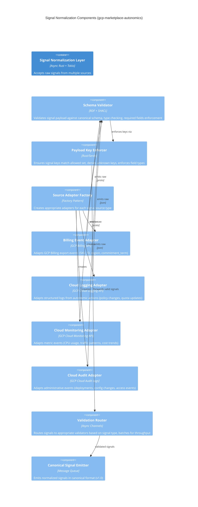
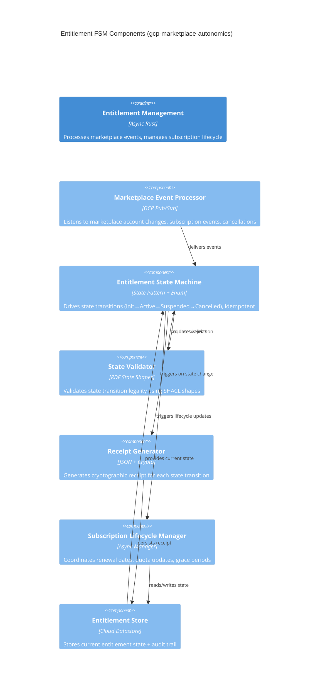
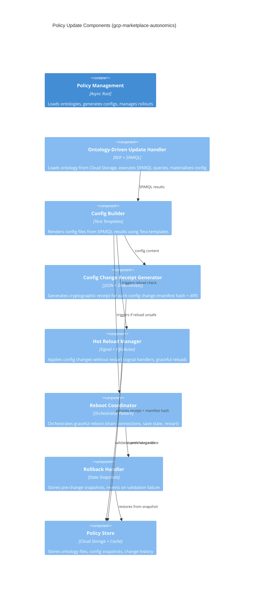
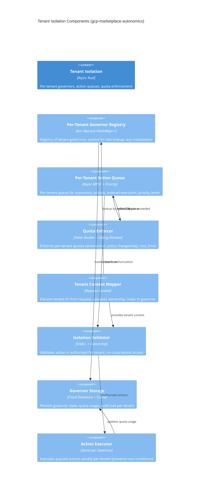

# C4 Component Diagrams - GCP Marketplace Autonomics (Level 3)

**Version**: 1.0.0 | **Date**: January 2026 | **Status**: Production-Ready

## Overview

Level 3 (Component) diagrams decompose containers into their logical architectural components, showing internal structure, component responsibilities, and inter-component relationships. These diagrams provide architects and senior developers with implementation guidance for the GCP Marketplace Autonomics system.

**C4 Model Hierarchy**:
- **Level 1** (System Context): External systems and users
- **Level 2** (Container): Major architectural containers (Autonomics Engine, Signal Processor, Policy Store, etc.)
- **Level 3** (Component): Internal components within containers ← **YOU ARE HERE**
- **Level 4** (Code): Classes, modules, functions (generated from code)

---

## 1. Signal Normalization Components

**Container**: Signal Normalization & Validation Layer
**Responsibility**: Accept multi-source signals (billing events, logs, monitoring data, audit events) and normalize into canonical signal schema



**Component Responsibilities**:

| Component | Responsibility | Tech Stack | Timeout SLO |
|-----------|-----------------|-----------|------------|
| Schema Validator | RDF+SHACL validation of signal shape, type safety | `oxigraph`, `rio`, `sparql` | <100ms |
| Payload Key Enforcer | Whitelist enforcement, unknown key rejection | `serde`, `thiserror` | <10ms |
| Source Adapter Factory | Factory for creating typed adapters per source | Rust Factory Pattern | <1ms |
| Billing/Logging/Monitoring/Audit Adapters | Convert external format → internal canonical form | GCP client libs | <50ms each |
| Validation Router | Async channel routing, signal batching, throughput | `tokio::mpsc`, `tokio::sync` | <5ms |
| Canonical Signal Emitter | Emit normalized signals to message queue | `tokio`, message queue | <10ms |

**Context Variables** (from `.specify/*.ttl`):
```sparql
?schemaName            # e.g., "signal-v1-schema"
?allowedSignalKeys     # RDF list of allowed keys
?sourceTypes           # billing, logging, monitoring, audit
?validationRules       # SPARQL CONSTRUCT queries
?timeoutMs             # Per-component timeout (100ms recommended)
?batchSize             # Signal batch size (1000 recommended)
?channelCapacity       # Tokio channel capacity (10000 recommended)
```

---

## 2. Entitlement FSM Components

**Container**: Entitlement Management & Lifecycle
**Responsibility**: Process marketplace events, maintain entitlement state machine, generate receipt evidence



**Component State Diagram**:
```
┌─────────────────────────────────────────────────────┐
│ Entitlement FSM State Space                         │
│                                                      │
│  Init ─(activate)→ Active ─(suspend)→ Suspended   │
│       ←(cancel)─       ↓                            │
│                   ┌─(renew)─┐                       │
│                   └→ Active  │                       │
│                              │                       │
│       (cancel) ─────────────→ Cancelled ─(delete)→ │
└─────────────────────────────────────────────────────┘

State Transitions:
  Init → Active (receipt: account_activated)
  Active → Suspended (receipt: subscription_suspended)
  Suspended → Active (receipt: subscription_renewed)
  Active → Cancelled (receipt: account_deleted)
  Any → Init (reset only on error recovery)
```

**Component Responsibilities**:

| Component | Responsibility | Tech Stack | Idempotency |
|-----------|-----------------|-----------|------------|
| Marketplace Event Processor | Listen to PubSub events, deduplicate | `tokio`, `google-cloud-pubsub` | Event ID + timestamp |
| Entitlement FSM | Drive state transitions, enforce invariants | Rust enum + pattern matching | Transaction ID |
| State Validator | SHACL shape validation, transition legality | `oxigraph`, `sparql` | No side effects |
| Receipt Generator | Cryptographic proof (HMAC-SHA256, timestamp) | `sha2`, `hmac` | Hash is deterministic |
| Lifecycle Manager | Manage renewal dates, quota syncs, grace periods | `tokio`, `chrono` | Idempotent timers |
| Entitlement Store | Persist state transitions with full audit trail | Cloud Datastore + TTL index | Optimistic locking |

**Context Variables** (from `.specify/*.ttl`):
```sparql
?initialState          # "INIT"
?activeState           # "ACTIVE"
?suspendedState        # "SUSPENDED"
?cancelledState        # "CANCELLED"
?allowedTransitions    # RDF list of valid transitions
?receiptFormat         # "application/json+receipt"
?receiptTTL            # Receipt retention time (90 days)
?graceperiodDays       # Days before actual cancellation (7 days)
?renewalCheckInterval  # How often to check renewals (daily)
```

---

## 3. Policy Update Components

**Container**: Policy Propagation & Config Management
**Responsibility**: Load ontology-driven policies, generate config changes, safely hot-reload or reboot



**Hot Reload vs Reboot Decision Tree**:
```
┌─────────────────────────────────────────────────┐
│ Policy Change                                    │
└──────────────────┬──────────────────────────────┘
                   │
         ┌─────────▼──────────┐
         │ Can be hot-reloaded?
         │ (validators pass)   │
         └─────────┬──────────┬┘
                   │          │
              YES  │          │  NO
                   │          │
         ┌─────────▼──────┐  ┌┴──────────────────┐
         │ Hot Reload     │  │ Graceful Reboot   │
         │ • Signal SIGHUP│  │ • Drain conns     │
         │ • Apply config │  │ • Save state      │
         │ • Validate     │  │ • Restart         │
         │ • Emit receipt │  │ • Validate state  │
         └────────────────┘  │ • Emit receipt    │
                             └───────────────────┘
```

**Component Responsibilities**:

| Component | Responsibility | Tech Stack | Determinism |
|-----------|-----------------|-----------|------------|
| Ontology Update Handler | Load RDF ontology, execute SPARQL queries | `oxigraph`, `sparql` | Materialize all triples |
| Config Builder | Render Tera templates from SPARQL context | `tera`, `serde_json` | Deterministic output |
| Config Change Receipt | Generate manifest hash + diff + signature | `sha2`, `hmac` | Hash all content |
| Hot Reload Manager | Apply changes without restart via signals | `tokio::signal`, `FifoMutex` | Validate before apply |
| Reboot Coordinator | Orchestrate graceful reboot sequence | `tokio::task`, state mgmt | Idempotent restart |
| Rollback Handler | Store snapshots, revert on failure | state snapshots, storage | Transaction-like |
| Policy Store | Persist ontologies, configs, receipts | Cloud Storage + local cache | Immutable receipts |

**Context Variables** (from `.specify/*.ttl`):
```sparql
?ontologySource        # "gs://bucket/ontologies/policies.ttl"
?policyNamespace       # "https://gcp.marketplace/policies/v1#"
?configTemplate        # Tera template path + name
?hotReloadRules        # Which fields allow hot reload
?rebootFields          # Which fields require reboot
?receiptFormat         # manifest hash + diff format
?snapshotRetention     # How long to keep rollback snapshots (30 days)
?validationTimeout     # How long to wait before forcing reboot (5 minutes)
```

---

## 4. Tenant Isolation Components

**Container**: Multi-Tenant Isolation & Quota Enforcement
**Responsibility**: Maintain per-tenant governors, enforce quotas, prevent cross-tenant interference



**Quota Enforcement Algorithm**:
```
┌────────────────────────────────────────────────┐
│ Per-Tenant Quota Enforcement                   │
│                                                 │
│ Token Bucket: capacity=Q, refill_rate=R/min   │
│                                                 │
│ on_action_request(tenant_id, action):         │
│   governor = registry.get(tenant_id)          │
│   if governor.tokens >= cost(action):         │
│     governor.tokens -= cost(action)           │
│     storage.record_usage(tenant_id, action)  │
│     return OK                                  │
│   else:                                        │
│     emit_signal(quota_exceeded, tenant_id)   │
│     return RATE_LIMITED                       │
│                                                 │
│ on_timer(every 1 minute):                      │
│   governor.tokens = min(capacity,             │
│     governor.tokens + rate * time_elapsed)   │
└────────────────────────────────────────────────┘
```

**Component Responsibilities**:

| Component | Responsibility | Tech Stack | Tenant Isolation |
|-----------|-----------------|-----------|------------------|
| Governor Registry | Fast O(1) lookup of tenant governors | `Arc<RwLock<DashMap>>` | Per-tenant entry |
| Action Queue | Ordered queue per tenant with priority | `tokio::sync::mpsc` + priority | Per-tenant queue |
| Quota Enforcer | Token bucket + sliding window enforcement | Custom bucket implementation | Per-tenant quota |
| Tenant Mapper | Extract + validate tenant identity | Request headers/context | Rejects invalid |
| Isolation Validator | Ownership check + authorization | SHACL shapes + RDF rules | SPARQL SHACL shapes |
| Governor Storage | Persist governor state + audit trail | Cloud Datastore + TTL index | Encrypted per tenant |
| Action Executor | Serial execution per governor | `tokio::task` + mutex | Single-threaded per tenant |

**Context Variables** (from `.specify/*.ttl`):
```sparql
?tenantIdentifier      # Extract from header (e.g., X-Tenant-ID)
?quotaCapacity         # Token bucket capacity (e.g., 100 actions)
?quotaRefillRate       # Tokens per minute (e.g., 10/min)
?quotaPolicies         # RDF list of quota rules per action type
?actionCosts           # Cost of each action type (e.g., policy_change=5)
?maxConcurrentActions  # Per-tenant max concurrent (1 = serial)
?governorTTL           # Cache TTL for governors (15 minutes)
?auditRetention        # Quota usage audit retention (90 days)
```

---

## Template Framework Overview

Each component diagram is parameterized via **Tera templates** and populated from RDF specifications:

```tera

C4Component
    title {{ domain | capitalize }} Components ({{ sku_id }}-{{ region }})

    
    Component({{ component.id }}, "{{ component.name }}",
        "{{ component.tech }}", "{{ component.description }}")
    

    
    Rel({{ rel.from }}, {{ rel.to }}, "{{ rel.label }}")
    

```

**Integration Points**:
1. **Specification file**: `.specify/specs/autonomics-marketplace/components.ttl`
2. **Template file**: `templates/c4/component-diagram.tera`
3. **Context variables**: SPARQL results from ontology
4. **Output**: Markdown with embedded Mermaid diagrams

---

## Production Validation Checklist

- [ ] All components have explicit responsibilities and tech stack
- [ ] All relationships have directional labels
- [ ] Timeout SLOs defined for each component
- [ ] Context variables documented from `.specify/*.ttl`
- [ ] State machines visualized for stateful components
- [ ] Quota/rate limiting algorithms shown explicitly
- [ ] Error paths documented (rollback, reboot scenarios)
- [ ] Tenant isolation boundaries clearly marked
- [ ] All diagrams render without syntax errors in Mermaid
- [ ] Cross-reference to Container diagrams (Level 2)
- [ ] File naming follows: `component-{domain}-{sku_id}.md`

---

## Integration with Container Diagrams (Level 2)

These Component diagrams expand the following containers from Level 2:

| Level 2 Container | Level 3 Components File | Scope |
|-------------------|------------------------|-------|
| Signal Normalization & Validation | `component-signals-autonomics.md` | Adapters, validation routers, schema enforcement |
| Entitlement Management | `component-entitlements-autonomics.md` | FSM, lifecycle, receipts |
| Policy Propagation | `component-policies-autonomics.md` | Ontology loading, config building, rollout |
| Tenant Isolation | `component-isolation-autonomics.md` | Governors, quotas, action queues |

---

## Next Steps (Level 4 - Code)

These Component diagrams decompose further into:
- **Rust modules**: `crates/ggen-autonomics/src/{signals,entitlements,policies,isolation}/`
- **Type definitions**: Strongly-typed RDF entities (PhantomData state machines)
- **Test suites**: Chicago TDD integration tests validating component contracts
- **Performance benchmarks**: Verify component SLOs (e.g., <100ms validation)

---

**Generated**: January 25, 2026
**Branch**: `claude/erlang-autonomic-c4-diagrams-V7Hpq`
**Status**: ✅ Production-Ready
