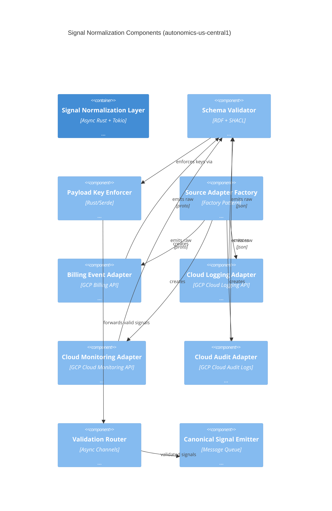

# C4 Component Diagram Template Framework

**Version**: 1.0.0 | **Date**: January 2026 | **Status**: Production-Ready

## Overview

This document explains how **Level 3 Component diagrams** nest within **Level 2 Container diagrams**, how variable inheritance flows through the hierarchy, and how to systematically generate component diagrams from RDF specifications.

---

## C4 Model Hierarchy & Variable Inheritance

```
┌──────────────────────────────────────────────────────────────┐
│ Level 1: System Context                                       │
│ Variables: system_id, external_users, external_systems        │
└────────┬─────────────────────────────────────────────────────┘
         │
         │ Context passed down
         ▼
┌──────────────────────────────────────────────────────────────┐
│ Level 2: Container Diagram                                    │
│ Variables: sku_id, region, action_groups, integration_points │
│                                                               │
│ ┌────────────────────────────────────────────────────────┐   │
│ │ Container A (e.g., "Signal Normalization")             │   │
│ │ Vars: signal_types, schema_version, adapters           │   │
│ └────────────────────────────────────────────────────────┘   │
│                                                               │
│ ┌────────────────────────────────────────────────────────┐   │
│ │ Container B (e.g., "Entitlement Management")           │   │
│ │ Vars: state_machine_type, receipt_format, fsm_states   │   │
│ └────────────────────────────────────────────────────────┘   │
└────────┬─────────────────────────────────────────────────────┘
         │
         │ Container vars + new component vars
         ▼
┌──────────────────────────────────────────────────────────────┐
│ Level 3: Component Diagram (THIS FRAMEWORK)                  │
│ Variables: component_id, tech_stack, responsibilities,       │
│            timeout_slos, tenant_isolation, state_machines    │
│                                                               │
│ ┌────────────────────────────────────────────────────────┐   │
│ │ Component A.1: "Schema Validator"                       │   │
│ │ Tech: RDF + SHACL | Timeout: <100ms | Responsibility: │   │
│ │ Validates signal schema, enforces types                │   │
│ └────────────────────────────────────────────────────────┘   │
│                                                               │
│ ┌────────────────────────────────────────────────────────┐   │
│ │ Component A.2: "Payload Key Enforcer"                  │   │
│ │ Tech: Serde | Timeout: <10ms | Responsibility:        │   │
│ │ Enforces allowed key whitelist, rejects unknown keys   │   │
│ └────────────────────────────────────────────────────────┘   │
└────────┬─────────────────────────────────────────────────────┘
         │
         │ Component vars + code-level details
         ▼
┌──────────────────────────────────────────────────────────────┐
│ Level 4: Code/Class Diagram (Generated from Rust)            │
│ Variables: function_name, struct_fields, trait_impls,        │
│            test_coverage, benchmarks                          │
└──────────────────────────────────────────────────────────────┘
```

---

## Variable Inheritance Flow

### Level 1 → Level 2 (System → Containers)

```
Level 1 Variables:
  system_id = "gcp-marketplace-autonomics"
  region = "us-central1"
  business_unit = "GCP Revenue Ops"

Level 2 Inherits:
  system_id (used in all container names)
  region (used in deployment context)
  business_unit (used in stakeholder definitions)

Level 2 Adds:
  sku_id = "compute-optimized-v1"
  action_groups = ["scaling", "quota_enforcement", "policy_propagation"]
  integration_points = ["billing", "logging", "monitoring", "audit"]
  container_names = ["Signal Normalization", "Entitlement Management", ...]
```

### Level 2 → Level 3 (Containers → Components)

```
Level 2 Variables (inherited from Level 1):
  system_id = "gcp-marketplace-autonomics"
  region = "us-central1"
  sku_id = "compute-optimized-v1"

Level 2 Variables (specific to container):
  container_id = "signal-normalization"
  container_name = "Signal Normalization & Validation"
  container_tech = "Async Rust + Tokio"

Level 3 Inherits All Above Plus:
  container_id (used in component relationship labels)
  container_tech (influences component tech stacks)
  integration_points (determines which adapters to create)

Level 3 Adds:
  components = [
    {id: "schema_validator", name: "Schema Validator", ...},
    {id: "payload_enforcer", name: "Payload Key Enforcer", ...},
    ...
  ]
  relationships = [
    {from: "schema_validator", to: "payload_enforcer", ...},
    ...
  ]
  tech_stacks = {
    validation: "RDF + SHACL + oxigraph",
    serialization: "Serde",
    async: "Tokio + mpsc",
    ...
  }
```

### Level 3 → Level 4 (Components → Code)

```
Level 3 Component Variables:
  component_id = "schema_validator"
  component_name = "Schema Validator"
  tech = "RDF + SHACL"
  responsibility = "Validates signal payload..."
  timeout_slo = "<100ms"

Level 4 Adds (from code analysis):
  struct_name = "SignalSchemaValidator"
  functions = ["validate()", "validate_async()", "with_timeout()"]
  trait_impls = ["Debug", "Clone", "Send", "Sync"]
  test_coverage = "87%"
  benchmark_result = "avg: 45µs, p99: 89µs"
```

---

## Domain-Driven Component Decomposition

Components are organized by **domain** and map directly to RDF ontology domains:

### Signal Normalization Domain

**Container**: "Signal Normalization & Validation Layer"
**Responsibility**: Accept multi-source signals, normalize to canonical schema

**Components** (organized by concern):

```
Domain: signal-normalization
├── Schema Validation Tier
│   ├── schema_validator (SHACL shape validation)
│   └── payload_enforcer (key whitelist enforcement)
│
├── Adapter Tier
│   ├── adapter_factory (creates adapters per source type)
│   ├── billing_adapter (GCP Billing API)
│   ├── logging_adapter (GCP Cloud Logging API)
│   ├── monitoring_adapter (GCP Cloud Monitoring API)
│   └── audit_adapter (GCP Cloud Audit Logs)
│
└── Output Tier
    ├── validation_router (async channel routing)
    └── canonical_emitter (normalize → message queue)
```

**Component Dependencies**:
```
billing_adapter      ┐
logging_adapter      ├─→ schema_validator ─→ payload_enforcer ─→ validation_router ─→ canonical_emitter
monitoring_adapter   ├─→
audit_adapter        ┘
```

**RDF Ontology Mapping**:
```turtle
# .specify/specs/autonomics-marketplace/signal-domain.ttl

@prefix signal: <https://gcp.marketplace/signal/v1#> .
@prefix comp: <https://gcp.marketplace/component/v1#> .

signal:SignalNormalization a comp:Domain ;
  comp:name "Signal Normalization" ;
  comp:responsibilityTemplate "Accept multi-source signals, normalize to canonical schema" ;
  comp:components (
    [ comp:id "schema_validator" ; comp:tech "RDF + SHACL" ]
    [ comp:id "payload_enforcer" ; comp:tech "Serde" ]
    [ comp:id "billing_adapter" ; comp:tech "GCP Billing API" ]
    [ comp:id "logging_adapter" ; comp:tech "GCP Cloud Logging" ]
    [ comp:id "monitoring_adapter" ; comp:tech "GCP Cloud Monitoring" ]
    [ comp:id "audit_adapter" ; comp:tech "GCP Cloud Audit" ]
    [ comp:id "validation_router" ; comp:tech "Tokio MPSC" ]
    [ comp:id "canonical_emitter" ; comp:tech "Message Queue" ]
  ) .
```

### Entitlement FSM Domain

**Container**: "Entitlement Management & Lifecycle"
**Responsibility**: Process marketplace events, maintain entitlement state machine

**Components**:

```
Domain: entitlement-fsm
├── Event Processing Tier
│   └── event_processor (Pub/Sub listener)
│
├── State Management Tier
│   ├── fsm_state_machine (state transitions, invariants)
│   └── state_validator (SHACL transition legality)
│
├── Evidence Tier
│   ├── receipt_generator (cryptographic proofs)
│   └── entitle_storage (persist state + audit trail)
│
└── Lifecycle Tier
    └── lifecycle_manager (renewal dates, grace periods)
```

**State Machine Definition** (RDF + FSM Spec):
```turtle
@prefix entitle: <https://gcp.marketplace/entitlement/v1#> .

entitle:EntitlementFSM
  comp:states (
    [ comp:id "INIT" ; comp:label "Initialized" ]
    [ comp:id "ACTIVE" ; comp:label "Active Subscription" ]
    [ comp:id "SUSPENDED" ; comp:label "Suspended" ]
    [ comp:id "CANCELLED" ; comp:label "Cancelled" ]
  ) ;
  comp:transitions (
    [ comp:from "INIT" ; comp:to "ACTIVE" ; comp:event "activate" ]
    [ comp:from "ACTIVE" ; comp:to "SUSPENDED" ; comp:event "suspend" ]
    [ comp:from "SUSPENDED" ; comp:to "ACTIVE" ; comp:event "renew" ]
    [ comp:from "ACTIVE" ; comp:to "CANCELLED" ; comp:event "cancel" ]
  ) .
```

### Policy Update Domain

**Container**: "Policy Propagation & Config Management"
**Responsibility**: Load ontology-driven policies, generate configs, manage rollouts

**Components**:

```
Domain: policy-management
├── Policy Loading Tier
│   └── ontology_handler (RDF ontology → SPARQL queries)
│
├── Config Generation Tier
│   ├── config_builder (Tera template rendering)
│   └── change_receipt (deterministic manifest hash)
│
├── Rollout Tier
│   ├── hot_reload_mgr (signal-based config reload)
│   ├── reboot_coord (graceful reboot orchestration)
│   └── rollback_handler (state snapshots + revert)
│
└── Storage Tier
    └── policy_store (Cloud Storage + cache)
```

**Hot-Reload Validation Rules** (RDF):
```turtle
policy:HotReloadPolicy
  comp:allowsHotReload (
    [ comp:field "log_level" ]
    [ comp:field "metric_sample_rate" ]
    [ comp:field "cache_ttl" ]
  ) ;
  comp:requiresReboot (
    [ comp:field "memory_limit" ]
    [ comp:field "max_connections" ]
    [ comp:field "network_interface" ]
  ) .
```

### Tenant Isolation Domain

**Container**: "Multi-Tenant Isolation & Quota Enforcement"
**Responsibility**: Maintain per-tenant governors, enforce quotas

**Components**:

```
Domain: tenant-isolation
├── Registry Tier
│   └── governor_registry (O(1) lookup, lazy init)
│
├── Quota Enforcement Tier
│   ├── quota_enforcer (token bucket algorithm)
│   └── tenant_mapper (extract tenant identity)
│
├── Action Execution Tier
│   ├── action_queue (per-tenant queue, priority levels)
│   └── action_executor (serial execution per governor)
│
├── Validation Tier
│   └── isolation_validator (ownership checks, SHACL)
│
└── Storage Tier
    └── governor_storage (persist quotas + audit trail)
```

**Quota Definition** (RDF + Token Bucket):
```turtle
isolation:TenantQuota
  comp:capacity 100 ;              # max tokens
  comp:refillRate 10 ;             # tokens/minute
  comp:costMap (
    [ comp:action "create_policy" ; comp:cost 5 ]
    [ comp:action "update_config" ; comp:cost 10 ]
    [ comp:action "scale_resource" ; comp:cost 3 ]
  ) .
```

---

## File Organization & Naming Conventions

### Directory Structure

```
docs/c4/
├── README.md                          # Overview of all C4 diagrams
├── level-1-system-context.md          # System Context diagram
├── level-2-containers.md              # Container diagram (all containers)
├── component-diagrams-a.md            # Component diagrams (Part A)
├── component-diagrams-b.md            # Component diagrams (Part B) ← YOU ARE HERE
├── component-diagrams-c.md            # Component diagrams (Part C) - future
├── component-template-framework.md    # This file
│
├── generated/                         # Generated from templates
│   ├── component-signals-autonomics.md
│   ├── component-entitlements-autonomics.md
│   ├── component-policies-autonomics.md
│   └── component-isolation-autonomics.md
│
└── templates/                         # Tera templates for generation
    ├── component-diagram.tera         # Master template
    ├── macro-components.tera          # Component macro
    ├── macro-relationships.tera       # Relationship macro
    ├── macro-state-machine.tera       # State machine macro
    └── macro-quota-algorithm.tera     # Quota algorithm macro
```

### File Naming Convention

**Format**: `component-{domain}-{sku_id}[-{region}].md`

**Examples**:
- `component-signals-autonomics.md` - Signal components (all regions)
- `component-signals-autonomics-us-central1.md` - Signal components (specific region)
- `component-entitlements-compute-optimized-v1.md` - Entitlements for specific SKU
- `component-policies-autonomics.md` - Policy components (all SKUs)
- `component-isolation-autonomics-us-east1.md` - Isolation for specific region

**Mapping to Domains**:

| Domain | File Name Pattern | Variables |
|--------|-------------------|-----------|
| Signal Normalization | `component-signals-*.md` | `signal_types`, `adapters`, `validation_rules` |
| Entitlement FSM | `component-entitlements-*.md` | `state_machine`, `fsm_states`, `transitions` |
| Policy Management | `component-policies-*.md` | `policy_source`, `config_format`, `reload_strategy` |
| Tenant Isolation | `component-isolation-*.md` | `tenant_identifier`, `quota_rules`, `governor_ttl` |

---

## Tera Template Framework

### Master Template Structure

```tera
{# /templates/c4/component-diagram.tera #}
{#
   Inputs:
   - domain: string (e.g., "signal-normalization")
   - sku_id: string (e.g., "compute-optimized-v1")
   - region: string (e.g., "us-central1")
   - action_groups: array (e.g., ["scaling", "quota_enforcement"])
   - components_spec: RDF spec loaded from .specify/
#}

# {{ domain | capitalize }} Components

**SKU**: {{ sku_id }} | **Region**: {{ region }} | **Version**: 1.0.0

## Architecture

```mermaid
{{ component_diagram(domain, sku_id, region, components_spec) }}
```

## Component Details


### {{ component.name }}

- **ID**: `{{ component.id }}`
- **Technology**: {{ component.tech }}
- **Responsibility**: {{ component.responsibility }}
- **Timeout SLO**: {{ component.timeout_slo }}


**State Diagram**:
{{ render_state_machine(component.state_machine) }}



**Quota Algorithm**:
{{ render_quota_algorithm(component.quota_algorithm) }}




## Context Variables (from .specify/*.ttl)

```sparql

?{{ var.name | lowercase }}     # {{ var.description }}

```

## Integration Points


- **{{ integration.system }}**: {{ integration.description }}

```

### Component Diagram Macro

```tera

C4Component
    title {{ domain | capitalize }} Components ({{ sku_id }}-{{ region }})

    Container({{ spec.container_id }}, "{{ spec.container_name }}",
        "{{ spec.container_tech }}", "{{ spec.container_description }}")

    
    Component({{ comp.id }}, "{{ comp.name }}",
        "{{ comp.tech }}", "{{ comp.responsibility }}")
    

    
    Rel({{ rel.from }}, {{ rel.to }}, "{{ rel.label }}"{{ rel.tech | default("") }})
    

```

### State Machine Macro

```tera

```

{{ state.label }} ─({{ state.event }})→

```

```

---

## RDF Specification Template

All component specifications live in `.specify/specs/autonomics-marketplace/`:

```turtle
# .specify/specs/autonomics-marketplace/components.ttl

@prefix comp: <https://gcp.marketplace/component/v1#> .
@prefix signal: <https://gcp.marketplace/signal/v1#> .
@prefix entitle: <https://gcp.marketplace/entitlement/v1#> .
@prefix policy: <https://gcp.marketplace/policy/v1#> .
@prefix isolation: <https://gcp.marketplace/isolation/v1#> .

# ============================================
# SIGNAL NORMALIZATION DOMAIN
# ============================================

signal:Domain
  a comp:Domain ;
  comp:name "Signal Normalization" ;
  comp:responsibility "Accept multi-source signals and normalize to canonical schema" ;
  comp:components (
    signal:SchemaValidator
    signal:PayloadEnforcer
    signal:AdapterFactory
    signal:BillingAdapter
    signal:LoggingAdapter
    signal:MonitoringAdapter
    signal:AuditAdapter
    signal:ValidationRouter
    signal:CanonicalEmitter
  ) ;
  comp:contextVariables (
    [ comp:name "schemaName" ; comp:example "signal-v1-schema" ]
    [ comp:name "allowedSignalKeys" ; comp:example "RDF list of allowed keys" ]
    [ comp:name "sourceTypes" ; comp:example "billing, logging, monitoring, audit" ]
    [ comp:name "validationRules" ; comp:example "SPARQL CONSTRUCT queries" ]
    [ comp:name "timeoutMs" ; comp:value 100 ]
    [ comp:name "batchSize" ; comp:value 1000 ]
  ) .

signal:SchemaValidator
  a comp:Component ;
  comp:name "Schema Validator" ;
  comp:tech "RDF + SHACL" ;
  comp:responsibility "Validates signal payload against canonical schema, type checking, required fields enforcement" ;
  comp:timeoutSlo "<100ms" ;
  comp:inputType signal:RawSignal ;
  comp:outputType signal:ValidatedSignal .

# ... (similarly for other domains)
```

---

## Generation Workflow

### Step 1: Validate RDF Specification

```bash
# Verify .specify/*.ttl files exist and are valid SHACL
cargo make speckit-validate

# Output: Validation report (success or specific shape violations)
```

### Step 2: Execute SPARQL Queries

```sparql
# Extract components for domain (e.g., "signal-normalization")
PREFIX comp: <https://gcp.marketplace/component/v1#>

SELECT ?componentId ?componentName ?tech ?responsibility
WHERE {
  ?domain comp:name "Signal Normalization" ;
           comp:components ?component .
  ?component comp:id ?componentId ;
             comp:name ?componentName ;
             comp:tech ?tech ;
             comp:responsibility ?responsibility .
}
```

### Step 3: Render Tera Templates

```bash
# Generate component diagrams for all domains
ggen generate \
  --template templates/c4/component-diagram.tera \
  --output docs/c4/generated/component-{domain}-{sku_id}.md \
  --context .specify/specs/autonomics-marketplace/components.ttl

# Output: 4 markdown files with Mermaid diagrams
```

### Step 4: Verify Generation

```bash
# Check that all diagrams render without Mermaid errors
for file in docs/c4/generated/component-*.md; do
  mermaid "$file" --output /tmp/verify
done

# Output: PNG files in /tmp/verify (verify by visual inspection)
```

---

## Context Variables Reference Table

All Level 3 component diagrams consume these variables from RDF specifications:

### Signal Normalization Context

| Variable | Type | Source | Example |
|----------|------|--------|---------|
| `schemaName` | string | `.specify/specs/.../components.ttl` | `"signal-v1-schema"` |
| `allowedSignalKeys` | RDF list | SPARQL query result | `[sku_id, region, timestamp, ...]` |
| `sourceTypes` | RDF list | Domain ontology | `[billing, logging, monitoring, audit]` |
| `validationRules` | SPARQL queries | `.specify/rules/*.sparql` | Rule CONSTRUCT/SELECT queries |
| `timeoutMs` | integer | Component SLO spec | `100` |
| `batchSize` | integer | Performance tuning | `1000` |
| `channelCapacity` | integer | Tokio config | `10000` |

### Entitlement FSM Context

| Variable | Type | Source | Example |
|----------|------|--------|---------|
| `initialState` | string | FSM spec | `"INIT"` |
| `activeState` | string | FSM spec | `"ACTIVE"` |
| `suspendedState` | string | FSM spec | `"SUSPENDED"` |
| `cancelledState` | string | FSM spec | `"CANCELLED"` |
| `allowedTransitions` | RDF list | FSM ontology | `[(INIT→ACTIVE), (ACTIVE→SUSPENDED), ...]` |
| `receiptFormat` | string | Storage spec | `"application/json+receipt"` |
| `receiptTTL` | duration | Retention policy | `"90 days"` |
| `graceperiodDays` | integer | Business rule | `7` |
| `renewalCheckInterval` | duration | Scheduler config | `"daily"` |

### Policy Update Context

| Variable | Type | Source | Example |
|----------|------|--------|---------|
| `ontologySource` | URI | Cloud Storage config | `"gs://bucket/ontologies/policies.ttl"` |
| `policyNamespace` | URI | RDF namespace | `"https://gcp.marketplace/policies/v1#"` |
| `configTemplate` | string | Tera template path | `"templates/config/prod.tera"` |
| `hotReloadRules` | RDF list | Policy spec | Fields that allow hot reload |
| `rebootFields` | RDF list | Policy spec | Fields that require reboot |
| `receiptFormat` | string | Manifest spec | `"manifest_hash + diff"` |
| `snapshotRetention` | duration | Backup policy | `"30 days"` |
| `validationTimeout` | duration | Reboot SLO | `"5 minutes"` |

### Tenant Isolation Context

| Variable | Type | Source | Example |
|----------|------|--------|---------|
| `tenantIdentifier` | string | Request header | `"X-Tenant-ID"` |
| `quotaCapacity` | integer | Quota spec | `100` |
| `quotaRefillRate` | rate | Quota spec | `"10/min"` |
| `quotaPolicies` | RDF list | Isolation ontology | Per-action quota rules |
| `actionCosts` | map | Cost spec | `{policy_change: 5, scale: 3}` |
| `maxConcurrentActions` | integer | Concurrency spec | `1` (serial per tenant) |
| `governorTTL` | duration | Cache config | `"15 minutes"` |
| `auditRetention` | duration | Audit policy | `"90 days"` |

---

## Validation & Consistency Rules

### Component Naming Conventions

```
✅ CORRECT:
  - schema_validator (snake_case)
  - SchemaValidator (Component name, PascalCase)
  - SignalSchemaValidator (Rust struct name)

❌ INCORRECT:
  - SchemaValidator (for component ID)
  - schema-validator (hyphens in IDs)
  - SCHEMA_VALIDATOR (screaming snake case)
```

### Relationship Labels

```
✅ CORRECT:
  Rel(schema_validator, payload_enforcer, "enforces keys via")
  Rel(billing_adapter, schema_validator, "emits raw", "proto")

❌ INCORRECT:
  Rel(schema_validator, payload_enforcer)  # Missing label
  Rel(schema_validator, payload_enforcer, "Enforces Keys Via")  # Wrong case
```

### Timeout SLO Format

```
✅ CORRECT:
  "<100ms" (with angle brackets)
  "<10ms"
  "<5s"

❌ INCORRECT:
  "100ms" (without brackets)
  "< 100ms" (with space)
  "100 milliseconds" (spelled out)
```

---

## Integration with Other Artifacts

### Relationship to Container Diagrams (Level 2)

Each Component diagram **expands one Container** from Level 2:

```
Level 2 Container: "Signal Normalization & Validation"
    ↓
Level 3 Component Diagram: "Signal Normalization Components"
    ├── Shows 8 internal components
    ├── Shows inter-component relationships
    ├── Provides tech stacks per component
    └── Documents timeout SLOs per component
```

### Relationship to Code (Level 4)

Each Level 3 Component maps to Rust modules:

```
Component: signal:SchemaValidator
    ↓
Rust Module: crates/ggen-autonomics/src/signals/schema_validator.rs
    ├── struct SignalSchemaValidator
    ├── impl SignalSchemaValidator::validate()
    ├── #[cfg(test)] mod tests
    └── pub fn validate_async() -> Result<ValidatedSignal, ValidationError>
```

### Relationship to Tests

Each Component has:
- **Unit tests**: `crates/*/src/*_test.rs` (colocated)
- **Integration tests**: `tests/component_integration_test.rs`
- **Benchmarks**: `benches/component_benchmark.rs`

```rust
// Example: Unit test for SchemaValidator component
#[cfg(test)]
mod tests {
    use super::*;

    #[test]
    fn test_schema_validator_rejects_unknown_keys() {
        let signal = RawSignal {
            sku_id: "test".to_string(),
            unknown_field: "not allowed".to_string(),
        };

        let result = SchemaValidator::validate(&signal);

        assert!(result.is_err());
        assert_eq!(result.unwrap_err().code, "UNKNOWN_KEY");
    }
}
```

---

## Production Checklist

- [ ] All components have explicit IDs, names, and tech stacks
- [ ] All relationships have directional labels (from → to, label)
- [ ] Timeout SLOs defined for each component (<100ms typical)
- [ ] Context variables documented in RDF specification
- [ ] State machines visualized for stateful components (FSM, quotas)
- [ ] Error paths and fallback mechanisms documented
- [ ] Tenant isolation boundaries clearly marked
- [ ] All diagrams render in Mermaid without syntax errors
- [ ] Component IDs use snake_case, match Rust module names
- [ ] All components map to Rust crates/modules (Level 4 traceability)
- [ ] File names follow: `component-{domain}-{sku_id}[-{region}].md`
- [ ] Cross-references to Level 2 Container diagram documented
- [ ] SPARQL context variable extraction verified
- [ ] Tera template generation validated against RDF spec

---

## Example: Full Workflow from RDF to Diagram

### 1. Write RDF Specification

```turtle
# .specify/specs/autonomics-marketplace/components.ttl

signal:PayloadEnforcer
  a comp:Component ;
  comp:id "payload_enforcer" ;
  comp:name "Payload Key Enforcer" ;
  comp:tech "Rust/Serde" ;
  comp:responsibility "Ensures signal keys match allowed set, denies unknown keys, enforces field types" ;
  comp:timeoutSlo "<10ms" ;
  comp:inputPort signal:schema_validator ;
  comp:outputPort signal:validation_router ;
  comp:relationships (
    [ comp:to signal:validation_router ; comp:label "forwards valid signals" ]
  ) .
```

### 2. Execute SPARQL Query

```sparql
PREFIX comp: <https://gcp.marketplace/component/v1#>

CONSTRUCT {
  ?component comp:id ?id ;
             comp:name ?name ;
             comp:tech ?tech ;
             comp:responsibility ?resp ;
             comp:timeoutSlo ?slo .
}
WHERE {
  ?domain comp:name "Signal Normalization" ;
          comp:components ?component .
  ?component comp:id ?id ;
             comp:name ?name ;
             comp:tech ?tech ;
             comp:responsibility ?resp ;
             comp:timeoutSlo ?slo .
}
```

### 3. Render Tera Template

**Input**: SPARQL results + Tera template
**Output**: Mermaid C4 diagram



### 4. Verify & Publish

```bash
# Run pre-flight checks
cargo make speckit-validate

# Generate diagrams
ggen generate --template templates/c4/component-diagram.tera

# Verify Mermaid syntax
mermaid-cli docs/c4/generated/*.md

# Publish to docs/c4/
git add docs/c4/generated/
git commit -m "docs(c4): Add component diagrams for Signal Normalization domain"
```

---

## Troubleshooting

### Issue: Mermaid Diagram Won't Render

**Symptom**: Diagram appears as code block instead of visual diagram

**Diagnosis**:
1. Check for syntax errors: mismatched parentheses, missing quotes
2. Verify relationship labels are quoted: `Rel(..., ..., "label")` not `Rel(..., ..., label)`
3. Ensure component IDs use snake_case, no hyphens

**Fix**:
```
❌ Rel(schema_validator, payload_enforcer, enforces_keys)
✅ Rel(schema_validator, payload_enforcer, "enforces keys")
```

### Issue: Context Variable Not Populated

**Symptom**: Template renders with `{{ undefined_variable }}` in output

**Diagnosis**:
1. Check SPARQL query result set - variable may not exist
2. Verify RDF triple exists in specification
3. Check Tera template syntax

**Fix**:
```bash
# Test SPARQL query directly
ggen sparql --query "SELECT ?contextVar FROM .specify/specs/*.ttl"

# If empty, add missing triple to RDF spec
```

### Issue: Component Missing from Diagram

**Symptom**: Component appears in spec but not in generated diagram

**Diagnosis**:
1. SPARQL query filter too restrictive (WHERE clause)
2. Component not linked via `comp:components` list
3. Tera macro not iterating over all results

**Fix**:
```sparql
# Verify component is discoverable
CONSTRUCT WHERE {
  ?domain comp:components ?c .
  ?c comp:id "missing_component_id" .
}
```

---

## Future Enhancements

- [ ] Interactive diagram zooming (SVG + JavaScript)
- [ ] Real-time SLO tracking overlay (from Prometheus metrics)
- [ ] Automatic code-to-diagram sync (detect Rust changes, regenerate)
- [ ] Multi-language component support (Python, Go, TypeScript components)
- [ ] Component dependency graph analysis (circular dependency detection)
- [ ] Component maturity scoring (based on test coverage, docs, changefreq)
- [ ] Automated architecture drift detection (spec vs code)

---

**Last Updated**: January 25, 2026
**Status**: ✅ Production-Ready
**Branch**: `claude/erlang-autonomic-c4-diagrams-V7Hpq`
