# GCP Marketplace Autonomics — C4 Container Diagrams (Level 2)

**Version**: 6.0.0 | **Date**: 2026-01-25 | **Status**: Production-Ready

This document defines the seven deployable container architectures for the GCP Marketplace Autonomics system. Each diagram shows the core services, data stores, message queues, and observability infrastructure required for autonomous SKU management at scale.

---

## 📋 Context Variables (from `.specify/*.ttl`)

All diagrams are parameterized by these RDF-sourced variables:

```turtle
# ggen-autonomic-context.ttl
:autonomicConfig a schema:Configuration ;
  :deploymentRegion "us-central1" ;
  :multiRegionEnabled true ;
  :numTenants 1000 ;
  :avgSkusPerTenant 25 ;
  :pubsubTopicPattern "{tenant}-{sku}-signals" ;
  :cloudRunCpu "2" ;
  :cloudRunMemory "4Gi" ;
  :firestoreMode "datastore" ;
  :monitoringStack "prometheus+otelsdk" ;
  :privateDeployment false ;
  :iapEnabled false ;
  :vpcServiceControlsEnabled false .
```

---

## 1️⃣ Single SKU Container Diagram

**Purpose**: Foundational deployment pattern for a single autonomous SKU managed by one tenant.

**Deployable Units**:
- 1× Cloud Run service (autonomic entrypoint)
- 1× Pub/Sub topic (signal ingestion)
- 1× Firestore collection (receipt ledger)
- 1× OTel Collector sidecar
- 1× Prometheus for metrics
- 1× Cloud Logging for structured logs


**Context Variables** (Tera template):
```tera
# templates/container-single-sku.tera

deployment:
  service_name: "autonomic-{{ config.sku_id }}"
  region: "{{ config.region }}"
  cpu: "{{ config.cloudrun_cpu }}"
  memory: "{{ config.cloudrun_memory }}"
  concurrency: {{ config.cloudrun_concurrency }}

pubsub:
  topic: "{{ config.tenant_id }}-{{ config.sku_id }}-signals"
  subscription: "{{ config.tenant_id }}-{{ config.sku_id }}-executor"
  push_endpoint: "https://{{ config.service_name }}-{{ config.region }}.run.app/signal"
  ack_deadline_seconds: 60
  max_delivery_attempts: 5

firestore:
  project: "{{ config.gcp_project }}"
  database: "autonomic-receipts"
  collection: "{{ config.tenant_id }}/skus/{{ config.sku_id }}/receipts"
  ttl_days: {{ config.receipt_retention_days }}

observability:
  otel_enabled: true
  prometheus_enabled: true
  traces_sample_rate: {{ config.trace_sample_rate }}
  metrics_interval_seconds: 60
  log_level: "info"
```

**Key Design Points**:
- ✅ Pub/Sub push prevents polling overhead
- ✅ Firestore write-once for immutable audit trail
- ✅ OTel sidecar enables distributed tracing across tenant→sku→action
- ✅ Prometheus local scraper reduces cardinality explosion (1 Cloud Run per SKU)

---

## 2️⃣ Multi-SKU Tenant Container Diagram

**Purpose**: Scale one tenant horizontally across 10–200 SKUs with entitlement routing and shared infrastructure.

**Deployable Units**:
- 1× Entitlement Router (fan-out logic)
- 1× Shared Cloud Run service (handles all SKUs for tenant)
- 10–200× Pub/Sub topics (per-SKU or shared by category)
- 1× Firestore tenant collection (receipts keyed by sku_id)
- 1× OTel backend (multi-SKU trace aggregation)
- 1× Prometheus scraper (aggregated metrics)

```mermaid
C4Container
    title Multi-SKU Tenant Container — Entitlement Routing Pattern

    Container(entitlement_router, "Entitlement\nRouter", "Cloud Functions", "Routes signals to correct SKU handler\nbased on customer contract terms,\nfeature flags, usage quotas")

    Container_Ext(signal_ingest, "External Signal Sources", "Kafka/API/Events", "Customer systems emit\nusage, errors, diagnostics")

    Container(pubsub_shared, "Pub/Sub Topics\n(10-200 topics)", "Pub/Sub", "Per-SKU: {{ tenant }}-{{ sku_1..sku_N }}-signals\nOr grouped by: {{ category }}-signals\n(e.g., compute-signals for all VMs)")

    Container(cloudrun_shared, "Cloud Run Service\n(shared executor)", "gRPC (Rust/Go)", "Dispatches autonomic policies\nfor all {{ tenant }}'s SKUs\nCPU: 4–8, RAM: 8–16Gi")

    Container(firestore_tenant, "Firestore\nTenant Silo", "NoSQL (sharded)", "Collection: /tenants/{{ tenant_id }}/skus/{sku}/receipts\nIndex: (sku, timestamp)\nCross-SKU queries: filtered by tenant")

    Container(otel_backend, "OTel Collector\n(multi-SKU aggregation)", "OpenTelemetry", "Collects traces from all SKU handlers\nGrouping attributes: tenant, sku, policy_id\n→ traces indexed by tenant+sku")

    Container(prometheus_agg, "Prometheus\n(tenant scraper)", "Prometheus", "Aggregated metrics:\n- per-SKU: latency, errors\n- per-tenant: total usage, quota")

    Container(firestore_billing, "Firestore\nBilling Log", "NoSQL", "Collection: /tenants/{{ tenant_id }}/billing\nTracks compute units consumed\nper SKU for chargeback")

    Rel(signal_ingest, entitlement_router, "POST /route\n(JSON signal)")
    Rel(entitlement_router, pubsub_shared, "route to topic(s)\nbased on entitlement")
    Rel(pubsub_shared, cloudrun_shared, "push subscription\n(concurrent handlers)")
    Rel(cloudrun_shared, firestore_tenant, "write receipt\n(tenant/sku/timestamp)")
    Rel(cloudrun_shared, firestore_billing, "log billing\n(cu consumed)")
    Rel(cloudrun_shared, otel_backend, "emit trace\n(OTLP)")
    Rel(otel_backend, prometheus_agg, "aggregate metrics")
```



**Context Variables** (Tera template):
```tera
# templates/container-multi-sku.tera



deployment:
  entitlement_router_region: "{{ tenant.region }}"
  executor_service_name: "autonomic-{{ tenant.id }}-executor"
  cpu: "4"
  memory: "8Gi"
  min_instances: {{ tenant.min_instances | default(value=1) }}
  max_instances: {{ tenant.max_instances | default(value=10) }}

pubsub:
  
  topics:
    
    - "{{ tenant.id }}-{{ sku.id }}-signals"
    
  
  topics:
    
    
    - "{{ tenant.id }}-{{ cat }}-signals"
    
  

firestore:
  database: "autonomic-receipts"
  tenant_collection: "tenants/{{ tenant.id }}/skus"
  billing_collection: "tenants/{{ tenant.id }}/billing"
  indexes:
    - "skus: (sku_id, timestamp)"
    - "billing: (sku_id, date)"

observability:
  trace_grouping: "by tenant+sku"
  metrics_cardinality: "{{ skus | length }} unique sku dimensions"
  scrape_interval_seconds: 30
```

**Key Design Points**:
- ✅ Entitlement router centralizes policy logic (no duplication)
- ✅ Shared Cloud Run amortizes cold starts (one warm instance for all SKUs)
- ✅ Per-SKU topics enable backpressure isolation (one SKU's surge doesn't block others)
- ✅ Firestore tenant silo prevents cross-tenant data leakage
- ✅ Billing log separates receipt (execution proof) from chargeback (financial record)

---

## 3️⃣ Category Hub Container Diagram

**Purpose**: Aggregate multiple "micro-SKUs" into a "Category Hub SKU" with cross-SKU signal consolidation.

**Deployable Units**:
- 1× Category Hub Cloud Run (aggregator)
- N× Micro-SKU Cloud Run services (individual handlers)
- 1× Hub Pub/Sub topic (consolidated signals)
- N× Micro Pub/Sub topics (per-SKU raw signals)
- 1× Firestore hub collection (aggregated state)
- 1× OTel aggregator (cross-SKU tracing)


**Context Variables** (Tera template):
```tera
# templates/container-category-hub.tera



hub:
  id: "{{ hub.id }}"
  category: "{{ hub.category }}"
  display_name: "{{ hub.display_name }}"
  micro_sku_count: {{ micros | length }}

deployment:
  aggregator_service: "autonomic-hub-{{ hub.id }}-agg"
  policy_service: "autonomic-hub-{{ hub.id }}-policy"
  region: "{{ hub.region }}"

pubsub:
  hub_topic: "{{ tenant.id }}-{{ hub.category }}-hub-signals"
  micro_topics:
    
    - "{{ tenant.id }}-{{ micro.id }}-signals"
    
  aggregation_strategy: "merge_by_timestamp"
  merge_window_ms: 1000

firestore:
  hub_collection: "hubs/{{ hub.id }}/state"
  micro_collections:
    
    - "tenants/{{ tenant.id }}/skus/{{ micro.id }}/receipts"
    
  indexes:
    - "hub: (hub_id, category, timestamp)"
    - "micro: (sku_id, timestamp)"

observability:
  trace_context: "hub_id={{ hub.id }}, category={{ hub.category }}"
  cross_sku_grouping: true
  metrics_hierarchy: "hub → category → micro"
```

**Key Design Points**:
- ✅ Hub aggregator consolidates signals from N micro-SKUs (prevents fan-out explosion)
- ✅ Policy engine makes cross-SKU decisions (e.g., "backup to 3 regions" instead of per-SKU)
- ✅ Hub state is merged view (denormalized for fast reads)
- ✅ Micro state remains immutable (receipts untouched)
- ✅ OTel trace context shows full path: micro→hub→policy→action

---

## 4️⃣ Fleet Control Plane Container Diagram

**Purpose**: Central control plane for catalog operations, policy updates, SKU provisioning, and infrastructure-as-code deployments.

**Deployable Units**:
- 1× Catalog Controller (Cloud Run Job on schedule)
- 1× Terraform Actuator (Cloud Run service)
- 1× Cloud Build CI/CD pipeline
- 1× Artifact Registry (store deployment packages)
- 1× Cloud Storage (Terraform state, plan artifacts, backup configs)
- 1× Firestore (control plane state: policies, SKU definitions, entitlements)
- 1× Pub/Sub (async job orchestration)


**Context Variables** (Tera template):
```tera
# templates/container-control-plane.tera


catalog_controller:
  schedule: "{{ control.catalog_sync_schedule }}"
  description: "Sync catalog from Git to Firestore"
  image: "{{ control.artifact_registry }}/catalog-controller:{{ control.image_tag }}"
  region: "{{ control.control_region }}"
  cpu: "2"
  memory: "4Gi"
  timeout_seconds: 600

terraform_actuator:
  service_name: "terraform-actuator"
  region: "{{ control.control_region }}"
  cpu: "4"
  memory: "8Gi"
  max_concurrent_jobs: {{ control.terraform_concurrency }}
  state_bucket: "{{ control.gcp_project }}-tfstate"
  encrypt_state: true

cloud_build:
  substitutions:
    ARTIFACT_REPO: "{{ control.artifact_registry }}"
    SERVICE_ACCOUNT: "cloud-build@{{ control.gcp_project }}.iam.gserviceaccount.com"
  timeout_seconds: 1800

firestore:
  database: "control-plane"
  collections:
    - "catalog/policies"
    - "catalog/skus"
    - "catalog/entitlements"
    - "catalog/deployments"

pubsub:
  topics:
    - "control-jobs"
    - "deployment-events"
    - "policy-updates"
  retention_days: 7

git:
  repo_url: "{{ control.git_repo_url }}"
  branch: "{{ control.git_branch | default(value='main') }}"
  poll_interval_minutes: 5
```

**Key Design Points**:
- ✅ Catalog Controller is idempotent (safe to run multiple times)
- ✅ Terraform Actuator reads state from Cloud Storage (shared view of infrastructure)
- ✅ Cloud Build is event-driven (push to Git → automatic image build)
- ✅ Firestore control plane is source of truth (queries Firestore to detect drift)
- ✅ Async job queue via Pub/Sub prevents thundering herd (Terraform apply operations are throttled)

---

## 5️⃣ Data Plane vs Control Plane Split

**Purpose**: Separate concerns — control plane handles entitlements/policy updates; data plane handles high-volume signal processing and action execution.

**Deployable Units**:

**Control Plane**:
- Entitlement API (Cloud Run)
- Policy Update Service (Cloud Run)
- Install/Uninstall Service (Cloud Run)
- Firestore control state

**Data Plane**:
- Signal Ingestion Cloud Run (high concurrency)
- Action Executor Cloud Run (concurrent, isolated)
- Pub/Sub signal topics (high throughput)
- Firestore receipts (write-heavy, append-only)
- OTel/Prometheus (observability)

```mermaid
C4Container
    title Data Plane vs Control Plane Split — Deployment Isolation Pattern

    Container_Ext(tenant_api, "Tenant Admin API\n(external)", "HTTPS REST", "Customer calls to update entitlements,\nread receipts, manage policies")

    Container_Ext(data_sources, "Data Sources\n(external)", "Kafka/API/Webhooks", "Customer systems emit\nreal-time signals\n(usage, errors, metrics)")

    Boundary(control_plane, "Control Plane\n(low throughput, high criticality)") {
        Container(entitlement_api, "Entitlement API\n(Cloud Run)", "Rust gRPC", "Adds/removes SKU entitlements\nValidates customer contract\nEmits events to Pub/Sub\n(1–10 req/sec SLA)")

        Container(policy_service, "Policy Update Service\n(Cloud Run)", "Rust HTTP", "Receives policy YAML from Git\nValidates SHACL compliance\nStores to Firestore control\nBroadcasts to data plane\n(1–5 updates/day)")

        Container(install_service, "Install/Uninstall Service\n(Cloud Run)", "Rust async", "Provisions SKU resources\n(creates Pub/Sub topics, Firestore collections)\nCleans up on uninstall\n(low frequency, high latency OK)")

        Container(firestore_control_plane, "Firestore\nControl State", "NoSQL", "Collections:\n- /customers/{id}/entitlements\n- /policies/{policy_id}\n- /installations/{sku_id}\nindex: (customer_id, timestamp)")
    }

    Boundary(data_plane, "Data Plane\n(high throughput, stateless)") {
        Container(signal_ingestion, "Signal Ingestion\n(Cloud Run auto-scaling)", "Tokio async (Rust)", "Receives signals via Pub/Sub push\nValidates schema\nEnriches with context\nQueues to action executor\n(1,000–10,000 req/sec)")

        Container(action_executor, "Action Executor\n(Cloud Run auto-scaling)", "Tokio async (Rust)", "Polls Pub/Sub for queued actions\nExecutes autonomic policies\nWrites receipt to Firestore\n(100–1,000 actions/sec)")

        Container(pubsub_data, "Pub/Sub Topics\n(10,000+ topics)", "Pub/Sub", "Signal topics: {{ tenant }}-{{ sku }}-signals\nAction topic: {{ sku }}-actions\nReceipt topic: {{ sku }}-receipts\n(high throughput, auto-scaling)")

        Container(firestore_data, "Firestore\nReceipts (append-only)", "NoSQL", "Collections:\n/tenants/{id}/skus/{sku}/receipts\nappend only, indexed by timestamp\nTTL policy: {{ receipt_ttl_days }} days")
    }

    Container(otel_data, "Observability Stack\n(Data Plane)", "OTel Collector", "Traces, metrics, logs from\nsignal ingestion → action executor\nsample rate: {{ trace_sample_rate }}%")

    Rel(tenant_api, entitlement_api, "POST /entitle\n(mTLS)")
    Rel(entitlement_api, firestore_control_plane, "write entitlement")
    Rel(entitlement_api, pubsub_data, "emit entitlement-updated")

    Rel(policy_service, firestore_control_plane, "write policy")
    Rel(policy_service, pubsub_data, "broadcast policy-updated")

    Rel(install_service, firestore_control_plane, "track installation")
    Rel(install_service, pubsub_data, "create signal topics")

    Rel(data_sources, signal_ingestion, "POST /signal\n(JSON)")
    Rel(signal_ingestion, pubsub_data, "route to action queue")
    Rel(signal_ingestion, otel_data, "trace")

    Rel(pubsub_data, action_executor, "pull actions")
    Rel(action_executor, firestore_data, "append receipt")
    Rel(action_executor, pubsub_data, "emit action-completed")
    Rel(action_executor, otel_data, "trace")

    BiRel(firestore_control_plane, firestore_data, "entitlements\nread by executor")
```



**Context Variables** (Tera template):
```tera
# templates/container-data-control-split.tera



control_plane:
  services:
    entitlement_api:
      region: "{{ control.region }}"
      cpu: "1"
      memory: "2Gi"
      max_instances: 3
      concurrency: 10
      sla_percentile: 99
      sla_latency_ms: 500

    policy_service:
      region: "{{ control.region }}"
      cpu: "2"
      memory: "4Gi"
      max_instances: 2
      batch_validation: true

    install_service:
      region: "{{ control.region }}"
      cpu: "1"
      memory: "2Gi"
      max_instances: 1
      timeout_seconds: 3600

data_plane:
  services:
    signal_ingestion:
      regions: [{{ data.regions | join(", ") }}]
      cpu: "4"
      memory: "8Gi"
      min_instances: {{ data.signal_min_instances }}
      max_instances: {{ data.signal_max_instances }}
      concurrency: 1000
      sla_throughput_rps: 10000

    action_executor:
      regions: [{{ data.regions | join(", ") }}]
      cpu: "2"
      memory: "4Gi"
      min_instances: {{ data.executor_min_instances }}
      max_instances: {{ data.executor_max_instances }}
      concurrency: 500
      sla_throughput_rps: 1000

observability:
  data_plane_traces: true
  control_plane_traces: false
  sample_rate: {{ data.trace_sample_rate }}

firestore:
  control_database: "control-plane"
  data_database: "data-plane"
  receipt_ttl_days: {{ data.receipt_ttl_days }}
```

**Key Design Points**:
- ✅ Control plane is low-volume, high-stakes (entitlements must be correct)
- ✅ Data plane is high-volume, stateless (signals → actions → receipts)
- ✅ Separate databases (control plane queries often, data plane append-only)
- ✅ Data plane auto-scales independently (control plane stays small)
- ✅ Control plane uses strict SLA (< 500ms), data plane is best-effort throughput

---

## 6️⃣ Regional Deployment Container Diagram

**Purpose**: Distribute autonomic services across multiple GCP regions for low-latency signal processing and high availability.

**Deployable Units** (per region):
- Cloud Run services (signal ingestion, action executor)
- Pub/Sub topics (regional, with cross-region replication)
- Firestore regional instance (or global with replicas)
- OTel collector (regional aggregation)
- Prometheus scraper (regional metrics)


**Context Variables** (Tera template):
```tera
# templates/container-regional-deployment.tera


regions:
  
  - name: "{{ region.name }}"
    zone: "{{ region.zone }}"
    cloudrun:
      cpu: "{{ region.cloudrun_cpu }}"
      memory: "{{ region.cloudrun_memory }}"
      min_instances: {{ region.min_instances }}
      max_instances: {{ region.max_instances }}
      latency_target_ms: {{ region.latency_target_ms }}
    pubsub:
      retention_days: {{ region.pubsub_retention_days }}
      dead_letter_retention_days: 30
    firestore:
      mode: "writeread"
      replication_lag_max_seconds: 05
  

global:
  load_balancer: "global-autonomic-lb"
  health_check_interval_seconds: 10
  failover_on_unhealthy: true

firestore:
  database: "autonomic-receipts"
  primary_region: "{{ deployment.primary_region }}"
  read_replicas: [{{ deployment.read_replicas | join(", ") }}]
  transaction_isolation: "strong"

observability:
  otel_backend: "cloud-trace"
  bigquery_dataset: "autonomic_analytics"
  trace_partitioning: "(region, tenant, sku)"
```

**Key Design Points**:
- ✅ Global load balancer routes to nearest region (low latency)
- ✅ Regional Pub/Sub topics enable fast local signal queueing
- ✅ Firestore global writes with read replicas (strong consistency, low read latency)
- ✅ Dead letter queues per region (investigate regional failures without global impact)
- ✅ OTel aggregator collects traces globally (trace context includes region)

---

## 7️⃣ Private/Restricted Deployment Variant

**Purpose**: Deploy autonomic services in restricted/private environment with no public endpoints, IAP authentication, and VPC egress controls.

**Deployable Units**:
- Cloud Run (with IAP enabled, no public URLs)
- Pub/Sub over private VPC
- Firestore via private service connection
- Signed OIDC tokens (for inter-service auth)
- VPC Service Controls (perimeter enforcement)
- Cloud Armor DDoS protection
- Private connectors for external APIs


**Context Variables** (Tera template):
```tera
# templates/container-private-deployment.tera


deployment:
  cloudrun:
    name: "autonomic-private"
    region: "{{ private.region }}"
    ingress: "internal"
    service_account: "cloud-run-sa@{{ private.gcp_project }}.iam.gserviceaccount.com"
    allow_unauthenticated: false
    cpu: "2"
    memory: "4Gi"

iap:
  enabled: true
  oauth_consent_screen: "internal"
  allowed_identity_domain: "{{ private.identity_domain }}"
  access_levels:
    - "accessPolicies/{{ private.access_policy_id }}/accessLevels/corporate-network"
    - "accessPolicies/{{ private.access_policy_id }}/accessLevels/workforce-identity"
  jwt_audience: "{{ private.gcp_project }}.iam.gserviceaccount.com"

vpc_service_controls:
  perimeter_name: "autonomic_perimeter"
  perimeter_title: "Autonomic Private Perimeter"
  resources:
    - "projects/{{ private.gcp_project }}"
  access_levels:
    - "corporate-network"
    - "workforce-identity"
  restricted_services:
    - "storage.googleapis.com"
    - "firestore.googleapis.com"
    - "pubsub.googleapis.com"

workload_identity:
  kubernetes_sa: "autonomic-service"
  gcp_service_account: "cloud-run-sa@{{ private.gcp_project }}.iam.gserviceaccount.com"
  oidc_provider_url: "{{ private.oidc_provider_url }}"
  oidc_subject: "system:serviceaccount:autonomic-ns:autonomic-service"

cloud_armor:
  policy_name: "autonomic-armor"
  rules:
    - priority: 1000
      action: "deny(403)"
      description: "Block non-corporate IPs"
      match:
        origin_region_code: ["!US", "!EU"]
    - priority: 2000
      action: "rate_based_ban"
      rate_limit_options:
        conform_action: "allow"
        exceed_action: "deny(429)"
        rate_limit_threshold_count: 1000
        rate_limit_threshold_interval_sec: 60

private_vpc_connector:
  name: "autonomic-connector"
  region: "{{ private.region }}"
  network: "{{ private.vpc_network_name }}"
  ip_cidr_range: "{{ private.connector_cidr }}"
  min_throughput: 200
  max_throughput: 1000

firestore:
  private_endpoint_enabled: true
  private_ip: "{{ private.firestore_private_ip }}"

pubsub:
  private_endpoint_enabled: true
  private_ip: "{{ private.pubsub_private_ip }}"
```

**Key Design Points**:
- ✅ No public Cloud Run URLs (internal ingress only)
- ✅ IAP enforces OIDC token validation (no token → no access)
- ✅ VPC Service Controls perimeter prevents data exfiltration (only allowed services accessible)
- ✅ Cloud Armor DDoS + geo-IP filtering (additional layer)
- ✅ Workload identity federation (signed OIDC for inter-service calls)
- ✅ Private VPC connectors (if external APIs needed, still goes through VPC)
- ✅ All external APIs referenced via secret manager (credentials stored privately)

---

## 🎯 Diagram Selection Guide

| Scenario | Use Diagram | Rationale |
|----------|------------|-----------|
| Single customer, single autonomic SKU | **#1: Single SKU** | Minimal footprint, easiest to deploy/monitor |
| Enterprise customer, many SKUs (10–200) | **#2: Multi-SKU** | Shared infra amortizes cost, entitlement routing isolates policies |
| Cross-SKU dependencies (backup, monitoring, optimization) | **#3: Category Hub** | Consolidate signals, make cross-SKU decisions |
| Scaling to many customers, many SKUs | **#2 + #4** | Combine multi-SKU with control plane for catalog sync |
| High-performance, globally distributed deployment | **#6: Regional** | Multi-region Cloud Run, regional Pub/Sub, global Firestore |
| Privacy/compliance-sensitive deployment | **#7: Private** | No public endpoints, IAP, VPC Service Controls |
| Development/test environment | **#1 or #2** | Simplified, single region, no HA |
| Production deployment (default recommendation) | **#2 + #4 + #5 + #6** | Combines multi-SKU, control plane, data/control split, multi-region |

---

## 🔗 Integration with Tera Templates

All diagrams are parameterized via Tera templates stored in `/templates/c4/`:

```bash
templates/c4/
├── container-single-sku.tera           # Diagram 1
├── container-multi-sku.tera            # Diagram 2
├── container-category-hub.tera         # Diagram 3
├── container-control-plane.tera        # Diagram 4
├── container-data-control-split.tera   # Diagram 5
├── container-regional-deployment.tera  # Diagram 6
├── container-private-deployment.tera   # Diagram 7
└── c4-helpers/
    ├── gcp-services.tera               # Shared GCP service definitions
    └── autonomic-context.tera          # Shared context variables
```

**Usage Example** (in Rust code generator):

```rust
// Load Tera context from RDF ontology
let context = rdf_to_tera_context(&ontology)?;

// Render container diagram
let rendered = tera.render("container-multi-sku.tera", &context)?;

// Output Mermaid C4 diagram
println!("{}", rendered);
```

---

## 🧪 Testing Diagrams

Verify each diagram with:

```bash
# Check Mermaid syntax validity
mermaid-cli -i docs/c4/container-diagrams-a.md -o /tmp/diagrams/

# Render all diagrams (PNG/SVG)
for diagram in $(grep -o 'container-.*\.tera' docs/c4/*.md); do
  cargo run -- render --template $diagram --output /tmp/diagrams/
done

# Verify no undefined variables in Tera templates
cargo make speckit-validate
```

---

## 📝 Document History

| Version | Date | Changes |
|---------|------|---------|
| 1.0 | 2026-01-25 | Initial 7-diagram set: Single SKU, Multi-SKU, Category Hub, Control Plane, Data/Control Split, Regional, Private |
| | | All diagrams Mermaid C4 syntax, Tera parameterized, production-ready |
| | | Integration guide for RDF ontology → diagram generation |

---

## 🚀 Next Steps

1. **Instantiate diagrams** from `.specify/*.ttl` context using Tera templates
2. **Validate Mermaid syntax** (`mermaid-cli`)
3. **Generate PNG/SVG** for architecture documentation
4. **Link from RFC** / deployment runbooks / SLO dashboards
5. **Keep in sync** with control plane Firestore schema and Cloud Run service updates

---

**Reference**: [C4 Model Specification](https://c4model.com/) | [Mermaid C4 Documentation](https://mermaid.js.org/syntax/c4Diagram.html)
