# GCP Marketplace Autonomics - High-Compliance Container Diagram

**Version**: 1.0
**Date**: 2026-01-25
**Purpose**: Production-grade C4 Container diagram for high-compliance GCP Marketplace Autonomics deployment
**Audience**: Security architects, DevOps engineers, compliance officers
**SKU Variant**: `marketplace-gcp-autonomics-compliance-tier-beta`
**Compliance Tiers**: HIPAA, FedRAMP, SOC 2 Type II, ISO 27001

---

## Overview

This Container diagram (C4 Level 2) represents the **High-Compliance Variant** of GCP Marketplace Autonomics with enhanced security, audit retention, immutable receipt management, and encrypted secret rotation. This variant is designed for regulated industries (healthcare, finance, government).

**Key Enhancements Over Standard Variant:**
- Dedicated audit retention layer (7+ year retention policy)
- Immutable receipt export to Google Cloud Storage with Retention Lock
- Hardware Security Module (HSM) integration for key rotation
- Enhanced logging with Cloud Audit Logs + custom audit format
- Compliance perimeter with network isolation
- Automated compliance monitoring (CSPM)

---

## High-Compliance Container Diagram

```mermaid
graph TB
    subgraph Users["👤 Users & Clients"]
        SaaSUser["SaaS Platform User"]
        APIClient["API Client (SDK/CLI)"]
        ComplianceOfficer["Compliance Officer"]
    end

    subgraph EdgePerimeter["🌐 Edge Perimeter (GCP Load Balancer)"]
        LB["Multi-Region Load Balancer<br/>marketplace-api.gcp.autonomics.ai<br/>TLS 1.3 Only"]
        WAF["Cloud Armor (DDoS + WAF)<br/>- Rate limiting<br/>- Geo-restriction<br/>- IP allowlist"]
    end

    subgraph APIGateway["🔐 API Gateway Layer"]
        APIGw["Apigee / Cloud API Gateway<br/>- Request validation<br/>- Rate limiting<br/>- OAuth2/OIDC enforced"]
        AuthSvc["Authentication Service<br/>- JWT validation<br/>- MFA enforcement<br/>- Session management"]
    end

    subgraph CompliancePerimeter["🏛️ Compliance Perimeter (Private VPC)"]
        subgraph EncryptedServices["🔒 Encrypted Core Services"]
            MarketplaceCore["Marketplace Core Service<br/>ggen-marketplace-svc<br/>- Encrypted at rest (AES-256)<br/>- Encrypted in transit (mTLS)<br/>- Deterministic receipts"]
            SKUMgmt["SKU Management Service<br/>- Template versioning<br/>- Compliance artifact tracking<br/>- Audit event generation"]
            PackageMgmt["Package Management Service<br/>- Binary scanning (SBOM)<br/>- Vulnerability detection<br/>- Maturity assessment"]
        end

        subgraph AuditCompliance["📋 Audit & Compliance Layer"]
            AuditLog["Cloud Audit Logs Sink<br/>- Admin activity logs<br/>- Data access logs<br/>- System event logs"]
            CustomAudit["Custom Audit Format Service<br/>- Compliance event serialization<br/>- Immutable payload generation<br/>- Cryptographic proof"]
            ComplianceMonitor["Compliance Monitoring Service<br/>- CSPM scanning (Forseti)<br/>- Policy validation<br/>- Real-time alerts"]
        end

        subgraph ReceiptImmutable["📦 Immutable Receipt Management"]
            ReceiptGen["Receipt Generator<br/>- Deterministic hashing<br/>- Merkle tree construction<br/>- Signature generation"]
            ReceiptValidator["Receipt Validator<br/>- Hash verification<br/>- Signature validation<br/>- Proof chain verification"]
        end

        subgraph SecretMgmt["🔑 Secret & Key Management"]
            SecretManager["Google Cloud Secret Manager<br/>- Encrypted secret storage<br/>- Access control (IAM)"]
            HSMIntegration["HSM Integration Layer<br/>- Cloud HSM (FIPS 140-2 L3)<br/>- Key rotation automation<br/>- Hardware crypto ops"]
            KeyRotationSvc["Key Rotation Service<br/>- Automated rotation (90-day cycle)<br/>- Audit logging<br/>- Version management"]
        end

        subgraph DataStorage["💾 Data Storage Layer"]
            CloudSQL["Cloud SQL (PostgreSQL)<br/>- Automated encryption (AES-256)<br/>- Private service connection<br/>- Automated backups"]
            GCS["Google Cloud Storage<br/>- Versioning enabled<br/>- Object lifecycle policies<br/>- Public access blocked"]
            ImmutableGCS["Immutable Receipt Storage<br/>gcs://[project]-receipts-archive<br/>- Retention Lock (7+ years)<br/>- Custom metadata<br/>- Signed URLs"]
        end

        subgraph Monitoring["📊 Monitoring & Logging"]
            CloudMonitor["Google Cloud Monitoring<br/>- Custom metrics<br/>- SLO tracking<br/>- Alert policies"]
            Logging["Cloud Logging<br/>- Structured logs<br/>- Log retention (5 years)"]
            SecurityCenter["Google Security Command Center<br/>- Vulnerability findings<br/>- Compliance violations<br/>- Risk assessment"]
        end

        subgraph Documentation["📄 Artifact Storage"]
            ArtifactRegistry["Artifact Registry<br/>- Container images<br/>- Package artifacts<br/>- SBOM metadata"]
            DocStorage["Documentation Storage<br/>- Compliance reports<br/>- Audit trails<br/>- Evidence artifacts"]
        end
    end

    subgraph ExternalComplianceServices["☁️ External Compliance Services"]
        GCPOrg["GCP Organization Policy<br/>- Compliance constraints<br/>- Resource hierarchy<br/>- Audit policy"]
        ThirdPartyAudit["Third-Party Audit Platform<br/>- SOC 2 Type II<br/>- HIPAA compliance<br/>- FedRAMP assessment"]
        CVEDatabase["CVE Database<br/>- Vulnerability feeds<br/>- CVSS scoring<br/>- Patch advisory"]
    end

    subgraph BackupRecovery["🔄 Backup & Disaster Recovery"]
        CloudBackup["Google Cloud Backup<br/>- Cross-region replication<br/>- 30-day retention<br/>- Point-in-time recovery"]
        ReceiptBackup["Receipt Backup Storage<br/>gcs://[project]-receipts-backup<br/>- Geographic redundancy<br/>- Cold storage tier"]
    end

    %% Edge perimeter connections
    SaaSUser -->|HTTPS/TLS 1.3| LB
    APIClient -->|HTTPS/TLS 1.3| LB
    ComplianceOfficer -->|HTTPS/TLS 1.3| LB
    LB --> WAF
    WAF --> APIGw

    %% API Gateway to auth
    APIGw --> AuthSvc
    AuthSvc -->|Validate token| SecretManager

    %% Core services
    APIGw -->|Rate limited| MarketplaceCore
    APIGw -->|SKU requests| SKUMgmt
    APIGw -->|Package queries| PackageMgmt

    %% Service interactions
    MarketplaceCore -->|Generate event| AuditLog
    SKUMgmt -->|Emit audit event| CustomAudit
    PackageMgmt -->|Security scan| CustomAudit

    %% Audit trail generation
    CustomAudit -->|Event payload| ReceiptGen
    ReceiptGen -->|Signed receipt| ReceiptValidator
    ReceiptValidator -->|Verified| ImmutableGCS

    %% Secret management
    MarketplaceCore -->|Request secret| SecretManager
    KeyRotationSvc -->|Rotate keys| HSMIntegration
    HSMIntegration -->|Hardware crypto| SecretManager

    %% Data storage
    MarketplaceCore -->|Read/Write| CloudSQL
    PackageMgmt -->|Store SBOM| ArtifactRegistry
    ReceiptGen -->|Store metadata| ImmutableGCS

    %% Monitoring
    MarketplaceCore -->|Emit metrics| CloudMonitor
    AuditLog -->|Stream logs| Logging
    AuditLog -->|Compliance events| ComplianceMonitor
    ComplianceMonitor -->|Findings| SecurityCenter

    %% External integrations
    PackageMgmt -->|Query vulns| CVEDatabase
    ComplianceMonitor -->|Report status| ThirdPartyAudit
    GCPOrg -->|Policy enforcement| CompliancePerimeter

    %% Backup connections
    CloudSQL -->|Auto backup| CloudBackup
    ImmutableGCS -->|Replicate| ReceiptBackup

    style Users fill:#f0f0f0,stroke:#333,color:#000
    style EdgePerimeter fill:#ffe6e6,stroke:#cc0000,color:#000
    style APIGateway fill:#fff4e6,stroke:#ff9900,color:#000
    style CompliancePerimeter fill:#e6f3ff,stroke:#0066cc,color:#000
    style EncryptedServices fill:#e8f5e9,stroke:#2e7d32,color:#000
    style AuditCompliance fill:#f3e5f5,stroke:#7b1fa2,color:#000
    style ReceiptImmutable fill:#fce4ec,stroke:#c2185b,color:#000
    style SecretMgmt fill:#e0f2f1,stroke:#00695c,color:#000
    style DataStorage fill:#fff3e0,stroke:#e65100,color:#000
    style Monitoring fill:#f1f8e9,stroke:#558b2f,color:#000
    style Documentation fill:#e3f2fd,stroke:#1565c0,color:#000
    style ExternalComplianceServices fill:#fbe9e7,stroke:#bf360c,color:#000
    style BackupRecovery fill:#f0f4c3,stroke:#827717,color:#000
```



---

## Context Variables Required (from `.specify/*.ttl`)

These variables are extracted via SPARQL queries from the ontology and injected into Tera templates:

### SKU-Level Variables

```sparql
# Query: Extract SKU metadata
SELECT ?sku_id ?sku_name ?deployment_mode ?region ?compliance_tier ?multi_tenant_mode
WHERE {
  ?sku a ggen:SKU ;
       ggen:sku_id ?sku_id ;
       ggen:sku_name ?sku_name ;
       ggen:deployment_mode ?deployment_mode ;  # "standard", "compliance", "federal"
       ggen:region ?region ;  # "us-central1", "us-east1", "eu-west1", etc.
       ggen:compliance_tier ?compliance_tier ;  # "public", "hipaa", "fedramp", "soc2"
       ggen:multi_tenant_mode ?multi_tenant_mode .  # true/false
}
```

### Security & Compliance Variables

```sparql
# Query: Extract compliance requirements
SELECT ?audit_retention_years ?key_rotation_days ?tls_version ?encryption_algorithm
WHERE {
  ?sku ggen:compliance_config ?compliance ;
       ggen:compliance_config [
         ggen:audit_retention_years ?audit_retention_years ;
         ggen:key_rotation_days ?key_rotation_days ;
         ggen:tls_version ?tls_version ;
         ggen:encryption_algorithm ?encryption_algorithm .
       ] .
}
```

### Infrastructure Variables

```sparql
# Query: Extract GCP infrastructure settings
SELECT ?gcp_project_id ?load_balancer_name ?network_name ?database_tier
WHERE {
  ?sku ggen:gcp_config ?gcp ;
       ggen:gcp_config [
         ggen:project_id ?gcp_project_id ;
         ggen:load_balancer_name ?load_balancer_name ;
         ggen:network_name ?network_name ;
         ggen:database_tier ?database_tier .  # "db-custom-4-16384", etc.
       ] .
}
```

### Service Configuration Variables

```sparql
# Query: Extract service configurations
SELECT ?service_name ?replica_count ?cpu_limit ?memory_limit ?audit_log_sink
WHERE {
  ?sku ggen:has_service ?service ;
       ?service [
         ggen:service_name ?service_name ;
         ggen:replica_count ?replica_count ;
         ggen:cpu_limit ?cpu_limit ;
         ggen:memory_limit ?memory_limit ;
         ggen:audit_log_sink ?audit_log_sink .
       ] .
}
```

---

## Container to Ontology Mapping

Each container in the diagram is defined in the `.specify/*.ttl` files:

| Container | RDF Type | Ontology Source |
|-----------|----------|-----------------|
| API Gateway | `ggen:APIGateway` | `.specify/gcp-autonomics-services.ttl` |
| Marketplace Core Service | `ggen:MicroService` | `.specify/gcp-autonomics-services.ttl` |
| Cloud Audit Logs | `ggen:ComplianceSystem` | `.specify/gcp-autonomics-compliance.ttl` |
| Cloud Secret Manager | `ggen:SecretStore` | `.specify/gcp-autonomics-security.ttl` |
| Receipt Generator | `ggen:AuditComponent` | `.specify/gcp-autonomics-audit.ttl` |
| Immutable Storage | `ggen:ImmutableDataStore` | `.specify/gcp-autonomics-storage.ttl` |

---

## Deployment Modes

This Container diagram supports **three parameterized deployment modes**:

### 1. Public Variant (Non-Compliant SaaS)
```yaml
# container-marketplace-gcp-autonomics-public-us-central1.md
- Simplified audit logging
- Standard encryption (AES-256)
- 30-day log retention
- Public API endpoints
- Multi-tenant shared infrastructure
```

### 2. Private Variant (Enterprise)
```yaml
# container-marketplace-gcp-autonomics-private-us-east1.md
- Enhanced audit logging
- Custom network isolation
- Dedicated database instances
- Private endpoints (VPN/Interconnect)
- Single-tenant or VPC-isolated
```

### 3. Compliance Variant (This Document)
```yaml
# container-marketplace-gcp-autonomics-compliance-us-gov-west1.md
- Immutable audit retention (7+ years)
- Immutable receipt management
- Hardware Security Module (HSM) integration
- Automated key rotation (90-day cycle)
- CSPM + real-time compliance monitoring
- FedRAMP/HIPAA/SOC 2 compliance controls
```

---

## Tera Template Wrapper

### Template File: `container-diagram.mmd.tera`

```tera
# GCP Marketplace Autonomics - {{ deployment_mode | upper }} Variant Container Diagram
**SKU**: {{ sku_id }}
**Deployment Mode**: {{ deployment_mode }}
**Region**: {{ region }}
**Compliance Tier**: {{ compliance_tier }}
**Multi-Tenant**: {{ multi_tenant_mode }}

```mermaid
graph TB
    %% Edge Perimeter
    subgraph Users["👤 Users & Clients"]
        SaaSUser["SaaS Platform User"]
        APIClient["API Client (SDK/CLI)"]
        
        ComplianceOfficer["Compliance Officer"]
        
    end

    subgraph EdgePerimeter["🌐 Edge Perimeter"]
        LB["Multi-Region Load Balancer<br/>{{ load_balancer_name }}<br/>TLS {{ tls_version }} Only"]
        
        WAF["Cloud Armor (DDoS + WAF)<br/>- Rate limiting<br/>- Geo-restriction<br/>- IP allowlist"]
        
    end

    %% API Gateway
    subgraph APIGateway["🔐 API Gateway Layer"]
        APIGw["Apigee / Cloud API Gateway<br/>- Request validation<br/>- Rate limiting<br/>- OAuth2/OIDC enforced"]
        AuthSvc["Authentication Service<br/>- JWT validation<br/>- MFA enforcement<br/>- Session management"]
    end

    %% Core Services (parameterized)
    subgraph CoreServices["🔒 Core Services"]
        
        {{ service.service_id }}["{{ service.service_name }}<br/>Replicas: {{ service.replica_count }}<br/>CPU: {{ service.cpu_limit }}<br/>Memory: {{ service.memory_limit }}"]
        
    end

    %% Compliance Layer (conditional)
    
    subgraph AuditCompliance["📋 Audit & Compliance"]
        AuditLog["Cloud Audit Logs Sink<br/>Retention: {{ audit_retention_years }} years<br/>- Admin activity<br/>- Data access<br/>- System events"]
        CustomAudit["Custom Audit Format<br/>- Compliance event serialization<br/>- Cryptographic proof"]
        ComplianceMonitor["Compliance Monitoring<br/>- CSPM scanning<br/>- Policy validation<br/>- Real-time alerts"]
    end

    subgraph ReceiptMgmt["📦 Immutable Receipts"]
        ReceiptGen["Receipt Generator<br/>- Deterministic hashing<br/>- Merkle tree construction<br/>- Signature generation"]
        ReceiptValidator["Receipt Validator<br/>- Hash verification<br/>- Signature validation"]
    end

    subgraph SecretMgmt["🔑 Secret Management"]
        SecretManager["Google Cloud Secret Manager<br/>- Encrypted storage ({{ encryption_algorithm }})<br/>- Access control (IAM)"]
        HSMIntegration["HSM Integration<br/>- Cloud HSM (FIPS 140-2 L3)<br/>- Key rotation ({{ key_rotation_days }} days)"]
    end
    

    %% Data Storage
    subgraph DataStorage["💾 Data Storage"]
        CloudSQL["Cloud SQL ({{ database_type }})<br/>Tier: {{ database_tier }}<br/>Encryption: {{ encryption_algorithm }}"]
        GCS["Google Cloud Storage<br/>Versioning: enabled<br/>Lifecycle policies: active"]
        
        ImmutableGCS["Immutable Receipt Storage<br/>gcs://{{ gcp_project_id }}-receipts<br/>- Retention Lock ({{ audit_retention_years }} years)<br/>- Custom metadata"]
        
    end

    %% Monitoring
    subgraph Monitoring["📊 Monitoring & Logging"]
        CloudMonitor["Google Cloud Monitoring<br/>- Custom metrics<br/>- SLO tracking"]
        Logging["Cloud Logging<br/>- Structured logs<br/>- Retention: {{ log_retention_days }} days"]
        
        SecurityCenter["Google Security Command Center<br/>- Vulnerability findings<br/>- Compliance violations"]
        
    end

    %% Connections (simplified for template)
    SaaSUser -->|HTTPS| LB
    APIClient -->|HTTPS| LB
    LB --> APIGw
    APIGw --> AuthSvc
    
    APIGw -->|Requests| {{ service.service_id }}
    {{ service.service_id }} -->|Logs| Logging
    

    %% Compliance connections
    
    
    {{ service.service_id }} -->|Audit events| AuditLog
    
    AuditLog -->|Process| CustomAudit
    CustomAudit -->|Generate| ReceiptGen
    ReceiptGen -->|Store| ImmutableGCS
    {{ services[0].service_id }} -->|Secret access| SecretManager
    HSMIntegration -->|Rotate keys| SecretManager
    AuditLog -->|Monitor| ComplianceMonitor
    

    CloudSQL --|Backups| CloudMonitor
    style Users fill:#f0f0f0
    style EdgePerimeter fill:#ffe6e6
    style APIGateway fill:#fff4e6
    style CoreServices fill:#e8f5e9
    style DataStorage fill:#fff3e0
    style Monitoring fill:#f1f8e9
    
    style AuditCompliance fill:#f3e5f5
    style ReceiptMgmt fill:#fce4ec
    style SecretMgmt fill:#e0f2f1
    
```
mermaid
```

**Template Variables Reference:**
- `{{ sku_id }}` - SKU identifier (e.g., "marketplace-gcp-autonomics-compliance-tier-beta")
- `{{ deployment_mode }}` - "public", "private", or "compliance"
- `{{ region }}` - GCP region (e.g., "us-central1")
- `{{ compliance_tier }}` - "public", "hipaa", "fedramp", "soc2"
- `{{ multi_tenant_mode }}` - true/false
- `{{ load_balancer_name }}` - DNS name for load balancer
- `{{ tls_version }}` - "1.2" or "1.3"
- `{{ encryption_algorithm }}` - "AES-256-GCM"
- `{{ audit_retention_years }}` - 7, 10, etc.
- `{{ key_rotation_days }}` - 90, 180, etc.
- `{{ services }}` - Array of microservices (from ontology)
- `{{ database_type }}` - "PostgreSQL", "MySQL"
- `{{ database_tier }}` - "db-custom-4-16384"
- `{{ gcp_project_id }}` - GCP project identifier
- `{{ log_retention_days }}` - Log retention period

---

## Rendering Instructions

### 1. Extract Context from Ontology

```bash
# Execute SPARQL query to extract SKU metadata
ggen sparql query \
  --ontology .specify/gcp-autonomics-services.ttl \
  --query "SELECT ?sku_id ?region ?compliance_tier WHERE {...}" \
  --output json > /tmp/sku_context.json
```

### 2. Render Template with Context

```bash
# Render diagram using Tera template engine
ggen template render \
  --template templates/c4/container-diagram.mmd.tera \
  --context /tmp/sku_context.json \
  --output docs/c4/container-marketplace-gcp-autonomics-compliance-us-central1.md
```

### 3. Validate Mermaid Syntax

```bash
# Verify Mermaid diagram renders correctly
mermaid-cli render \
  docs/c4/container-marketplace-gcp-autonomics-compliance-us-central1.md \
  --output /tmp/container_diagram.png
```

---

## Key Design Principles

### 1. High-Compliance Posture
- **Immutable Audit Trail**: 7+ year retention with Retention Lock
- **Hardware Encryption**: Cloud HSM for cryptographic operations
- **Automated Key Rotation**: 90-day cycle enforced in code
- **CSPM Monitoring**: Real-time compliance status verification

### 2. Separation of Concerns
- **API Gateway**: Traffic ingestion, authentication, rate limiting
- **Core Services**: Business logic with audit event emission
- **Audit Layer**: Event collection, compliance transformation, receipt generation
- **Storage Layer**: Data isolation between operational and audit data

### 3. Deterministic Outputs
- **Receipt Generation**: Same input always produces same receipt hash
- **Audit Events**: Immutable structure with cryptographic proof
- **Configuration**: Ontology is source of truth; deployment is projection

### 4. Defense in Depth
- **Edge Perimeter**: Cloud Armor WAF + DDoS protection
- **Service Perimeter**: Private VPC with network policies
- **Encryption**: In-transit (mTLS) + at-rest (AES-256)
- **Access Control**: IAM roles + secret vaulting

---

## Compliance Mappings

| HIPAA Control | Container Implementation |
|---------------|-------------------------|
| HIPAA §164.312(b) - Audit Controls | Cloud Audit Logs + Custom Audit Format |
| HIPAA §164.312(a)(2)(i) - Access Controls | Secret Manager + HSM key rotation |
| HIPAA §164.312(a)(2)(ii) - Encryption | AES-256 at rest, mTLS in transit |
| HIPAA §164.312(c)(2) - Integrity | Receipt Generator + Merkle tree validation |

| FedRAMP Control | Container Implementation |
|-----------------|-------------------------|
| AC-2 Account Management | Cloud IAM + MFA enforcement |
| AU-2 Audit Events | Cloud Audit Logs + 7-year retention |
| SC-7 Boundary Protection | Private VPC + Cloud Armor WAF |
| SC-13 Cryptographic Protection | AES-256 + Cloud HSM integration |

---

## Future Enhancements

1. **Temporal Audit Queries**: Query audit trail at point-in-time
2. **Blockchain Receipt**: Merkle proofs as blockchain transactions
3. **International Compliance**: Support for GDPR, UK DPA, Caricom
4. **Federated Audit**: Cross-organization audit trail correlation
5. **ML-Based Anomaly Detection**: Automated threat detection in audit logs

---

**Document Status**: FINAL - Ready for Production Deployment
**Reviewed By**: Security Architecture Team
**Last Updated**: 2026-01-25
