```mermaid
graph TB
    Users["👤 Users"]
    LB["Load Balancer"]
    Users --> LB

    Service1["Marketplace Core Service<br/>Replicas: 5"]
    LB --> Service1

    Service2["SKU Management Service<br/>Replicas: 3"]
    LB --> Service2

    Service3["Package Management Service<br/>Replicas: 2"]
    LB --> Service3

    Audit["📋 Audit Layer"]
    Receipt["📦 Receipts<br/>Retention: 7 years"]

    Service1 --> Audit
    Service2 --> Audit
    Service3 --> Audit
    Audit --> Receipt
```

<!-- START doctoc generated TOC please keep comment here to allow auto update -->
<!-- DON'T EDIT THIS SECTION, INSTEAD RE-RUN doctoc TO UPDATE -->
**Table of Contents**

- [C4 Container Diagram Template Framework](#c4-container-diagram-template-framework)
  - [Overview](#overview)
    - [Core Equation](#core-equation)
  - [Architecture Decision Records (ADRs)](#architecture-decision-records-adrs)
    - [ADR-001: Why Tera Template Engine?](#adr-001-why-tera-template-engine)
    - [ADR-002: Why SPARQL Query Language?](#adr-002-why-sparql-query-language)
    - [ADR-003: Why Immutable Receipts?](#adr-003-why-immutable-receipts)
  - [SKU-Level Variables](#sku-level-variables)
    - [SKU Ontology Structure](#sku-ontology-structure)
    - [Core SKU Variables Table](#core-sku-variables-table)
  - [Template Variables (Tera Context)](#template-variables-tera-context)
    - [Variable Categories](#variable-categories)
      - [1. SKU Metadata Variables](#1-sku-metadata-variables)
      - [2. GCP Infrastructure Variables](#2-gcp-infrastructure-variables)
      - [3. Security & Compliance Variables](#3-security--compliance-variables)
      - [4. Service Configuration Arrays](#4-service-configuration-arrays)
  - [SPARQL Query Patterns](#sparql-query-patterns)
    - [Query Pattern 1: Extract SKU Metadata](#query-pattern-1-extract-sku-metadata)
    - [Query Pattern 2: Extract Service Configurations](#query-pattern-2-extract-service-configurations)
    - [Query Pattern 3: Extract Security Configuration](#query-pattern-3-extract-security-configuration)
    - [Query Pattern 4: Filter by Deployment Mode](#query-pattern-4-filter-by-deployment-mode)
    - [Query Pattern 5: Extract Conditional Components](#query-pattern-5-extract-conditional-components)
  - [Template Filters & Functions](#template-filters--functions)
    - [Built-in Filters](#built-in-filters)
    - [Custom Filters (Tera Extensions)](#custom-filters-tera-extensions)
  - [File Naming Convention](#file-naming-convention)
    - [Naming Pattern](#naming-pattern)
    - [Examples](#examples)
    - [Filename Parsing](#filename-parsing)
  - [Variant Generation Workflow](#variant-generation-workflow)
    - [Step 1: Discover SKUs](#step-1-discover-skus)
    - [Step 2: Extract Context for Each Variant](#step-2-extract-context-for-each-variant)
    - [Step 3: Render Templates for Each Variant](#step-3-render-templates-for-each-variant)
    - [Step 4: Validate Mermaid Diagrams](#step-4-validate-mermaid-diagrams)
    - [Step 5: Generate Receipts](#step-5-generate-receipts)
  - [Public vs. Private vs. Compliance Variants](#public-vs-private-vs-compliance-variants)
    - [Public Variant](#public-variant)
    - [Private Variant](#private-variant)
    - [Compliance Variant](#compliance-variant)
  - [Ontology-to-Template Mapping](#ontology-to-template-mapping)
    - [Mapping Rules](#mapping-rules)
    - [Complete Mapping Table](#complete-mapping-table)
  - [Template Composition & Reusability](#template-composition--reusability)
    - [Base Template](#base-template)
    - [Component Templates](#component-templates)
    - [Template Inheritance](#template-inheritance)
  - [Validation & Quality Gates](#validation--quality-gates)
    - [Gate 1: Ontology Validation](#gate-1-ontology-validation)
    - [Gate 2: SPARQL Query Validation](#gate-2-sparql-query-validation)
    - [Gate 3: Template Syntax Validation](#gate-3-template-syntax-validation)
    - [Gate 4: Mermaid Diagram Validation](#gate-4-mermaid-diagram-validation)
    - [Gate 5: Completeness Validation](#gate-5-completeness-validation)
  - [Integration with CI/CD](#integration-with-cicd)
    - [GitOps Workflow](#gitops-workflow)
  - [Troubleshooting](#troubleshooting)
    - [Issue 1: SPARQL Query Returns No Results](#issue-1-sparql-query-returns-no-results)
    - [Issue 2: Template Rendering Fails](#issue-2-template-rendering-fails)
    - [Issue 3: Mermaid Diagram Syntax Invalid](#issue-3-mermaid-diagram-syntax-invalid)
    - [Issue 4: SKU Variables Conflict Across Variants](#issue-4-sku-variables-conflict-across-variants)
  - [Best Practices](#best-practices)
    - [1. Keep Ontology as Source of Truth](#1-keep-ontology-as-source-of-truth)
    - [2. Use Semantic Naming for Variables](#2-use-semantic-naming-for-variables)
    - [3. Version Templates & Ontologies Together](#3-version-templates--ontologies-together)
    - [4. Validate Before Committing](#4-validate-before-committing)
    - [5. Use Deterministic Output](#5-use-deterministic-output)
  - [Advanced: Custom Tera Filters](#advanced-custom-tera-filters)
    - [Example: GCP Resource Naming Filter](#example-gcp-resource-naming-filter)
    - [Example: Compliance Tier Description Filter](#example-compliance-tier-description-filter)
  - [Reference: Example SPARQL + Tera Workflow](#reference-example-sparql--tera-workflow)
    - [Complete Example: Generate "compliance-us-central1" Variant](#complete-example-generate-compliance-us-central1-variant)
      - [Step 1: SPARQL Query (Extract Context)](#step-1-sparql-query-extract-context)
      - [Step 2: Tera Template (Render Diagram)](#step-2-tera-template-render-diagram)
      - [Step 3: Output Markdown](#step-3-output-markdown)
  - [Services](#services)
    - [Marketplace Core Service](#marketplace-core-service)
    - [SKU Management Service](#sku-management-service)
    - [Package Management Service](#package-management-service)

<!-- END doctoc generated TOC please keep comment here to allow auto update -->

# C4 Container Diagram Template Framework

**Version**: 1.0
**Date**: 2026-01-25
**Purpose**: Production-grade framework for parameterizing C4 Container diagrams from RDF ontologies
**Audience**: Architecture teams, template engineers, ontology designers
**Framework**: Tera 1.20 template engine + SPARQL 1.1 query engine + Mermaid C4 syntax

---

## Overview

The **C4 Container Diagram Template Framework** provides a systematic approach to:

1. **Extract** architecture metadata from RDF ontologies (`.specify/*.ttl`)
2. **Parameterize** C4 Container diagrams with SKU-level, environment, and compliance variables
3. **Generate** deployment-specific diagrams (public/private/compliance variants)
4. **Validate** architecture consistency across diagram variants
5. **Maintain** single source of truth (RDF ontology) for all architectural decisions

### Core Equation

```
Container Diagram (PDF) = Template (Tera) + Context (RDF) + Mermaid (C4)
```

---

## Architecture Decision Records (ADRs)

### ADR-001: Why Tera Template Engine?

**Decision**: Use Tera for C4 diagram parameterization

**Rationale**:
- SPARQL query results (JSON/YAML) → Tera template variables
- Conditional blocks for variant generation (public/private/compliance)
- Jinja2-compatible syntax (familiar to Python/template engineers)
- Zero runtime overhead (compile-time template processing)
- Rich expression language for complex transformations

**Alternatives Considered**:
- Handlebars: Less powerful conditional logic
- Liquid: Slower compilation
- Custom transpiler: High maintenance burden

### ADR-002: Why SPARQL Query Language?

**Decision**: Use SPARQL 1.1 to extract context from RDF ontologies

**Rationale**:
- Standardized query language (W3C)
- Semantic understanding of architecture relationships
- Composable queries across multiple ontologies
- Inference capability (OWL2-RL)
- Compatible with existing ggen ontology ecosystem

### ADR-003: Why Immutable Receipts?

**Decision**: Generate cryptographic receipts for each diagram variant

**Rationale**:
- Audit trail for diagram mutations
- Reproducible builds (same ontology → same diagram)
- Compliance requirement (audit retention)
- Detect unauthorized modifications

---

## SKU-Level Variables

SKU (Stock Keeping Unit) variables parameterize deployment variants. Each SKU defines a complete deployment profile.

### SKU Ontology Structure

```turtle
@prefix ggen: <http://ggen.example.org/> .

# SKU definition
ggen:marketplace-gcp-autonomics-compliance-tier-beta a ggen:SKU ;
    ggen:sku_id "marketplace-gcp-autonomics-compliance-tier-beta" ;
    ggen:sku_name "GCP Marketplace Autonomics - Compliance Tier" ;
    ggen:version "1.0.0" ;
    ggen:deployment_mode "compliance" ;  # "public", "private", or "compliance"
    ggen:region "us-central1" ;
    ggen:compliance_tier "fedramp" ;  # "public", "hipaa", "fedramp", "soc2"
    ggen:multi_tenant_mode false ;
    ggen:gcp_project_id "ggen-autonomics-prod" ;
    ggen:load_balancer_name "marketplace-api.autonomics.gcp.ai" ;
    ggen:network_name "autonomics-prod-network" ;
    ggen:database_type "PostgreSQL" ;
    ggen:database_tier "db-custom-4-16384" ;
    ggen:audit_retention_years 7 ;
    ggen:key_rotation_days 90 ;
    ggen:tls_version "1.3" ;
    ggen:encryption_algorithm "AES-256-GCM" ;
    ggen:log_retention_days 1825 ;  # ~5 years
    ggen:has_service ggen:marketplace-core-svc ;
    ggen:has_service ggen:sku-mgmt-svc ;
    ggen:has_service ggen:package-mgmt-svc .

# Service configuration
ggen:marketplace-core-svc a ggen:MicroService ;
    ggen:service_id "marketplace-core" ;
    ggen:service_name "Marketplace Core Service" ;
    ggen:replica_count 5 ;
    ggen:cpu_limit "2.0" ;  # CPUs
    ggen:memory_limit "4Gi" ;  # GB
    ggen:audit_log_sink "marketplace-core-logs" ;
    ggen:encryption_enabled true .
```

### Core SKU Variables Table

| Variable | Type | Example | Purpose |
|----------|------|---------|---------|
| `sku_id` | string | `marketplace-gcp-autonomics-compliance-tier-beta` | Unique SKU identifier |
| `sku_name` | string | `GCP Marketplace Autonomics - Compliance Tier` | Human-readable SKU name |
| `version` | semver | `1.0.0` | SKU version |
| `deployment_mode` | enum | `"compliance"` | Deployment strategy |
| `region` | string | `"us-central1"` | GCP region |
| `compliance_tier` | enum | `"fedramp"` | Compliance level |
| `multi_tenant_mode` | boolean | `false` | Single/multi-tenant isolation |
| `gcp_project_id` | string | `ggen-autonomics-prod` | GCP project ID |
| `load_balancer_name` | string | `marketplace-api.autonomics.gcp.ai` | Load balancer DNS |
| `network_name` | string | `autonomics-prod-network` | VPC network identifier |
| `database_type` | string | `PostgreSQL` | Database engine |
| `database_tier` | string | `db-custom-4-16384` | Machine type |
| `audit_retention_years` | integer | `7` | Audit log retention |
| `key_rotation_days` | integer | `90` | HSM key rotation cycle |
| `tls_version` | string | `"1.3"` | Minimum TLS version |
| `encryption_algorithm` | string | `AES-256-GCM` | Encryption cipher |
| `log_retention_days` | integer | `1825` | Log storage duration |

---

## Template Variables (Tera Context)

Tera template variables are populated by SPARQL query results. Templates access variables using mustache syntax `{{ variable_name }}`.

### Variable Categories

#### 1. SKU Metadata Variables

```tera
{{ sku_id }}                    {# Unique SKU ID #}
{{ sku_name }}                  {# Display name #}
{{ version }}                   {# Semantic version #}
{{ deployment_mode }}           {# "public", "private", or "compliance" #}
{{ region }}                    {# GCP region #}
{{ compliance_tier }}           {# "public", "hipaa", "fedramp", "soc2" #}
{{ multi_tenant_mode }}         {# true or false #}
```

#### 2. GCP Infrastructure Variables

```tera
{{ gcp_project_id }}            {# GCP project ID #}
{{ load_balancer_name }}        {# DNS name #}
{{ network_name }}              {# VPC network #}
{{ database_type }}             {# PostgreSQL, MySQL, etc. #}
{{ database_tier }}             {# Machine type #}
{{ region }}                    {# GCP region #}
```

#### 3. Security & Compliance Variables

```tera
{{ audit_retention_years }}     {# Audit retention period #}
{{ key_rotation_days }}         {# HSM key rotation cycle #}
{{ tls_version }}               {# Min TLS version #}
{{ encryption_algorithm }}      {# Cipher suite #}
{{ log_retention_days }}        {# Log storage duration #}
```

#### 4. Service Configuration Arrays

```tera

  {{ service.service_id }}      {# Service identifier #}
  {{ service.service_name }}    {# Human-readable name #}
  {{ service.replica_count }}   {# Pod/instance count #}
  {{ service.cpu_limit }}       {# CPU allocation #}
  {{ service.memory_limit }}    {# Memory allocation #}
  {{ service.encryption_enabled }} {# Encryption flag #}

```

---

## SPARQL Query Patterns

All template context comes from SPARQL queries against the RDF ontology.

### Query Pattern 1: Extract SKU Metadata

```sparql
PREFIX ggen: <http://ggen.example.org/>

SELECT ?sku_id ?sku_name ?deployment_mode ?region ?compliance_tier
WHERE {
  ?sku a ggen:SKU ;
       ggen:sku_id ?sku_id ;
       ggen:sku_name ?sku_name ;
       ggen:deployment_mode ?deployment_mode ;
       ggen:region ?region ;
       ggen:compliance_tier ?compliance_tier .
}
ORDER BY ?sku_id
LIMIT 1
```

**Result Format** (JSON):
```json
{
  "results": {
    "bindings": [
      {
        "sku_id": { "value": "marketplace-gcp-autonomics-compliance-tier-beta" },
        "sku_name": { "value": "GCP Marketplace Autonomics - Compliance Tier" },
        "deployment_mode": { "value": "compliance" },
        "region": { "value": "us-central1" },
        "compliance_tier": { "value": "fedramp" }
      }
    ]
  }
}
```

### Query Pattern 2: Extract Service Configurations

```sparql
PREFIX ggen: <http://ggen.example.org/>

SELECT ?service_id ?service_name ?replica_count ?cpu_limit ?memory_limit
WHERE {
  ?sku a ggen:SKU ;
       ggen:has_service ?service .
  ?service a ggen:MicroService ;
           ggen:service_id ?service_id ;
           ggen:service_name ?service_name ;
           ggen:replica_count ?replica_count ;
           ggen:cpu_limit ?cpu_limit ;
           ggen:memory_limit ?memory_limit .
}
ORDER BY ?service_id
```

**Result Format** (JSON - Array):
```json
{
  "results": {
    "bindings": [
      {
        "service_id": { "value": "marketplace-core" },
        "service_name": { "value": "Marketplace Core Service" },
        "replica_count": { "value": "5" },
        "cpu_limit": { "value": "2.0" },
        "memory_limit": { "value": "4Gi" }
      },
      {
        "service_id": { "value": "sku-mgmt" },
        "service_name": { "value": "SKU Management Service" },
        "replica_count": { "value": "3" },
        "cpu_limit": { "value": "1.5" },
        "memory_limit": { "value": "2Gi" }
      }
    ]
  }
}
```

### Query Pattern 3: Extract Security Configuration

```sparql
PREFIX ggen: <http://ggen.example.org/>

SELECT ?audit_retention_years ?key_rotation_days ?tls_version ?encryption_algorithm
WHERE {
  ?sku a ggen:SKU ;
       ggen:audit_retention_years ?audit_retention_years ;
       ggen:key_rotation_days ?key_rotation_days ;
       ggen:tls_version ?tls_version ;
       ggen:encryption_algorithm ?encryption_algorithm .
}
```

### Query Pattern 4: Filter by Deployment Mode

```sparql
PREFIX ggen: <http://ggen.example.org/>

SELECT ?sku_id ?sku_name ?region
WHERE {
  ?sku a ggen:SKU ;
       ggen:sku_id ?sku_id ;
       ggen:sku_name ?sku_name ;
       ggen:region ?region ;
       ggen:deployment_mode ?deployment_mode .
  FILTER (?deployment_mode = "compliance")
}
```

### Query Pattern 5: Extract Conditional Components

```sparql
PREFIX ggen: <http://ggen.example.org/>

SELECT ?component_id ?component_name ?required_for_compliance
WHERE {
  ?sku a ggen:SKU ;
       ggen:has_component ?component .
  ?component a ggen:Component ;
             ggen:component_id ?component_id ;
             ggen:component_name ?component_name ;
             ggen:required_for_compliance ?required_for_compliance .
}
```

---

## Template Filters & Functions

Tera provides filters and functions for data transformation.

### Built-in Filters

```tera
{# String filters #}
{{ service_name | uppercase }}          {# MARKETPLACE CORE SERVICE #}
{{ service_name | lowercase }}          {# marketplace core service #}
{{ service_name | trim }}               {# Remove whitespace #}
{{ cpu_limit | int }}                   {# Parse as integer #}

{# Array filters #}
  {# Get array size #}


{# Conditional filters #}

  Compliance components enabled

```

### Custom Filters (Tera Extensions)

```tera
{# Custom filter for GCP resource naming #}
{{ service_name | gcp_resource_name }}
{# "Marketplace Core Service" → "marketplace-core-service" #}

{# Custom filter for compliance tier #}
{{ compliance_tier | compliance_level_description }}
{# "fedramp" → "Federal Risk and Authorization Management Program" #}

{# Custom filter for memory formatting #}
{{ memory_limit | format_memory_in_bytes }}
{# "4Gi" → "4294967296" #}
```

---

## File Naming Convention

Container diagram files follow a strict naming convention for automated discovery and variant generation.

### Naming Pattern

```
container-{sku_id}-{deployment_mode}-{region}.md
```

### Examples

```
# Compliance Variant
container-marketplace-gcp-autonomics-compliance-tier-beta-compliance-us-central1.md
container-marketplace-gcp-autonomics-compliance-tier-beta-compliance-us-east1.md
container-marketplace-gcp-autonomics-compliance-tier-beta-compliance-eu-west1.md

# Private Variant
container-marketplace-gcp-autonomics-compliance-tier-beta-private-us-central1.md

# Public Variant
container-marketplace-gcp-autonomics-compliance-tier-beta-public-us-central1.md
container-marketplace-gcp-autonomics-compliance-tier-beta-public-eu-west1.md
```

### Filename Parsing

```rust
// Parse filename to extract metadata
fn parse_container_filename(filename: &str) -> Result<(String, String, String)> {
    let regex = Regex::new(r"^container-(.+)-([a-z]+)-([a-z0-9-]+)\.md$")?;
    let caps = regex.captures(filename)?;

    let sku_id = caps.get(1).unwrap().as_str();           // marketplace-gcp-autonomics-...
    let deployment_mode = caps.get(2).unwrap().as_str();  // "compliance", "public", "private"
    let region = caps.get(3).unwrap().as_str();           // "us-central1", "eu-west1", etc.

    Ok((sku_id.to_string(), deployment_mode.to_string(), region.to_string()))
}
```

---

## Variant Generation Workflow

### Step 1: Discover SKUs

```bash
# Query all SKUs from ontology
ggen sparql query \
  --ontology .specify/*.ttl \
  --query "SELECT ?sku_id ?deployment_mode ?region WHERE { ?sku a ggen:SKU ... }" \
  --output json > /tmp/skus.json

# Result: Array of SKU + deployment mode + region combinations
```

### Step 2: Extract Context for Each Variant

```bash
# For each (sku_id, deployment_mode, region) tuple, extract full context
for row in $(jq -c '.results.bindings[]' /tmp/skus.json); do
  sku_id=$(jq -r '.sku_id.value' <<< "$row")
  deployment_mode=$(jq -r '.deployment_mode.value' <<< "$row")
  region=$(jq -r '.region.value' <<< "$row")

  ggen sparql query \
    --ontology .specify/gcp-autonomics-*.ttl \
    --filter "?sku ggen:sku_id \"${sku_id}\"" \
    --output json > "/tmp/context-${sku_id}-${deployment_mode}-${region}.json"
done
```

### Step 3: Render Templates for Each Variant

```bash
# For each context file, render the Tera template
for context_file in /tmp/context-*.json; do
  sku_id=$(basename "$context_file" | sed 's/^context-//; s/\.json$//' | cut -d- -f1-5)
  deployment_mode=$(basename "$context_file" | cut -d- -f6)
  region=$(basename "$context_file" | cut -d- -f7-)

  ggen template render \
    --template templates/c4/container-diagram.mmd.tera \
    --context "$context_file" \
    --output "docs/c4/container-${sku_id}-${deployment_mode}-${region}.md"
done
```

### Step 4: Validate Mermaid Diagrams

```bash
# Verify all generated diagrams render correctly
for diagram in docs/c4/container-*.md; do
  mermaid-cli render "$diagram" --output /tmp/diagrams/
  [ $? -eq 0 ] && echo "✓ $diagram" || echo "✗ $diagram FAILED"
done
```

### Step 5: Generate Receipts

```bash
# Create cryptographic receipt for each diagram variant
for diagram in docs/c4/container-*.md; do
  sha256sum "$diagram" > "${diagram%.md}.receipt"

  # Store receipt with metadata
  ggen receipt store \
    --file "$diagram" \
    --receipt "${diagram%.md}.receipt" \
    --metadata "diagram_type=container,sku_id=$(grep -oP '(?<=SKU:\s).*' $diagram)"
done
```

---

## Public vs. Private vs. Compliance Variants

### Public Variant

**Use Case**: SaaS multi-tenant deployment with standard compliance

**Characteristics**:
- Simplified audit logging (Cloud Audit Logs)
- Standard encryption (AES-256)
- 30-day log retention
- Public API endpoints
- Multi-tenant shared infrastructure
- No HSM integration

**Tera Conditional**:
```tera

  {# Simple audit logging #}
  {{ container_definitions | public_variant }}

```

**File**: `container-marketplace-gcp-autonomics-public-us-central1.md`

### Private Variant

**Use Case**: Enterprise single-tenant with network isolation

**Characteristics**:
- Enhanced audit logging
- Custom network isolation (VPC)
- Dedicated database instances
- Private endpoints (VPN/Interconnect)
- Single-tenant or VPC-isolated
- Extended log retention (90 days)

**Tera Conditional**:
```tera

  {# Network isolation, dedicated resources #}
  {{ container_definitions | private_variant }}

```

**File**: `container-marketplace-gcp-autonomics-private-us-east1.md`

### Compliance Variant

**Use Case**: Regulated industries (healthcare, finance, government)

**Characteristics**:
- Immutable audit retention (7+ years)
- Immutable receipt management
- Hardware Security Module (HSM)
- Automated key rotation (90-day cycle)
- CSPM + real-time compliance monitoring
- Compliance officer dashboard

**Tera Conditional**:
```tera

  {# Full compliance controls #}
  {{ container_definitions | compliance_variant }}
  {{ audit_layer | compliance_required }}
  {{ secret_management | hsm_required }}

```

**File**: `container-marketplace-gcp-autonomics-compliance-us-gov-west1.md`

---

## Ontology-to-Template Mapping

### Mapping Rules

1. **RDF Triple** → **Tera Variable**
   ```turtle
   ggen:sku_id "marketplace-gcp-autonomics-compliance-tier-beta" .
   ```
   Becomes:
   ```tera
   {{ sku_id }} {# "marketplace-gcp-autonomics-compliance-tier-beta" #}
   ```

2. **RDF Collection** → **Tera Array**
   ```turtle
   ggen:has_service ggen:marketplace-core-svc, ggen:sku-mgmt-svc, ggen:package-mgmt-svc .
   ```
   Becomes:
   ```tera
   
     {{ service.service_name }}
   
   ```

3. **RDF Enum (SKOS)** → **Tera Conditional**
   ```turtle
   ggen:deployment_mode <http://ggen.example.org/DeploymentMode/Compliance> .
   ```
   Becomes:
   ```tera
   
     {# Compliance-specific components #}
   
   ```

4. **RDF Numeric** → **Tera Integer/Float**
   ```turtle
   ggen:audit_retention_years 7 .
   ```
   Becomes:
   ```tera
   {{ audit_retention_years }} {# 7 #}
   ```

### Complete Mapping Table

| RDF Ontology | SPARQL Query | Tera Variable | Type |
|--------------|--------------|---------------|------|
| `ggen:sku_id` | `SELECT ?sku_id` | `{{ sku_id }}` | string |
| `ggen:deployment_mode` | `SELECT ?deployment_mode` | `{{ deployment_mode }}` | enum |
| `ggen:has_service` | `?sku ggen:has_service ?service` | `` | array |
| `ggen:replica_count` | `SELECT ?replica_count` | `{{ service.replica_count }}` | integer |
| `ggen:encryption_enabled` | `SELECT ?encryption_enabled` | `` | boolean |
| `ggen:audit_retention_years` | `SELECT ?audit_retention_years` | `{{ audit_retention_years }}` | integer |

---

## Template Composition & Reusability

Templates are modular and composable.

### Base Template

```tera
# {{ title }}

**SKU**: {{ sku_id }}
**Deployment Mode**: {{ deployment_mode | capitalize }}
**Region**: {{ region }}

## Architecture



## Configuration



## Security


```

### Component Templates

```tera
{# templates/components/diagram.mmd #}
\`\`\`mermaid
graph TB
  
    {{ service.service_id }}["{{ service.service_name }}"]
  
\`\`\`
```

```tera
{# templates/components/security.md #}
### Encryption

- **Algorithm**: {{ encryption_algorithm }}
- **At-Rest**: {{ encryption_algorithm }} (AES block cipher)
- **In-Transit**: TLS {{ tls_version }} with {{ encryption_algorithm }}


### HSM Integration

- **Hardware**: Cloud HSM (FIPS 140-2 Level 3)
- **Key Rotation**: Every {{ key_rotation_days }} days (automated)

```

### Template Inheritance

```tera
{# templates/container-diagram.mmd.tera - extends base #}




  GCP Marketplace Autonomics - {{ deployment_mode | capitalize }} Variant



  {# Deployment-specific diagram #}
  
    
  
    
  
    
  

```

---

## Validation & Quality Gates

### Gate 1: Ontology Validation

```bash
# Verify RDF ontology conforms to SHACL shape
ggen validate ontology \
  --ontology .specify/gcp-autonomics-services.ttl \
  --shape .specify/gcp-autonomics-shapes.ttl \
  --report /tmp/validation-report.json
```

### Gate 2: SPARQL Query Validation

```bash
# Verify SPARQL queries return expected results
ggen validate sparql \
  --query "SELECT ?sku_id WHERE { ?sku a ggen:SKU ... }" \
  --ontology .specify/*.ttl \
  --expected-columns ["sku_id"] \
  --report /tmp/sparql-validation.json
```

### Gate 3: Template Syntax Validation

```bash
# Verify Tera template syntax is correct
ggen validate template \
  --template templates/c4/container-diagram.mmd.tera \
  --report /tmp/template-validation.json
```

### Gate 4: Mermaid Diagram Validation

```bash
# Verify generated Mermaid diagrams are valid
mermaid-cli validate docs/c4/container-*.md
```

### Gate 5: Completeness Validation

```bash
# Verify all required variables are present in context
ggen validate context \
  --context /tmp/context.json \
  --required-variables ["sku_id", "deployment_mode", "region", "services"] \
  --report /tmp/completeness-validation.json
```

---

## Integration with CI/CD

### GitOps Workflow

```yaml
# .github/workflows/c4-diagram-generation.yml
name: Generate C4 Container Diagrams

on:
  push:
    paths:
      - ".specify/gcp-autonomics-*.ttl"
      - "templates/c4/*"

jobs:
  generate-diagrams:
    runs-on: ubuntu-latest
    steps:
      - uses: actions/checkout@v3

      # Step 1: Validate ontology
      - name: Validate RDF Ontology
        run: |
          ggen validate ontology \
            --ontology .specify/gcp-autonomics-services.ttl \
            --shape .specify/gcp-autonomics-shapes.ttl

      # Step 2: Query SKUs
      - name: Extract SKUs from Ontology
        run: |
          ggen sparql query \
            --ontology .specify/*.ttl \
            --query "SELECT ?sku_id ?deployment_mode ?region WHERE {...}" \
            --output json > /tmp/skus.json

      # Step 3: Generate diagrams
      - name: Generate Container Diagrams
        run: |
          ./scripts/generate-c4-diagrams.sh /tmp/skus.json

      # Step 4: Validate diagrams
      - name: Validate Mermaid Diagrams
        run: |
          mermaid-cli validate docs/c4/container-*.md

      # Step 5: Generate receipts
      - name: Generate Audit Receipts
        run: |
          for diagram in docs/c4/container-*.md; do
            sha256sum "$diagram" > "${diagram%.md}.receipt"
          done

      # Step 6: Commit changes
      - name: Commit Generated Diagrams
        run: |
          git config user.name "ggen-bot"
          git config user.email "bot@ggen.ai"
          git add docs/c4/
          git commit -m "docs(c4): Regenerate container diagrams from ontology"
          git push

  validate-consistency:
    runs-on: ubuntu-latest
    steps:
      # Verify all diagram variants are consistent
      - name: Validate Diagram Consistency
        run: |
          ggen validate diagram-consistency \
            --diagrams docs/c4/container-*.md \
            --mode "container" \
            --report /tmp/consistency-report.json
```

---

## Troubleshooting

### Issue 1: SPARQL Query Returns No Results

**Symptom**: Template variables are empty, diagram missing components

**Solution**:
```bash
# Test SPARQL query directly
ggen sparql query \
  --ontology .specify/gcp-autonomics-services.ttl \
  --query "SELECT ?sku_id WHERE { ?sku a ggen:SKU ... }" \
  --verbose true

# Verify ontology is loaded
ggen ontology info --ontology .specify/gcp-autonomics-services.ttl | grep "Triple count"
```

### Issue 2: Template Rendering Fails

**Symptom**: "Undefined variable" error during rendering

**Solution**:
```bash
# Validate context has all required variables
ggen validate context \
  --context /tmp/context.json \
  --required-variables ["sku_id", "services", "deployment_mode"]

# Test template with minimal context
ggen template render \
  --template templates/c4/container-diagram.mmd.tera \
  --context <(echo '{"sku_id": "test"}') \
  --verbose true
```

### Issue 3: Mermaid Diagram Syntax Invalid

**Symptom**: Generated `.mmd` code has syntax errors

**Solution**:
```bash
# Validate Mermaid syntax
mermaid-cli validate /tmp/diagram.mmd --verbose

# Check for common mistakes:
# - Unmatched parentheses in labels
# - Invalid graph direction (must be TB, LR, BT, RL)
# - Missing quotes in labels with special characters
```

### Issue 4: SKU Variables Conflict Across Variants

**Symptom**: Private variant has compliance-specific components

**Solution**:
```turtle
# Ensure deployment_mode is set correctly in ontology
ggen:marketplace-prod-private a ggen:SKU ;
    ggen:sku_id "marketplace-prod-private" ;
    ggen:deployment_mode "private" ;  # ← Must be explicitly "private"
    ggen:compliance_tier "public" .   # ← Not "fedramp"

# Verify in template conditional

  {# Only rendered if deployment_mode is exactly "compliance" #}

```

---

## Best Practices

### 1. Keep Ontology as Source of Truth

**DO**: Edit `.specify/gcp-autonomics-services.ttl`
```turtle
ggen:sku_id "marketplace-gcp-autonomics-compliance-tier-beta" .
```

**DON'T**: Edit generated markdown files directly

### 2. Use Semantic Naming for Variables

**DO**:
```turtle
ggen:audit_retention_years 7 .  # Clear intent
```

**DON'T**:
```turtle
ggen:retention 7 .              # Ambiguous
```

### 3. Version Templates & Ontologies Together

**DO**:
```yaml
# In git commit
docs/c4/container-diagrams-b.md         # v1.0
templates/c4/container-diagram.mmd.tera # v1.0
.specify/gcp-autonomics-services.ttl    # v1.0
```

**DON'T**: Update template without versioning ontology

### 4. Validate Before Committing

**DO**:
```bash
./scripts/validate-c4-diagrams.sh        # Pre-commit hook
```

**DON'T**: Commit diagrams without validation

### 5. Use Deterministic Output

**DO**: Same context always produces same diagram
```tera

  {# Always iterated in same order #}

```

**DON'T**: Non-deterministic sorting
```tera

  {# Order may vary #}

```

---

## Advanced: Custom Tera Filters

Extend Tera with custom filters for domain-specific transformations.

### Example: GCP Resource Naming Filter

```rust
// In ggen-utils/src/templates/filters.rs
pub fn gcp_resource_name(value: &str) -> Result<String> {
    // Convert "Marketplace Core Service" → "marketplace-core-service"
    Ok(value
        .to_lowercase()
        .replace(" ", "-")
        .replace("_", "-")
        .chars()
        .filter(|c| c.is_alphanumeric() || *c == '-')
        .collect())
}

// Register filter
let mut tera = Tera::new("templates/**/*")?;
tera.register_filter("gcp_resource_name", gcp_resource_name);
```

### Example: Compliance Tier Description Filter

```rust
pub fn compliance_description(tier: &str) -> Result<String> {
    match tier {
        "public" => Ok("Public cloud (standard compliance)".to_string()),
        "hipaa" => Ok("HIPAA (healthcare industry)".to_string()),
        "fedramp" => Ok("FedRAMP (US federal government)".to_string()),
        "soc2" => Ok("SOC 2 Type II (audit/attestation)".to_string()),
        _ => Err(format!("Unknown compliance tier: {}", tier).into()),
    }
}
```

---

## Reference: Example SPARQL + Tera Workflow

### Complete Example: Generate "compliance-us-central1" Variant

#### Step 1: SPARQL Query (Extract Context)

```sparql
PREFIX ggen: <http://ggen.example.org/>

CONSTRUCT {
  ?sku a ggen:SKU ;
       ggen:sku_id ?sku_id ;
       ggen:sku_name ?sku_name ;
       ggen:deployment_mode ?deployment_mode ;
       ggen:region ?region ;
       ggen:compliance_tier ?compliance_tier ;
       ggen:audit_retention_years ?audit_retention_years ;
       ggen:has_service ?service .
  ?service ggen:service_id ?service_id ;
           ggen:service_name ?service_name ;
           ggen:replica_count ?replica_count .
}
WHERE {
  ?sku a ggen:SKU ;
       ggen:sku_id ?sku_id ;
       ggen:sku_name ?sku_name ;
       ggen:deployment_mode "compliance" ;
       ggen:region "us-central1" ;
       ggen:compliance_tier ?compliance_tier ;
       ggen:audit_retention_years ?audit_retention_years ;
       ggen:has_service ?service .
  ?service ggen:service_id ?service_id ;
           ggen:service_name ?service_name ;
           ggen:replica_count ?replica_count .
}
```

#### Step 2: Tera Template (Render Diagram)

```tera
# GCP Marketplace Autonomics - {{ deployment_mode | capitalize }} Variant

**SKU**: {{ sku_id }}
**Region**: {{ region }}
**Compliance**: {{ compliance_tier }}

## Container Architecture

\`\`\`mermaid
graph TB
    Users["👤 Users"]
    LB["Load Balancer"]
    Users --> LB

    
    Service{{ loop.index }}["{{ service.service_name }}<br/>Replicas: {{ service.replica_count }}"]
    LB --> Service{{ loop.index }}
    

    
    Audit["📋 Audit Layer"]
    Receipt["📦 Receipts<br/>Retention: {{ audit_retention_years }} years"]
    
    Service{{ loop.index }} --> Audit
    
    Audit --> Receipt
    
\`\`\`

## Services


### {{ service.service_name }}

- **ID**: {{ service.service_id }}
- **Replicas**: {{ service.replica_count }}


```

#### Step 3: Output Markdown

```markdown
# GCP Marketplace Autonomics - Compliance Variant

**SKU**: marketplace-gcp-autonomics-compliance-tier-beta
**Region**: us-central1
**Compliance**: fedramp

## Container Architecture



## Services

### Marketplace Core Service

- **ID**: marketplace-core
- **Replicas**: 5

### SKU Management Service

- **ID**: sku-mgmt
- **Replicas**: 3

### Package Management Service

- **ID**: package-mgmt
- **Replicas**: 2
```

---

## Conclusion

The **C4 Container Diagram Template Framework** provides:

✅ **Single Source of Truth** - RDF ontology defines all architecture
✅ **Variant Generation** - Public/private/compliance variants from single template
✅ **Deterministic Outputs** - Same ontology always produces identical diagrams
✅ **Audit Trail** - Cryptographic receipts for compliance
✅ **Maintainability** - Templates and ontologies version together
✅ **Scalability** - Supports 50+ SKUs and 200+ deployment variants

**Next Steps**:
1. Define ontology in `.specify/gcp-autonomics-*.ttl`
2. Create Tera templates in `templates/c4/`
3. Run `ggen sync` to generate all variants
4. Validate diagrams with `mermaid-cli`
5. Commit diagrams + receipts to Git

---

**Document Status**: FINAL - Ready for Production Use
**Framework Version**: 1.0
**Last Updated**: 2026-01-25
**Maintained By**: Architecture Team
