# The Autonomic GCP Graph: FINAL BOSS Diagram (C4 Level #46)

**Diagram ID**: `c4-level-46-autonomic-gcp-graph`
**Release**: January 2026 (v6.0.0)
**Purpose**: Ultimate knowledge graph visualization - ALL SKUs, ALL signals, ALL action endpoints, ALL causal paths with receipt-based proof trails
**Audience**: Platform architects, autonomous system designers, compliance auditors, marketplace observers

---

## Overview

The Autonomic GCP Graph is the supreme diagram - the "kudzu visualization" where GCP itself becomes a directed knowledge graph. Every node is a resource, every edge is a permissioned causal path, and every edge traversal is cryptographically verified via receipt proofs.

**Core Insight**: GCP infrastructure is not just cloud - it's a dynamic knowledge graph where entitlements + signals → actions. This diagram proves the linkage.

---

## The Diagram (Mermaid)

```mermaid
graph TD
    subgraph SKU ["📦 Autonomous SKU Catalog (8 Products)"]
        CG["🛡️ cost_guard<br/>Cost Optimization"]
        PP["📊 performance_pulse<br/>Performance Monitoring"]
        SS["🔐 security_sentinel<br/>Security Controls"]
        CC["✅ compliance_compass<br/>Compliance & Audit"]
        SR["⚡ scaling_serenity<br/>Autoscaling"]
        AA["🏗️ availability_armor<br/>High Availability"]
        DD["🔒 data_defender<br/>Data Protection"]
        NN["🌐 network_ninja<br/>Network Optimization"]
    end

    subgraph SIGNALS ["📡 GCP Telemetry Signals (24+ Stream Types)"]
        CS["💵 Cost Signals<br/>spend_rate, quota_usage, budget_alerts"]
        PS["⚙️ Performance Signals<br/>cpu_util, mem_util, latency_p99, throughput"]
        SS_SIG["🚨 Security Signals<br/>breach_attempts, auth_failures, vault_status"]
        AVL["🎯 Availability Signals<br/>uptime_pct, error_rate, region_status"]
        NW["🌍 Network Signals<br/>bandwidth, latency_zone, dns_queries"]
        SCA["📈 Scaling Signals<br/>instance_count, pod_pending, queue_depth"]
        DT["📦 Data Signals<br/>storage_bytes, io_latency, replication_lag"]
        CMP["☑️ Compliance Signals<br/>audit_log_status, cert_expiry, policy_violations"]
    end

    subgraph ANALYTICS ["🧠 Autonomic Analytics Engine"]
        ML["Machine Learning<br/>Predictive models, anomaly detection, pattern recognition"]
        RULES["Rule Engine<br/>Temporal logic, constraint solving, policy enforcement"]
        FORECAST["Forecasting<br/>Cost projections, traffic prediction, breach risk"]
    end

    subgraph ACTIONS ["⚙️ Action Endpoints (16+ Operations)"]
        SCALE["Scale Operations<br/>scale_up, scale_down, drain_instances"]
        POL["Policy Updates<br/>update_policy, rotate_credentials, revoke_access"]
        BACKUP["Data Operations<br/>trigger_backup, restore_snapshot, migrate_data"]
        CONFIG["Configuration<br/>update_config, patch_system, deploy_version"]
        ALERT["Alert & Notify<br/>send_alert, trigger_incident, page_oncall"]
        OPTIMIZE["Optimize<br/>rebalance_storage, compress_data, cache_warmup"]
    end

    subgraph EVIDENCE ["✅ Receipt & Proof Trail (Cryptographic Ledger)"]
        EXE_ID["Execution ID<br/>UUID v4 + timestamp ISO 8601"]
        SIG_HASH["Signal Hash<br/>SHA256 per signal stream"]
        ACTION_HASH["Action Hash<br/>SHA256 per action result"]
        CAUSALITY["Causality Proof<br/>Signal → Decision → Action chain"]
        AUDIT_LOG["Audit Trail<br/>Who, When, What, Why, Outcome"]
    end

    subgraph ENTITLEMENTS ["🔑 Permission Graph (Role-Based Edges)"]
        E1["cost_guard can<br/>scale_down, pause_instances"]
        E2["performance_pulse can<br/>update_config, trigger_profiling"]
        E3["security_sentinel can<br/>rotate_credentials, update_policy, trigger_incident"]
        E4["compliance_compass can<br/>export_audit_logs, trigger_compliance_scan"]
        E5["scaling_serenity can<br/>scale_up, scale_down, update_placement"]
        E6["availability_armor can<br/>failover_instance, update_health_checks"]
        E7["data_defender can<br/>trigger_backup, encrypt_at_rest, enable_replication"]
        E8["network_ninja can<br/>update_routes, configure_firewall, manage_dns"]
    end

    subgraph KNOWLEDGE ["🗺️ Knowledge Graph (RDF Triple Store)"]
        KG_PROJECT["Project Ontology<br/>project:has_gcp_project_id<br/>project:has_billing_account"]
        KG_RESOURCE["Resource Graph<br/>gcp:compute_instance, gcp:storage_bucket<br/>gcp:kubernetes_cluster"]
        KG_POLICY["Policy Assertions<br/>policy:allows_action<br/>policy:requires_approval"]
        KG_TEMPORAL["Temporal Facts<br/>event:occurred_at_timestamp<br/>event:caused_by_previous_event"]
    end

    subgraph MARKETPLACE ["🏪 Marketplace Integration"]
        LISTING["SKU Listing<br/>visibility, pricing, deployment guides"]
        DISCOVERY["Package Discovery<br/>search by capability, region, compliance tier"]
        DEPLOYMENT["Deployment Guides<br/>terraform, helm, arm templates"]
        REPORTING["Analytics & Reporting<br/>usage metrics, cost breakdown, roi"]
    end

    %% Signal Collection Edges
    CS -.->|"collect every 60s"| ML
    PS -.->|"collect every 10s"| ML
    SS_SIG -.->|"collect on event"| ML
    AVL -.->|"collect every 30s"| ML
    NW -.->|"collect every 5s"| ML
    SCA -.->|"collect every 15s"| ML
    DT -.->|"collect every 120s"| ML
    CMP -.->|"collect daily"| ML

    %% SKU → Analytics Edges
    CG -->|"subscribes"| PS
    CG -->|"subscribes"| CS
    PP -->|"subscribes"| PS
    SS -->|"subscribes"| SS_SIG
    CC -->|"subscribes"| CMP
    SR -->|"subscribes"| SCA
    AA -->|"subscribes"| AVL
    DD -->|"subscribes"| DT
    NN -->|"subscribes"| NW

    %% Analytics → Decision Edges
    ML -->|"predict & decide"| RULES
    RULES -->|"enforce"| FORECAST

    %% Decision → Action Edges (Entitlement-Gated)
    FORECAST -->|"authorize via E1"| SCALE
    FORECAST -->|"authorize via E2"| CONFIG
    FORECAST -->|"authorize via E3"| POL
    FORECAST -->|"authorize via E4"| ALERT
    FORECAST -->|"authorize via E5"| SCALE
    FORECAST -->|"authorize via E6"| OPTIMIZE
    FORECAST -->|"authorize via E7"| BACKUP
    FORECAST -->|"authorize via E8"| OPTIMIZE

    %% Action → Receipt Edges
    SCALE -->|"proof: causality chain + signature"| CAUSALITY
    CONFIG -->|"proof: execution hash + timestamp"| SIG_HASH
    POL -->|"proof: action authorization + outcome"| ACTION_HASH
    ALERT -->|"proof: incident created + assigned"| AUDIT_LOG
    BACKUP -->|"proof: backup initiated + location"| ACTION_HASH
    OPTIMIZE -->|"proof: resources rebalanced + metrics"| CAUSALITY

    %% Receipt → Knowledge Graph Edges
    CAUSALITY -->|"record as RDF triple"| KG_TEMPORAL
    SIG_HASH -->|"materialize signal fact"| KG_PROJECT
    ACTION_HASH -->|"record action result"| KG_RESOURCE
    AUDIT_LOG -->|"triple store update"| KG_POLICY

    %% Knowledge Graph → Marketplace Edges
    KG_PROJECT -->|"aggregate metrics"| LISTING
    KG_RESOURCE -->|"compute usage"| REPORTING
    KG_POLICY -->|"verify compliance"| DISCOVERY
    KG_TEMPORAL -->|"derive ROI"| REPORTING

    %% Marketplace → SKU Loop (Feedback)
    LISTING -.->|"update pricing"| CG
    REPORTING -.->|"insights"| PP
    DISCOVERY -.->|"new deployments"| SS
    DEPLOYMENT -.->|"template updates"| CC

    %% Styling
    classDef sku fill:#e1f5ff,stroke:#01579b,stroke-width:2px
    classDef signals fill:#fff3e0,stroke:#e65100,stroke-width:2px
    classDef analytics fill:#f3e5f5,stroke:#4a148c,stroke-width:2px
    classDef actions fill:#e8f5e9,stroke:#1b5e20,stroke-width:2px
    classDef evidence fill:#fce4ec,stroke:#880e4f,stroke-width:2px,color:#000
    classDef entitlements fill:#fff9c4,stroke:#f57f17,stroke-width:2px
    classDef knowledge fill:#e0f2f1,stroke:#004d40,stroke-width:2px
    classDef marketplace fill:#f1f8e9,stroke:#33691e,stroke-width:2px

    class CG,PP,SS,CC,SR,AA,DD,NN sku
    class CS,PS,SS_SIG,AVL,NW,SCA,DT,CMP signals
    class ML,RULES,FORECAST analytics
    class SCALE,POL,BACKUP,CONFIG,ALERT,OPTIMIZE actions
    class EXE_ID,SIG_HASH,ACTION_HASH,CAUSALITY,AUDIT_LOG evidence
    class E1,E2,E3,E4,E5,E6,E7,E8 entitlements
    class KG_PROJECT,KG_RESOURCE,KG_POLICY,KG_TEMPORAL knowledge
    class LISTING,DISCOVERY,DEPLOYMENT,REPORTING marketplace
```



---

## Architecture Layers & Flows

### Layer 1: Signal Collection (Real-Time Telemetry)
**What happens**: GCP emits 24+ signal types across cost, performance, security, availability, network, scaling, data, and compliance domains.

**Collection SLOs**:
- Cost signals: 60s cadence (balance throughput vs. billing impact)
- Performance signals: 10s cadence (fast feedback for optimization)
- Security signals: Event-driven (immediate on breach attempt)
- Availability signals: 30s cadence (uptime monitoring)
- Network signals: 5s cadence (ultra-fast for DDoS detection)
- Scaling signals: 15s cadence (pod-level metrics)
- Data signals: 120s cadence (I/O intensive, batched)
- Compliance signals: Daily + on-demand (audit trail)

**Evidence Trail**: Every signal includes timestamp, source, signature (prevents spoofing)

---

### Layer 2: Analytics & Machine Learning
**What happens**: Signals feed into ML models for prediction + anomaly detection.

**Models per SKU**:
- **cost_guard**: Cost trajectory model (predict spend in 30/60/90 days)
- **performance_pulse**: Latency predictor (identify bottlenecks before SLA breach)
- **security_sentinel**: Threat classifier (distinguish anomaly vs. attack)
- **compliance_compass**: Drift detector (identify policy violations early)
- **scaling_serenity**: Traffic forecaster (predict scale-out 15min ahead)
- **availability_armor**: Failure predictor (identify components at risk)
- **data_defender**: Encryption gap detector (find unencrypted assets)
- **network_ninja**: Congestion predictor (reroute before saturation)

**Decision Making**: Rule engine applies temporal logic + constraint solving to decide which action(s) to take.

---

### Layer 3: Entitlement-Gated Actions
**What happens**: ML decisions are checked against RBAC permissions before execution.

**8 SKUs × 16 Actions = Permission Matrix**:

| SKU | Can Scale? | Can Update Policy? | Can Rotate? | Can Backup? | Can Alert? | Can Optimize? |
|-----|-----------|-------------------|-----------|-----------|-----------|---------------|
| cost_guard | ✅ (down) | ❌ | ❌ | ❌ | ✅ | ✅ |
| performance_pulse | ✅ (config) | ❌ | ❌ | ❌ | ✅ | ✅ |
| security_sentinel | ❌ | ✅ | ✅ | ❌ | ✅ | ❌ |
| compliance_compass | ❌ | ✅ | ❌ | ❌ | ✅ | ❌ |
| scaling_serenity | ✅ (all) | ❌ | ❌ | ❌ | ✅ | ✅ |
| availability_armor | ✅ (failover) | ❌ | ❌ | ❌ | ✅ | ✅ |
| data_defender | ❌ | ❌ | ❌ | ✅ | ✅ | ✅ |
| network_ninja | ❌ | ✅ | ❌ | ❌ | ✅ | ✅ |

**Entitlement Enforcement**: Via RDF assertions: `sku:cost_guard policy:can_execute action:scale_down`

---

### Layer 4: Receipt & Proof Trails (Cryptographic Audit)
**What happens**: Every action execution generates a receipt proving causality.

**Receipt Structure**:
```json
{
  "execution_id": "a7b2c3d4-e5f6-7890-abcd-ef1234567890",
  "timestamp": "2026-01-25T14:23:45.123Z",
  "sku_id": "cost_guard",
  "signal_hash": "sha256:abc123def456...",
  "decision_rationale": {
    "model_name": "cost_trajectory_v3",
    "confidence": 0.94,
    "threshold": 0.80,
    "prediction": "spend will exceed budget in 23 days"
  },
  "action_authorized": true,
  "action_type": "scale_down",
  "action_parameters": {
    "instances_to_drain": 3,
    "grace_period_seconds": 300
  },
  "action_result": {
    "status": "success",
    "instances_drained": 3,
    "cost_saved_daily": 124.56,
    "timestamp_executed": "2026-01-25T14:23:47.456Z"
  },
  "causality_chain": [
    "cost_signal_collected → cost_threshold_exceeded",
    "cost_threshold_exceeded → ml_decision_triggered",
    "ml_decision_triggered → action_authorized",
    "action_authorized → action_executed",
    "action_executed → cost_savings_achieved"
  ],
  "audit_trail": {
    "who": "sku:cost_guard",
    "what": "scaled_down_3_instances",
    "when": "2026-01-25T14:23:47Z",
    "why": "cost_trajectory_exceeded_threshold",
    "outcome": "daily_cost_reduced_by_124.56"
  },
  "signature": "ed25519:xyz789..."
}
```

**Verification**: Receipt hash = SHA256(execution_id + timestamp + action + result). Auditors can verify chain-of-custody.

---

### Layer 5: Knowledge Graph & RDF Triple Store
**What happens**: Every signal, decision, and action is recorded as RDF triples for querying.

**Ontology Sample**:
```sparql
# Cost Signal
gcp:signal_20260125_143000_cost
  a gcp:CostSignal ;
  gcp:has_project_id "my-gcp-project" ;
  gcp:has_spend_rate 4567.89 ;
  gcp:has_timestamp "2026-01-25T14:30:00Z" ;
  gcp:has_source "Google Cloud Billing API" ;
  gcp:has_signature "ed25519:xyz..." ;
  gcp:detected_by sku:cost_guard .

# Decision Record
decision:20260125_143000_scale_decision
  a sku:AutonomicDecision ;
  sku:based_on gcp:signal_20260125_143000_cost ;
  sku:made_by sku:cost_guard ;
  sku:action_type action:scale_down ;
  sku:confidence 0.94 ;
  sku:approved_at "2026-01-25T14:23:45Z" ;
  sku:executed_at "2026-01-25T14:23:47Z" ;
  sku:has_result "cost_saved_124.56" .

# Causality Chain
gcp:signal_20260125_143000_cost
  gcp:caused decision:20260125_143000_scale_decision ;
  gcp:ultimately_caused "cost_savings_achieved" .
```

**Query Example**:
```sparql
SELECT ?sku ?action ?cost_saved ?timestamp
WHERE {
  ?decision a sku:AutonomicDecision ;
           sku:made_by ?sku ;
           sku:action_type ?action ;
           sku:has_result ?cost_saved ;
           sku:executed_at ?timestamp .
  FILTER (?sku = sku:cost_guard && ?cost_saved > 100)
}
ORDER BY DESC(?timestamp)
```

---

### Layer 6: Marketplace Integration & Feedback Loop
**What happens**: Aggregated metrics from the knowledge graph feed back to Marketplace.

**Feedback Cycle**:
1. **Usage Aggregation**: Total execution count, success rate, cost impact per SKU
2. **ROI Calculation**: For each SKU, compute (cost_saved + performance_gained + security_breaches_prevented) / cost
3. **Pricing Updates**: Adjust SKU pricing based on demand + ROI
4. **Deployment Guides**: Auto-generate Terraform/Helm/ARM templates for each region + compliance tier
5. **Analytics Dashboard**: Real-time visualization of all 46 diagrams

**Data Flow**:
```
Knowledge Graph → Aggregate Metrics → Marketplace Listing → Customer Visibility → New Deployments
                                                    ↓
                                          Update Pricing & Guides
                                                    ↓
                                          Feedback to SKU Implementation
```

---

## Why This Diagram Matters: Market Takeover Summary

### 1. **Complete Visibility**
Traditional cloud platforms hide infrastructure behind APIs. The Autonomic GCP Graph makes EVERYTHING visible:
- Every resource (node)
- Every permission (edge)
- Every action (transformation)
- Every outcome (proof trail)

**Market Impact**: Customers can finally audit cloud spending + security in real time.

---

### 2. **Autonomous Yet Auditable**
The system is autonomous (decisions made automatically) BUT every decision is:
- Explainable (decision_rationale in receipt)
- Traceable (causality_chain proves signal → action)
- Reversible (audit trail enables rollback)
- Verifiable (cryptographic signatures prevent tampering)

**Market Impact**: Enterprises can adopt autonomics WITHOUT losing compliance + governance.

---

### 3. **Network Effects**
Each new SKU improves the graph:
- More SKUs → more signals → better ML models
- Better ML models → more accurate decisions
- More accurate decisions → higher ROI
- Higher ROI → more customers → more data

**Market Impact**: Exponential competitive moat. First mover advantage in autonomous cloud ops.

---

### 4. **Entitlement-Based Security**
Permission model is **explicit and enforceable**:
- cost_guard CANNOT access security policies (separation of concerns)
- security_sentinel CANNOT modify cost controls (no privilege escalation)
- All permissions are queryable and auditable

**Market Impact**: Addresses #1 barrier to adoption: "Can I trust the autonomous system?"

---

### 5. **Universal Marketplace**
The 8 SKUs + 46 C4 diagrams form a **complete product family**. Each diagram is:
- Auto-generated from RDF ontology
- Versioned with releases
- Filterable by region + compliance tier
- Measurable for ROI

**Market Impact**: One platform, infinite customizations. "Build once, deploy everywhere" autonomics.

---

### 6. **Competitive Advantages Over AWS/Azure/GCP Native**
| Aspect | Native Cloud | Autonomic GCP Graph |
|--------|-------------|-------------------|
| Visibility | API call per resource | Complete RDF graph query |
| Optimization | Manual + basic autoscaling | ML-driven + ML-explainable |
| Audit Trail | CloudTrail (log only) | Receipt + causality proof |
| Multi-cloud | Vendor lock-in | Ontology-agnostic (portable) |
| Time-to-insight | 24-48 hours | Real-time (5-60s signals) |
| Compliance | Post-facto review | Real-time compliance signals |

---

## Implementation Checklist

### Phase 1: Knowledge Graph (Week 1-2)
- [ ] RDF ontology for GCP resources (compute, storage, network, etc.)
- [ ] SPARQL query engine for analytics
- [ ] Signal ingestion pipeline (pub/sub → triple store)

### Phase 2: ML Models (Week 3-4)
- [ ] Cost trajectory model (8-week historical data)
- [ ] Performance anomaly detection (latency, throughput)
- [ ] Security threat classifier (breach vs. normal)
- [ ] Compliance drift detector (policy violations)

### Phase 3: Autonomic Engine (Week 5-6)
- [ ] Decision rule engine (temporal logic)
- [ ] Entitlement enforcement (RBAC → SPARQL)
- [ ] Action executor (API calls to GCP)
- [ ] Receipt generator (cryptographic proof trails)

### Phase 4: Marketplace Integration (Week 7-8)
- [ ] 46 C4 diagrams (auto-generated from ontology)
- [ ] SKU listing with pricing + ROI metrics
- [ ] Deployment guides (Terraform/Helm/ARM)
- [ ] Customer analytics dashboard

### Phase 5: Production Hardening (Week 9-10)
- [ ] Performance SLOs (signal latency <5s, decision <100ms, action <1s)
- [ ] Reliability (99.99% uptime for action execution)
- [ ] Security audit (cryptographic proof verification)
- [ ] Compliance validation (HIPAA, SOC2, FedRAMP ready)

---

## Verification & Metrics

### Key Performance Indicators (KPIs)
1. **Autonomy Rate**: % of decisions executed without human approval
2. **Accuracy Rate**: % of decisions that result in positive outcome (cost saved + SLA met + compliance maintained)
3. **Response Time**: Mean time from signal → decision → action (target: <300ms)
4. **Proof Trail Completeness**: % of actions with valid cryptographic receipt (target: 100%)
5. **ROI per SKU**: Cost saved / customer acquisition cost

### Audit Verification
Every quarter, audit team can verify:
```bash
# Verify all receipts are cryptographically valid
ggen audit verify-receipts --from 2026-01-01 --to 2026-03-31

# Query knowledge graph for compliance adherence
ggen query --sparql "SELECT ?sku ?action WHERE { ?sku :took_action_without_approval ?action }"
# Expected result: empty (zero violations)

# Compute ROI per SKU
ggen metrics --metric roi_per_sku --aggregation monthly
```

---

## Conclusion

The Autonomic GCP Graph is NOT just a diagram - it's a **market-dominating architecture**:

1. **Visibility**: Complete knowledge graph of GCP infrastructure
2. **Autonomy**: ML-driven decisions with 100% audit trails
3. **Trustworthiness**: Cryptographic proofs for every action
4. **Scalability**: 8 SKUs × 16 actions × unlimited projects = exponential network effects
5. **Compliance**: Real-time signals + proof trails = audit-ready autonomics

**Market Position**: "From cloud chaos to autonomous order. One graph. One platform. Infinite possibilities."

---

**Next Steps**:
1. Review this diagram with executive stakeholders (VCs love exponential networks)
2. Generate all 46 C4 diagrams using the Tera template framework
3. Integrate receipt verification into Marketplace
4. Launch beta with 3 enterprise customers
5. Measure ROI + publish case studies
