<!-- START doctoc generated TOC please keep comment here to allow auto update -->
<!-- DON'T EDIT THIS SECTION, INSTEAD RE-RUN doctoc TO UPDATE -->
**Table of Contents**

- [Industrial-Strength Deployment Diagrams](#industrial-strength-deployment-diagrams)
  - [1. Multi-Tenant Mega-Fleet Architecture](#1-multi-tenant-mega-fleet-architecture)
    - [Operational Context](#operational-context)
    - [When This Matters](#when-this-matters)
    - [Tera Template Wrapper](#tera-template-wrapper)
  - [2. Regional Sovereignty & Data Residency](#2-regional-sovereignty--data-residency)
    - [Operational Context](#operational-context-1)
    - [When This Matters](#when-this-matters-1)
    - [Tera Template Wrapper](#tera-template-wrapper-1)
  - [3. Rate & Quota Governance (Multi-Level)](#3-rate--quota-governance-multi-level)
    - [Operational Context](#operational-context-2)
    - [When This Matters](#when-this-matters-2)
    - [Tera Template Wrapper](#tera-template-wrapper-2)
  - [4. Supply Chain & Build Attestation](#4-supply-chain--build-attestation)
    - [Operational Context](#operational-context-3)
    - [When This Matters](#when-this-matters-3)
    - [Tera Template Wrapper](#tera-template-wrapper-3)
  - [5. Disaster Recovery & Restore Chain](#5-disaster-recovery--restore-chain)
    - [Operational Context](#operational-context-4)
    - [When This Matters](#when-this-matters-4)
    - [Tera Template Wrapper](#tera-template-wrapper-4)
  - [Integration: End-to-End Deployment Flow](#integration-end-to-end-deployment-flow)
  - [Reference: Production Operations Checklist](#reference-production-operations-checklist)
    - [Daily Operations](#daily-operations)
    - [Weekly](#weekly)
    - [Monthly](#monthly)
    - [Quarterly](#quarterly)
  - [Glossary](#glossary)

<!-- END doctoc generated TOC please keep comment here to allow auto update -->

# Industrial-Strength Deployment Diagrams

Production Mermaid C4 diagrams for large-scale ggen deployments handling 10,000+ tenants, multi-region sovereignty, advanced governance, and enterprise resilience.

**Version**: 1.0.0 | **Updated**: 2026-01-25 | **Audience**: SRE, Ops Engineers, Enterprise Architects

---

## 1. Multi-Tenant Mega-Fleet Architecture

**Scale**: 10,000 tenants | **Isolation**: Per-tenant | **Deployments**: Fleet-wide atomic rollouts

```mermaid
graph TB
    subgraph "Global Control Plane (Single Region)"
        AP["API Gateway<br/>(Rate Limit 50K req/s)"]
        RZ["Request Router<br/>(Zone Affinity)"]
        WLC["Workload Coordinator<br/>(Tenant Isolation)"]
        TM["Tenant Manager<br/>(10K instances)"]
        FCB["Fleet Control Bus<br/>(Event Log)"]
    end

    subgraph "Cost Attribution Layer"
        MU["Metering Unit<br/>(Per-action costs)"]
        BA["Budget Allocator<br/>(Tenant quotas)"]
        CC["Cost Controller<br/>(Real-time burn)"]
    end

    subgraph "Tenant Shards (1-N, 100 tenants/shard)"
        TS1["Shard 1<br/>(Tenants 1-100)"]
        TS2["Shard 2<br/>(Tenants 101-200)"]
        TSN["Shard N<br/>(Tenants 9901-10K)"]

        subgraph "Per-Shard Resources"
            KV1["KV Store<br/>(Tenant state)"]
            Q1["Queue<br/>(Workload)"]
            C1["Compute<br/>(Workers)"]
        end

        subgraph "Per-Shard Resources_2"
            KV2["KV Store"]
            Q2["Queue"]
            C2["Compute"]
        end

        subgraph "Per-Shard Resources_N"
            KVN["KV Store"]
            QN["Queue"]
            CN["Compute"]
        end
    end

    subgraph "Fleet Rollout Pipeline"
        CB["Canary Builder<br/>(2% tenants)"]
        VE["Validation Engine<br/>(SLO gates)"]
        RR["Ring Rollout<br/>(5% → 25% → 100%)"]
        OR["Orchestrated Rollout<br/>(Atomic per-shard)"]
    end

    AP --> RZ
    RZ --> WLC
    WLC --> TM
    TM --> TS1 & TS2 & TSN

    TS1 --> KV1 & Q1 & C1
    TS2 --> KV2 & Q2 & C2
    TSN --> KVN & QN & CN

    AP --> MU
    MU --> BA
    BA --> CC

    FCB --> CB
    CB --> VE
    VE --> RR
    RR --> OR
    OR --> TS1 & TS2 & TSN

    classDef control fill:#2E86AB,stroke:#1A472A,stroke-width:3px,color:#fff
    classDef tenant fill:#A23B72,stroke:#1A472A,stroke-width:2px,color:#fff
    classDef compute fill:#F18F01,stroke:#1A472A,stroke-width:2px,color:#fff
    classDef rollout fill:#06A77D,stroke:#1A472A,stroke-width:2px,color:#fff
    classDef cost fill:#C73E1D,stroke:#1A472A,stroke-width:2px,color:#fff

    class AP,RZ,WLC,TM,FCB control
    class TS1,TS2,TSN,KV1,KV2,KVN,Q1,Q2,QN tenant
    class C1,C2,CN compute
    class CB,VE,RR,OR rollout
    class MU,BA,CC cost
```



### Operational Context

**Multi-Tenant Isolation Model**:
- Each tenant has **dedicated KV store** (no cross-tenant data visibility)
- **Zone affinity** routing: requests stay in lower-latency regional zones
- **Tenant Manager** enforces hard isolation via namespacing and RBAC
- **Per-shard isolation**: Network policies prevent cross-shard traffic

**Cost Attribution**:
- Every action tagged with `tenant_id + action_type`
- Real-time burn tracking prevents budget overruns
- Tenant can query cost dashboard (read-only access to own costs)

**Fleet-Wide Rollouts**:
- **Canary phase**: 2% of tenants (stratified sampling, smallest tenants first)
- **SLO gates**: p99 latency, error rate, memory usage validated at each ring
- **Ring progression**: Conservative 5% → 25% → 100% (stops if gates fail)
- **Atomic per-shard**: All tenants in a shard see same version simultaneously

### When This Matters

- **Multi-tenant SaaS**: 1000+ customers requiring financial separation
- **Blast radius containment**: Bad rollout affects max 5% before auto-rollback
- **Budget enforcement**: Hard quotas prevent runaway costs
- **Compliance**: Data residency verified within shard boundaries

### Tera Template Wrapper

```tera
{# Multi-Tenant Mega-Fleet Configuration #}
[tenants]
total_tenants = {{ total_tenants | default(value=10000) }}
shards = {{ shards | default(value=100) }}
tenants_per_shard = {{ total_tenants / shards }}

[isolation]
per_tenant_kv = true
zone_affinity = true
cross_tenant_isolation = "strict"

[rollout]
canary_percentage = 2
ring_gates = ["p99_latency_ms", "error_rate", "memory_usage_mb"]
rollout_rings = [5, 25, 100]

[cost_control]
real_time_burn = true
budget_enforcement = "hard_quota"
tenant_visibility = "own_costs_only"
```

---

## 2. Regional Sovereignty & Data Residency

**Scale**: 5 regions (EU, US-East, US-West, APAC, LATAM) | **Compliance**: GDPR, CCPA, data residency laws

```mermaid
graph TB
    subgraph "Global Orchestrator (Neutral Zone)"
        GO["Global Orchestrator<br/>(Policy enforcement)"]
        RC["Region Coordinator<br/>(Affinity routing)"]
        DC["Deployment Coordinator<br/>(Atomic updates)"]
    end

    subgraph "EU Region (GDPR Compliant)"
        EU_AP["EU API Gateway"]
        EU_RC["EU Regional Controller<br/>(Catalog shard 1)"]
        EU_KV["EU KV Store<br/>(Tenant data)"]
        EU_REC["EU Receipt Store<br/>(Partition 1)"]
        EU_Comp["EU Compute<br/>(Tenant workloads)"]
    end

    subgraph "US-East Region"
        USE_AP["USE API Gateway"]
        USE_RC["USE Regional Controller<br/>(Catalog shard 2)"]
        USE_KV["USE KV Store"]
        USE_REC["USE Receipt Store<br/>(Partition 2)"]
        USE_Comp["USE Compute"]
    end

    subgraph "US-West Region"
        USW_AP["USW API Gateway"]
        USW_RC["USW Regional Controller<br/>(Catalog shard 3)"]
        USW_KV["USW KV Store"]
        USW_REC["USW Receipt Store<br/>(Partition 3)"]
        USW_Comp["USW Compute"]
    end

    subgraph "APAC Region"
        AP_AP["APAC API Gateway"]
        AP_RC["APAC Regional Controller<br/>(Catalog shard 4)"]
        AP_KV["APAC KV Store"]
        AP_REC["APAC Receipt Store<br/>(Partition 4)"]
        AP_Comp["APAC Compute"]
    end

    subgraph "LATAM Region"
        LA_AP["LATAM API Gateway"]
        LA_RC["LATAM Regional Controller<br/>(Catalog shard 5)"]
        LA_KV["LATAM KV Store"]
        LA_REC["LATAM Receipt Store<br/>(Partition 5)"]
        LA_Comp["LATAM Compute"]
    end

    subgraph "Data Residency Enforcement"
        DR["Residency Policy Engine<br/>(Geo-lock)]
        GEO["GeoIP Enforcer<br/>(Request origin)"]
        TX["Transit Control<br/>(No cross-region data)"]
    end

    subgraph "Audit & Compliance"
        AL["Audit Log<br/>(Region-locked)"]
        CC["Compliance Checker<br/>(GDPR/CCPA rules)"]
        AR["Access Reporter<br/>(Per-region)"]
    end

    GO --> RC
    RC --> GEO
    GEO --> EU_AP & USE_AP & USW_AP & AP_AP & LA_AP

    EU_AP --> EU_RC
    USE_AP --> USE_RC
    USW_AP --> USW_RC
    AP_AP --> AP_RC
    LA_AP --> LA_RC

    EU_RC --> EU_KV & EU_REC & EU_Comp
    USE_RC --> USE_KV & USE_REC & USE_Comp
    USW_RC --> USW_KV & USW_REC & USW_Comp
    AP_RC --> AP_KV & AP_REC & AP_Comp
    LA_RC --> LA_KV & LA_REC & LA_Comp

    DR --> TX
    TX -.NO_CROSS_REGION_TRANSIT.-> EU_KV
    TX -.NO_CROSS_REGION_TRANSIT.-> USE_KV

    EU_REC --> AL
    USE_REC --> AL
    AL --> CC
    CC --> AR

    classDef global fill:#1F4788,stroke:#1A472A,stroke-width:3px,color:#fff
    classDef eu fill:#006B3F,stroke:#1A472A,stroke-width:2px,color:#fff
    classDef us fill:#0066CC,stroke:#1A472A,stroke-width:2px,color:#fff
    classDef apac fill:#FF6B35,stroke:#1A472A,stroke-width:2px,color:#fff
    classDef latam fill:#8B0000,stroke:#1A472A,stroke-width:2px,color:#fff
    classDef compliance fill:#DC143C,stroke:#1A472A,stroke-width:2px,color:#fff

    class GO,RC,DC global
    class EU_AP,EU_RC,EU_KV,EU_REC,EU_Comp eu
    class USE_AP,USE_RC,USE_KV,USE_REC,USE_Comp,USW_AP,USW_RC,USW_KV,USW_REC,USW_Comp us
    class AP_AP,AP_RC,AP_KV,AP_REC,AP_Comp apac
    class LA_AP,LA_RC,LA_KV,LA_REC,LA_Comp latam
    class DR,GEO,TX,AL,CC,AR compliance
```

### Operational Context

**Regional Data Isolation**:
- **Geo-locked receipts**: Generated in region, stored in region-partitioned receipt store
- **No cross-region data transit**: Firewalls prevent data leakage between regions
- **Per-region catalog shards**: Regional Controller owns Catalog shard for that region
- **Access origin validation**: GeoIP enforcer ensures requests originate from compliant zone

**Compliance Enforcement**:
- **GDPR (EU)**: Data deletion honored within 30 days via region-locked audit trail
- **CCPA (US)**: Tenant can export own data per-region
- **Data residency proof**: Audit log shows all access + region + timestamp

**Regional Failover**:
- Regions are **independent**: US-East failure does NOT cascade to EU
- **Regional reconciliation**: After recovery, receipts re-validated against chain head
- **No global consensus**: Regions converge independently

### When This Matters

- **Enterprise deployments**: Multi-national companies with data residency requirements
- **Regulatory compliance**: GDPR, CCPA, HIPAA, PII protection
- **Latency optimization**: Data locality for per-region users
- **Blast radius control**: Region-scoped incidents don't affect others

### Tera Template Wrapper

```tera
{# Regional Sovereignty Configuration #}
[regions]

[[regions.{{ region.code }}]]
name = "{{ region.name }}"
compliance = {{ region.compliance | join(", ") }}
data_residency = "required"
catalog_shard = {{ region.shard_id }}
receipt_partition = {{ region.partition_id }}
audit_retention_days = {{ region.audit_retention }}


[enforcement]
geo_lock = true
cross_region_transit = "forbidden"
per_region_isolation = true
access_origin_validation = true

[failover]
independent_regions = true
no_global_consensus = true
recovery_chain_validation = true
```

---

## 3. Rate & Quota Governance (Multi-Level)

**Scale**: Per-tenant, per-action, global budgets | **Pattern**: Token buckets + circuit breakers


### Operational Context

**Three-Layer Quota Enforcement**:
1. **Per-Tenant Global**: `monthly_budget = $1000` (total spend cap per tenant)
2. **Per-Action**: `generate_code_quota = 10K calls/month` (action-specific limits)
3. **Global Budget**: `fleet_budget = $1M/month` (prevents runaway costs across all tenants)

**Token Bucket Model**:
- Tokens refill over time (e.g., 100 tokens/hour for action quota)
- Burst capacity allowed (e.g., 500 tokens max, refill rate 100/hour)
- Debit happens on **successful execution** (failed requests don't consume quota)

**Circuit Breaker**:
- Tracks error rate for each action (rolling 30-second window)
- **Trips** if error rate > 5% (prevents cascading failures)
- **Auto-heals** after 60 seconds of healthy operation
- Rejects new requests while tripped (fail-fast, reduce load)

**Adaptive Rate Limiting**:
- When quota available but approaching limit → queue requests with exponential backoff
- Throttled requests get `Retry-After: 5s` (client respects backoff)
- Under extreme load → reject with 429 instead of queue (prevents memory explosion)

### When This Matters

- **Runaway cost prevention**: Quotas prevent single tenant from bankrupting operation
- **Noisy neighbor isolation**: Action quotas ensure one tenant can't starve others
- **Graceful degradation**: Circuit breaker prevents cascade when single action fails
- **Multi-tenant fairness**: Global budget caps prevent one region/tenant from claiming all resources

### Tera Template Wrapper

```tera
{# Rate & Quota Governance Configuration #}
[quotas]
per_tenant_monthly_budget_usd = {{ per_tenant_budget | default(value=1000) }}
per_action_monthly_limit = {{ per_action_limit | default(value=10000) }}
global_fleet_budget_usd = {{ global_budget | default(value=1000000) }}

[token_bucket]
refill_rate_per_hour = 100
burst_capacity = 500
debit_on_success_only = true

[circuit_breaker]
error_rate_threshold_percent = 5
monitoring_window_seconds = 30
recovery_health_check_seconds = 60
fail_fast_on_trip = true

[rate_limiting]
backoff_algorithm = "exponential"
initial_backoff_ms = 100
max_backoff_ms = 30000
queue_on_near_limit = true
reject_with_429_on_extreme_load = true

[alerts]
quota_exhaustion_percent = 80
budget_burn_alert_percent = 90
circuit_breaker_trip_alert = true
```

---

## 4. Supply Chain & Build Attestation

**Pattern**: SBOM + signed images + provenance receipts + deploy verification


### Operational Context

**Software Bill of Materials (SBOM)**:
- Generated during build: `cyclonedx` captures all Rust dependencies
- Stored **with image** in registry (pulled during deploy verification)
- Validated against **known vulnerabilities** (NVD, OSV databases)
- Prevents deployment if critical CVE detected in dependency

**Code Signing (Cosign)**:
- Image signed with **GitHub OIDC certificate** (no long-lived keys)
- Signature verified pre-deployment: `cosign verify-attestation`
- Prevents tampering between registry and cluster

**Provenance (in-toto)**:
- Records: Git commit hash, build timestamp, test results, builder ID
- Linked to source via Git commit (can trace image back to exact source)
- Prevents supply chain attacks (e.g., forged commits)

**Deploy Attestation**:
- Firestore receipt documents: `{timestamp, deployer_id, image_digest, verification_status}`
- Receipt linked via content hash to previous receipt (immutable chain)
- Enables forensics: "Which version was running at 2026-01-25 14:30 UTC?"

### When This Matters

- **Regulatory compliance**: HIPAA, SOC2, FedRAMP require deployment provenance
- **Supply chain attacks**: Verify no image tampering between build and deploy
- **Incident forensics**: Trace production issue back to exact source commit
- **Vulnerability response**: Query: "Which deployments contain vulnerable dependency X?"

### Tera Template Wrapper

```tera
{# Supply Chain & Build Attestation Configuration #}
[sbom]
format = "cyclonedx"
vulnerability_databases = ["nvd", "osv"]
block_critical_cves = true
archive_with_image = true

[signing]
provider = "cosign"
oidc_provider = "https://token.actions.githubusercontent.com"
key_rotation_days = 90

[provenance]
format = "in-toto"
include_git_commit = true
include_test_results = true
include_builder_id = true
store_in_registry = true

[deployment_verification]
verify_image_signature = true
validate_sbom = true
validate_provenance = true
fail_on_verification_error = true

[audit_trail]
store = "firestore"
immutable_receipts = true
receipt_chain_enabled = true
forensics_enabled = true
retention_years = 7
```

---

## 5. Disaster Recovery & Restore Chain

**Failure Modes**: Firestore outage, data corruption, region unavailable | **Recovery**: Backup receipts + chain head validation

```mermaid
graph TB
    subgraph "Normal Operations"
        APP["Application<br/>(ggen sync)"]
        WRITE["Write Path<br/>(Firestore)"]
        RECEIPT["Receipt Document<br/>(Immutable)"]
        CHAIN["Receipt Chain<br/>(Head pointer)"]
    end

    subgraph "Failure Modes (Detection)"
        FM1["🔴 Firestore Region Down<br/>(Write unavailable)"]
        FM2["🔴 Data Corruption<br/>(Checksum mismatch)"]
        FM3["🔴 Partial Outage<br/>(Reads slow >10s)"]
        DETECT["Failure Detector<br/>(Heartbeat)"]
    end

    subgraph "Automatic Failover"
        FAILOVER["Failover Coordinator"]
        TO_BACKUP["Switch to Backup Store<br/>(Cloud Storage)"]
        BUFFER["Request Buffer<br/>(Memory queue)"]
    end

    subgraph "Backup System"
        BACKUP_STORE["Backup Store<br/>(Cloud Storage)"]
        BACKUP_SNAP["Point-in-Time Snapshots<br/>(Hourly)"]
        BACKUP_LOG["Backup Changelog<br/>(Append-only)"]
    end

    subgraph "Restore Process"
        RESTORE["Restore Coordinator"]
        VALIDATE["Restore Validator<br/>(Chain head)"]
        REPLAY["Transaction Replay<br/>(Changelog)"]
        RECONSTRUCT["Reconstruct State<br/>(From chain)"]
    end

    subgraph "Verification & Healing"
        VERIFY["Chain Head Validator<br/>(Hash chain)"]
        REPAIR["Automatic Repair<br/>(Fork resolution)"]
        HEAL["Healing Verification<br/>(Full rebuild)"]
    end

    subgraph "Restored State"
        RESTORED["Firestore Restored<br/>(Consistent state)"]
        NOTIFY["Notify Tenants<br/>(Incident report)"]
    end

    APP --> WRITE
    WRITE --> RECEIPT
    RECEIPT --> CHAIN

    DETECT --> FM1 & FM2 & FM3
    FM1 --> FAILOVER
    FM2 --> FAILOVER
    FM3 --> FAILOVER

    FAILOVER --> TO_BACKUP
    TO_BACKUP --> BUFFER

    BUFFER -.Drains to.-> BACKUP_STORE
    BACKUP_SNAP -.Every hour.-> BACKUP_STORE
    BACKUP_LOG -.Changelog.-> BACKUP_STORE

    VERIFY --> VALIDATE
    VALIDATE -->|Chain valid?| REPLAY
    REPLAY --> RECONSTRUCT

    RECONSTRUCT --> REPAIR
    REPAIR -->|Fork detected?| HEAL
    HEAL --> RESTORED

    RESTORED --> NOTIFY

    classDef normal fill:#2ECC71,stroke:#1A472A,stroke-width:2px,color:#fff
    classDef failure fill:#E74C3C,stroke:#1A472A,stroke-width:3px,color:#fff
    classDef failover fill:#F39C12,stroke:#1A472A,stroke-width:2px,color:#fff
    classDef backup fill:#3498DB,stroke:#1A472A,stroke-width:2px,color:#fff
    classDef restore fill:#9B59B6,stroke:#1A472A,stroke-width:2px,color:#fff
    classDef verify fill:#1ABC9C,stroke:#1A472A,stroke-width:2px,color:#fff

    class APP,WRITE,RECEIPT,CHAIN normal
    class FM1,FM2,FM3,DETECT failure
    class FAILOVER,TO_BACKUP,BUFFER failover
    class BACKUP_STORE,BACKUP_SNAP,BACKUP_LOG backup
    class RESTORE,VALIDATE,REPLAY,RECONSTRUCT restore
    class VERIFY,REPAIR,HEAL verify
    class RESTORED,NOTIFY normal
```



### Operational Context

**Failure Modes & Detection**:
- **Firestore region down**: Detected within 30s via heartbeat timeout
- **Data corruption**: Checksum validation on every read (SHA-256)
- **Partial outage**: Read latency > 10s triggers failover to backup
- **Detection SLA**: <30s to detect, <5m to initiate failover

**Automatic Failover**:
- Writes buffered in memory (max 100K requests, ~50MB)
- Failover coordinator switches to Cloud Storage (eventual consistency acceptable)
- Tenants notified: "Using degraded mode, may see stale data"
- Buffer drains asynchronously (no request loss)

**Backup Strategy**:
- **Point-in-time snapshots**: Hourly full backup (Firebase native)
- **Changelog**: Append-only log of all mutations (for delta recovery)
- **Retention**: 30 days (recover from 4-week-old data if needed)
- **Backup validation**: Random sampling weekly (ensure backup integrity)

**Restore Chain Logic**:
1. **Validate chain head**: Verify last receipt's hash matches previous receipt
2. **Detect forks**: If chain broken → find last valid receipt
3. **Replay transactions**: From last valid receipt → replay changelog → reconstruct state
4. **Verify consistency**: After rebuild, validate all documents pass schema
5. **Healing check**: Full rebuild takes ~10s per 100K documents

**Recovery SLAs**:
- Detect failure: <30s
- Initiate failover: <5m
- Restore from backup: <15m
- Full healing validation: <30m
- RPO (Recovery Point Objective): <1 hour (last snapshot)
- RTO (Recovery Time Objective): <30 minutes

### When This Matters

- **High availability requirements**: Enterprise SaaS demanding <5 min downtime
- **Financial impact**: Every minute of downtime costs $$$
- **Regulatory audits**: Compliance requires disaster recovery plan + annual testing
- **Forensics**: Chain-of-custody for incident investigation

### Tera Template Wrapper

```tera
{# Disaster Recovery Configuration #}
[failure_detection]
heartbeat_interval_seconds = 10
heartbeat_timeout_seconds = 30
checksum_validation = "sha256"
read_latency_threshold_ms = 10000

[failover]
automatic_failover_enabled = true
buffer_max_requests = 100000
buffer_max_memory_mb = 50
failover_timeout_seconds = 300
notify_tenants = true

[backup]
snapshot_interval_hours = 1
changelog_enabled = true
changelog_format = "append_only"
retention_days = 30
backup_validation_sampling_percent = 5

[restore]
validate_chain_head = true
detect_forks = true
replay_transactions = true
verify_consistency = true
healing_check_enabled = true

[sla]
detect_failure_seconds = 30
initiate_failover_seconds = 300
restore_from_backup_seconds = 900
full_healing_seconds = 1800
rpo_minutes = 60
rto_minutes = 30

[testing]
annual_disaster_recovery_drill = true
monthly_backup_validation = true
backup_restore_test_sample = "{{ num_regions }}"
```

---

## Integration: End-to-End Deployment Flow


---

## Reference: Production Operations Checklist

### Daily Operations
- [ ] Monitor failover buffer size (should be <10% of capacity)
- [ ] Verify receipt chain integrity (run chain validation hourly)
- [ ] Check quota burn across all tenants (no single tenant >80% monthly)
- [ ] Audit regional isolation (no cross-region data transit)
- [ ] Review circuit breaker state (no prolonged trips indicate healthy system)

### Weekly
- [ ] Validate all SBOM checksums (sample 5% of images)
- [ ] Test restore from backup (not on production data)
- [ ] Audit tenant isolation (random spot checks)
- [ ] Review deployment attestations (any unsigned deployments?)

### Monthly
- [ ] Full disaster recovery drill (restore from 30-day-old backup)
- [ ] Cost attribution reconciliation (verify metering accuracy)
- [ ] Compliance report generation (GDPR data access audit)
- [ ] Performance SLO review (any regressions?)

### Quarterly
- [ ] Security audit (vulnerability scan all SBOM artifacts)
- [ ] Architecture review (capacity planning for growth)
- [ ] Incident postmortem review (any patterns?)

---

## Glossary

| Term | Definition |
|------|------------|
| **SBOM** | Software Bill of Materials - list of all dependencies in build artifact |
| **Cosign** | Container Image Signing Tool (CNCF project, part of Sigstore) |
| **in-toto** | Supply chain security framework (links artifacts to source commits) |
| **Receipt** | Immutable Firestore document proving deployment action + timestamp |
| **Chain Head** | Pointer to most recent receipt (enables chain validation) |
| **RTO** | Recovery Time Objective - max acceptable downtime |
| **RPO** | Recovery Point Objective - max acceptable data loss (age of backup) |
| **Circuit Breaker** | Failure detection pattern (fails fast to prevent cascade) |
| **Token Bucket** | Rate limiting algorithm (tokens refill at fixed rate) |
| **Geo-lock** | Data residency enforcement (prevents cross-region transit) |
| **Canary** | Staged rollout (2% → 5% → 25% → 100% to catch issues early) |

---

**Document Version**: 1.0.0 | **Last Updated**: 2026-01-25 | **Status**: Production-Ready
